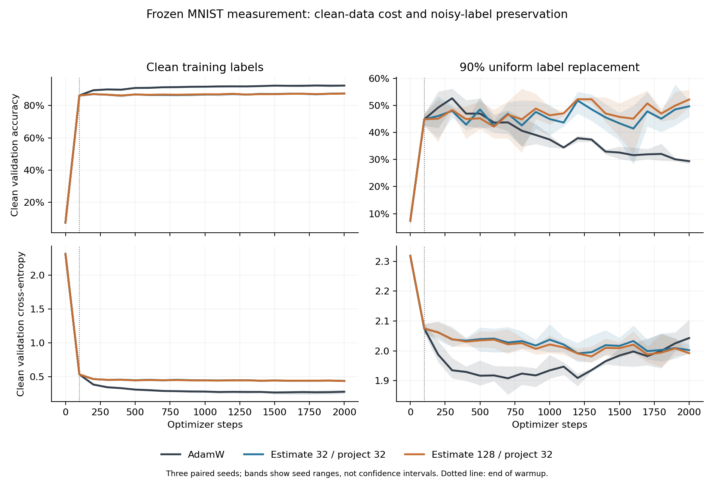

# Neural follow-up: anti-memorization without improved denoising selectivity

The frozen three-seed MNIST experiment supports a restricted-learning account,
not a general covariance-denoising account. Both rank-32 filters preserve much
more noisy-label test accuracy than prolonged AdamW training, while sacrificing
clean-data learning. Widening covariance estimation from 32 to 128 improves
mean noisy-label accuracy but helps only two of three seeds, and does **not**
improve the measured clean-versus-corruption retention gap. Actual AdamW steps
mostly leave the applied gradient subspace; that leakage is not generally an
ascent reversal.

These are results from one prospectively specified small task with three paired
seeds. They are not a tuned benchmark, a general causal explanation, or a claim
that a wider estimator should become the default. This report supplements the
already delivered investigation; its original PDF remains unchanged.

## Design and evidence

The complete [protocol](protocol.md), [analysis plan](analysis-plan.md), harness
and summarizer were frozen in commit
`d3e93cce20325e84a0ab98dafb9fa62c9289cf80` before execution. Each seed used 5,000
MNIST training examples, 5,000 clean validation examples and a disjoint clean
probe pool; the model was a 50,890-parameter `784→64→10` ReLU MLP. All methods
shared initialization, data splits, batches and fixed corruption assignments
within each seed. Training used 2,000 steps, batch size 64, AdamW LR .001 and
weight decay .01. Filtered arms used stable global raw covariance, decay .99,
100-step warmup, canonical initialization and hard projection rank 32.

The factors were no corruption versus nominal .9 uniform label replacement,
and AdamW versus estimation widths 32 and 128 at the **same delivered rank 32**.
Actual incorrect-label fractions were 80.22%, 81.68% and 80.32%. Replacement
can preserve the original digit; the expected incorrect fraction is 81%.

Clean and corrupted-label probe gradients were evaluated at identical pre-step
parameters on independently drawn batches from the fixed training data. Their
difference is a fixed training-corruption residual, not independent zero-mean
gradient noise. A second clean probe used disjoint examples. Probes did not
update covariance or optimizer state. Update geometry was measured after the
self-inclusive covariance update, using the basis actually applied that step.

All 18 runs finished in **225.81 elapsed seconds** on the local RTX 3090. There
were 36,000 scalar step records, 756 gradient-probe/state checks, 378 validation
records and 36 final/selected test evaluations. No gate failed and no run was
replaced. All training and checkpoint selection ended before the official test
set was opened. Test checkpoints were final and earliest minimum-validation-
cross-entropy checkpoints, not maximum-validation-accuracy checkpoints.

The [frozen summary](summary.json) contains every seed and paired contrast.
The [independent numerical audit](audit-results.json) rederived all 2,196
seed-level metrics and 732 paired metric contrasts, regenerated all three RNG
plans, checked checkpoint selection and replayed all 36 checkpoint states on
test and validation data using a separate CPU implementation. All accuracies
matched exactly; the largest cross-entropy discrepancy was `7.3242e-8`.

## Learning: strong endpoint preservation, clean-data cost

The table reports equal-weight means across the three paired seeds. Accuracy
is in percent; cross-entropy is unscaled. The selected columns use the frozen
validation-cross-entropy rule.

| Training labels | Method | Final test accuracy | Selected test accuracy | Selected test cross-entropy |
|---|---|---:|---:|---:|
| Clean | AdamW | 92.78 | 92.90 | .2554 |
| Clean | Estimate 32 / project 32 | 88.02 | 88.13 | .4318 |
| Clean | Estimate 128 / project 32 | 87.82 | 88.08 | .4291 |
| .9 replacement | AdamW | 30.67 | 44.85 | 1.8769 |
| .9 replacement | Estimate 32 / project 32 | 49.79 | 48.80 | 1.9766 |
| .9 replacement | Estimate 128 / project 32 | 52.93 | 51.65 | 1.9607 |

Final noisy-training-label accuracy is 44.91% for AdamW versus 17.35% and
17.56% for the filters, while clean training accuracy is 29.85% versus 49.93%
and 53.23%. This supports reduced corruption fitting, not zero memorization.
On clean data, AdamW reaches 99.06% training accuracy while the filters reach
88.73% and 88.57%: their clean-data cost includes substantial underfitting at
this fixed horizon.

Lines are means and bands are seed ranges, not confidence intervals. The
vertical line marks the end of the shared 100-step warmup. All scheduled
validation points are shown; the figure changes no checkpoint-selection rule.
The noisy-label accuracy and cross-entropy panels make the metric tradeoff
visible. Filtering preserves competence while AdamW increasingly fits the
corrupted labels; clean-data progress after warmup is much more restricted.

## Wider estimation is not a uniform improvement

For noisy labels, width128-minus-width32 final accuracy differences are
**−2.09, +5.94 and +5.56 points**, mean +3.14. Selected-checkpoint differences
are **−3.89, +5.94 and +6.50**, mean +2.85. The negative seed is retained.
On clean data, widening slightly lowers final test accuracy in every seed,
by .04, .19 and .37 points.

The earlier synthetic experiment established truncation-induced covariance
adaptation delay. This neural experiment separates estimation width from
delivered rank, but does not establish that the synthetic delay explains the
learning differences. Once filtering begins, the two widths develop different
parameters, gradients, covariances and moment states. Their contrast is between
complete training procedures, not two covariance approximations on a fixed
common gradient stream. Nor was either width selected by a tuning sweep here.

## Retention: both components move together

These values average the 39 postwarmup probe ratios within each seed, then
average seeds equally. They are fractions of each vector's squared norm.

| Noisy-label method | Clean-gradient retention | Corruption-residual retention | Clean minus residual | Combined noisy-gradient retention |
|---|---:|---:|---:|---:|
| AdamW, identity by definition | 1.00000 | 1.00000 | .00000 | 1.00000 |
| Estimate 32 / project 32 | .50722 | .48293 | .02429 | .53884 |
| Estimate 128 / project 32 | .51528 | .49124 | .02404 | .53162 |

Widening changes clean retention by +.00806 and residual retention by +.00831.
The selectivity-gap change is **−.000248**, with seed differences
−.001031, +.000630 and −.000344. Thus the observed mean accuracy improvement
is not accompanied by improved measured marginal selectivity. A small gap does
not prove absence of every useful geometric effect, and three seeds cannot
establish equivalence, but this particular denoising explanation is unsupported.

The combined noisy-gradient retention actually moves in the opposite direction
from the two marginal averages. This is not an inconsistency: if `n=c+r`, then
`||n||²=||c||²+||r||²+2*cᵀr`, with an analogous projected identity. Negative
clean/residual cross terms and the distinction between means of ratios and
ratios of energies matter. The raw records preserve these cross terms; the
frozen summary separately names its energy-weighted secondary ratios.

The independently checked label-noise decomposition (artifact not distributed in this public snapshot)
adds a conceptual caution. At fixed parameters, fresh uniform replacement
mixes the clean-target gradient with a uniform-target gradient; the mean
clean-to-corrupted residual is generally nonzero. Along training on a fixed
corruption assignment, the model Jacobian is itself label-dependent. Calling
the residual pure nuisance or an oracle memorization direction would overstate
what was measured.

## Actual updates: large leakage, rare reversals

The primary geometry subtracts nominal decoupled weight decay from the measured
parameter displacement; total-update results remain in the summary. This does
not remove historical effects of decay. All 1,900 postwarmup steps per run,
including near-zero classifications, enter the event denominators.

| Label condition and method | Mean outside-subspace squared-step fraction | Current-gradient ascent frequency | Closure-robust leakage-associated reversals |
|---|---:|---:|---:|
| Clean, AdamW | 0 by convention | 1.140% | 0 |
| Clean, estimate 32 | 76.972% | 3.018% | 8 / 5,700 steps |
| Clean, estimate 128 | 76.895% | 2.596% | 5 / 5,700 steps |
| Noisy, AdamW | 0 by convention | 0% | 0 |
| Noisy, estimate 32 | 60.467% | .175% | 0 / 5,700 steps |
| Noisy, estimate 128 | 60.622% | .158% | 0 / 5,700 steps |

Baseline leakage is zero because its applied operator is defined as identity,
not because it agrees with a learned spectral subspace. The pooled event counts
are descriptive exposure totals, not independent optimizer replications.

The noisy filtered runs have positive outside contributions on approximately
29.82% and 23.63% of steps, yet no supported reversal from inside-subspace
descent to total ascent. A positive contribution can weaken descent without
reversing it. Conversely, momentum can make the inside term positive too.
The largest normalized decomposition-closure residual across the study is
`7.73383e-7`; reported robust reversals require sign margins larger than the
observed absolute closure residual plus their sign tolerances.

This verifies the initial report's warning that pre-Adam projection does not
confine parameter updates. It also constrains the new quadratic counterexample:
the corresponding signed directional pattern occurs rarely under the clean
recipe and was not the form of ascent observed under the noisy recipe. This
does not identify the first-step mechanism or establish finite-loss increases.
It is not a demonstrated explanation
for anti-memorization or clean underfitting. Large out-of-subspace motion can
coexist with strong restrictions on the gradient information entering Adam's
coordinatewise moments.

## What this changes, and what should come next

The strongest updated explanation remains a task-dependent restriction on
learning. Stable filtering repeats noisy-label endpoint preservation in a
fresh paired design, but loses clean-data competence. Wider estimation is a
plausible implementation control, not a demonstrated semantic denoiser. The
actual gradient/update distinction is now measured in neural trajectories,
while directional reversals were rare here and do not establish the broad
explanation. Rarity alone cannot rule out disproportionate causal effects.

The next useful comparison should freeze **both** validation-accuracy and
validation-cross-entropy selection, retain both checkpoints, and include a
warmup-stop or matched attenuation control. That separates preservation of
early competence from continued useful learning and avoids conflating different
prediction metrics. A common-gradient replay can separately measure estimator
differences without endogenous-trajectory confounding. These are proposals,
not additional completed experiments.

## Reproducible artifacts

- Execution record (artifact not distributed in this public snapshot), [summary](summary.json),
  [independent audit report](audit-results.md), [audit values](audit-results.json)
  and [audit implementation](audit_completed_results.py).
- Lossless raw-evidence manifest (artifact not distributed in this public snapshot): 19 compressed
  JSON files, including execution metadata, preserve 72,476,924 original bytes
  in 8,754,246 compressed bytes. Every decompression hash matches its unchanged
  original. Plaintext results passed the secret scan before the archive commit.
- Raw JSON, checkpoints and RNG plans remain locally available; compression
  deleted or replaced nothing. The [archive script](archive_results.py) refuses
  overwrite. Checkpoint/RNG hashes and sizes are retained in execution metadata.
- [Plot script](plot_results.py) produces the descriptive validation figure.
  The [pilot report](pilot-report.md) and code audit (artifact not distributed in this public snapshot) document
  the pre-run measurement checks and their limits.

Production optimizer source was not changed. The three paired seeds, single
architecture, fixed untuned optimization recipe and synthetic noise remain
limits on every application-level inference.
