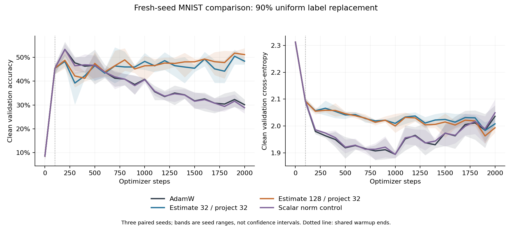

# Stopping metric changes the comparison; scalar attenuation does not reproduce endpoint preservation

Iteration 004, 6 September 2026. Prospective three-seed extension on reused
MNIST, not an independent dataset-level confirmation. **Independent numerical
audit passed**, including raw reaggregation and saved-checkpoint CPU replay.
This report follows the original emailed investigation and does not alter it.

## Main result

Hard rank-32 filtering again preserves much more clean-test accuracy at the
end of noisy-label training. That endpoint advantage does **not** establish
superiority to accuracy-selected stopping. With each method's checkpoint
selected by maximum clean-validation accuracy, hard estimate32/project32
scores 52.56% versus AdamW's 54.93% and the scalar control's 54.30%.
Both co-primary differences are negative on average and in two of three seeds.
The wider estimator scores 54.97%, but its near-zero mean difference from
AdamW combines materially positive and negative seeds, not evidence of equivalence.

The distinction is sharp within this same frozen experiment: hard32-minus-AdamW
test accuracy is **+18.81 percentage points at the endpoint**, **+6.89 points
with minimum-validation-CE selection**, and **-2.38 points with maximum-
validation-accuracy selection**. Test CE favors AdamW at both selected states.
All these comparisons were retained prospectively; none was selected after
test outcomes. Direct evidence: [summary.json](summary.json),
raw result archive (artifact not distributed in this public snapshot), [protocol](protocol.md) and
[pre-outcome aggregation specification](analysis-plan.md).

The scalar control matches the candidate projected gradient's norm on its
**own** trajectory, without rotating the raw gradient. It behaves descriptively
much like AdamW in its learning curves and does not preserve late accuracy.
This rejects that specific whole-policy norm control as a reproduction of the
endpoint effect. It does not uniquely identify a directional or denoising
mechanism, nor match actual AdamW update norms.

## Frozen design and execution

The design was motivated by [iteration003](../iteration-003/results.md), which
retained minimum-validation-CE checkpoints but not maximum-validation-accuracy
checkpoints. No earlier test curve was used to select new checkpoints. Seeds
3,4,5 give fresh split/initialization/corruption/batch bundles on the same
benchmark and official test set. Their actual incorrect-label fractions are
81.08%, 81.28% and 80.62%; nominal .9 replacement includes replacing a label
with itself.

Each seed uses 5,000 training and 5,000 clean validation examples, a
784–64–ReLU–10 MLP with 50,890 parameters, batches of 64 and 2,000 AdamW steps.
Learning rate .001, weight decay .01, betas (.9,.999), epsilon 1e-8; no
schedule, clipping, augmentation or tuning. Stable global covariance uses
decay .99 and the canonical initialization. Estimation widths are 32 and 128,
but both hard arms deliver at most rank 32. Every observer is self-inclusive.

All policies pass through the first 100 gradients unchanged. Exact checks
verify their shared parameter/gradient trajectory and step-100 optimizer/core
state; hard32 and scalar32 also share their width-32 observer state through
warmup. Thereafter the scalar policy delivers alpha*g, with
alpha=||P32*g||/||g|| computed on its own state. It retains explicit zero and
numerical-tolerance rules. The actual delivered gradients pass the norm and
collinearity gates. A zero gradient still invokes AdamW; moments/decay may move
the parameters.

Validation is evaluated at 0,100,...,2000. Minimum CE and maximum accuracy are
selected independently with earliest exact ties; there is no secondary
tie-break. Final, both selected and the common warmup100 state are separately
cloned and retained, even if selected steps coincide. All twelve training and
selection runs finish before any official test loading. Each saved state is
then evaluated on all 10,000 test examples.

Source freeze commit: `e9126179a010323111ded3dad37ba1c0ba0af244`. The
[runtime-only pilot](pilot-report.md), 18 synthetic tests, independent
[design](design-audit.md)/code (artifact not distributed in this public snapshot) reviews and
parent launch decision (artifact not distributed in this public snapshot) preceded confirmation.
All nine bound source hashes match the passing pilot and committed source.
No source change, failed gate or retry occurred during confirmation.

Execution (artifact not distributed in this public snapshot) ran 11:50:32.701964–11:53:12.252353 UTC:
159.550389 elapsed seconds. All training completed at 11:53:10.731196 and the
test loader completed its first load at 11:53:10.744911. There are 24,000 step
rows, 252 validation records, 504 passing measurement-state checks and 48
test evaluations. Training-loop elapsed times sum to 154.45 seconds; peak GPU
allocation is 250,605,568 bytes and peak reservation 627,048,448 bytes. Only the
existing local RTX3090 was used; no paid GPU/API work or production code edit.

## Co-primary comparisons and full learning outcomes

The predeclared primary metric is test accuracy at the independently
**maximum-validation-accuracy** checkpoint. Differences below are percentage
points, with all paired observations shown. Sample SD is descriptive, not a
standard error or confidence interval.

| Co-primary contrast | Seed 3 | Seed 4 | Seed 5 | Mean | Median | Sample SD |
|---|---:|---:|---:|---:|---:|---:|
| Hard32 minus AdamW | +3.43 | -3.51 | -7.05 | -2.38 | -3.51 | 5.33 |
| Hard32 minus scalar32 | +2.31 | -1.95 | -5.59 | -1.74 | -1.95 | 3.95 |

These are mixed/adverse comparisons, not consistent superiority. Three
paired bundles do not justify treating dependent steps or test examples as
additional seeds. No p-values, discovery or equivalence claim is made.

Mean test accuracy over the three seeds:

| Method | Common step100 | Final step2000 | Min-validation-CE state | Max-validation-accuracy state |
|---|---:|---:|---:|---:|
| AdamW | 46.08% | 30.24% | 42.46% | 54.93% |
| Hard estimate32/project32 | 46.08% | 49.05% | 49.35% | 52.56% |
| Hard estimate128/project32 | 46.08% | 51.82% | 51.67% | 54.97% |
| Scalar32 norm control | 46.08% | 29.81% | 42.45% | 54.30% |

Mean test cross-entropy, lower is better:

| Method | Common step100 | Final step2000 | Min-validation-CE state | Max-validation-accuracy state |
|---|---:|---:|---:|---:|
| AdamW | 2.08556 | 2.02291 | 1.86910 | 1.93670 |
| Hard estimate32/project32 | 2.08556 | 1.99975 | 1.97384 | 2.02059 |
| Hard estimate128/project32 | 2.08556 | 1.98381 | 1.95145 | 2.01960 |
| Scalar32 norm control | 2.08556 | 2.03307 | 1.87023 | 1.95430 |

Both hard arms have worse test CE than AdamW **in every seed under either
selected checkpoint rule**. Endpoint CE mildly favors the filters on average;
this does not reverse the selected-state CE comparison. Validation selection
does not guarantee the best test value of the selected metric or any other
metric. The complete seed records are retained:

| Seed | Method | Final accuracy | CE-selected accuracy | CE-selected step | Accuracy-selected accuracy | Accuracy-selected step |
|---|---|---:|---:|---:|---:|---:|
| 3 | AdamW | 28.91% | 43.52% | 1000 | 52.80% | 200 |
| 3 | Hard32 | 52.30% | 54.71% | 1900 | 56.23% | 700 |
| 3 | Hard128 | 54.14% | 54.28% | 1900 | 56.85% | 800 |
| 3 | Scalar32 | 27.59% | 43.19% | 1000 | 53.92% | 400 |
| 4 | AdamW | 29.62% | 43.41% | 800 | 53.11% | 500 |
| 4 | Hard32 | 47.99% | 43.09% | 800 | 49.60% | 1400 |
| 4 | Hard128 | 54.09% | 50.85% | 1900 | 54.09% | 2000 |
| 4 | Scalar32 | 30.90% | 43.51% | 800 | 51.55% | 200 |
| 5 | AdamW | 32.19% | 40.44% | 1000 | 58.89% | 200 |
| 5 | Hard32 | 46.86% | 50.24% | 1900 | 51.84% | 200 |
| 5 | Hard128 | 47.24% | 49.88% | 1900 | 53.97% | 200 |
| 5 | Scalar32 | 30.93% | 40.65% | 1000 | 57.43% | 200 |

Curves show the mean and full seed range, not confidence intervals. They use
every scheduled validation point, with no smoothing or outcome-based window.
The scalar and AdamW curves both show early accuracy peaks and later decline;
the hard arms retain substantially higher late accuracy but higher CE over
much of training. Plot source: [plot_results.py](plot_results.py).

## Secondary width, warmup and norm-control findings

The common step-100 test accuracies are 43.71%, 44.81%, 49.72% for seeds 3–5,
identical across policies within each seed. Accuracy-selected checkpoints
improve on their own common warmup checkpoint in every seed and arm. Their
mean improvements are +8.85 points for AdamW, +6.48 for hard32, +8.89 for
hard128 and +8.22 for scalar32. Continued filtered training therefore is not
simply an exact frozen warmup state. However, at the endpoint both filters
fall below warmup in seed 5: -2.86 and -2.48 points. There is no blanket claim
that filtering preserves every warmup competence or that selection improves
unseen data by construction.

At the endpoint, noisy-training accuracy is 44.69% for AdamW and 45.01% for
scalar32, versus 17.40% and 17.41% for the hard arms. Corresponding clean-label
training accuracies are 29.99%, 29.37%, 49.39% and 51.67%, respectively.
Together with the test curves, this supports suppression of late corrupted-
label fitting by these hard policies. The scalar-control endpoint difference
from AdamW is -1.32,+1.28,-1.26 points, mean -0.43. The hard32 endpoint gain
over scalar32 is +24.71,+17.09,+15.93 points, mean +19.24.

Those endpoint differences are real policy outcomes, but scalar attenuation
is not an actual-update-matched comparator. The following table uses the
predeclared postwarmup window, steps 101–2000, averaging within each seed first.
Gradient ratios are means of per-step norm ratios, not energy fractions.

| Method | Applied/raw gradient norm ratio | Raw/applied gradient cosine | Mean decay-subtracted update norm | Raw-gradient ascent steps / 5700 |
|---|---:|---:|---:|---:|
| AdamW | 1.00000 | 1.00000 | 0.055033 | 0 |
| Hard32 | 0.89784 | 0.89784 | 0.042273 | 6 |
| Hard128 | 0.90867 | 0.90867 | 0.043452 | 7 |
| Scalar32 | 0.90565 | 1.00000 | 0.054562 | 0 |

Scalar alpha ranges from .70536 to .99879 after warmup; mean .90565. The
maximum absolute candidate/applied norm discrepancy is 5.75e-8 and the logged
relative collinearity discrepancy is zero. Scaling is implemented and measured,
not accidentally bypassed. Nonetheless, its average realized update norm is
close to AdamW's, unlike the hard arms. The control matches its own hypothetical
projection norm, not the hard arm's counterfactual norm or moment trajectory.

This pattern is compatible with adaptive normalization attenuating the effect
of scalar gradient rescaling. It is not proof that exact constant-scaling
invariance explains the observed trajectories: alpha varies, epsilon is nonzero
and scaling starts after unscaled warmup. The prospective
mathematical implementation check (artifact not distributed in this public snapshot) derives the
constant-history special case and its limits. Matching update norms or testing
an SGD base would be different, unperformed interventions.

The six/seven positive raw-gradient directional dots are tolerance-qualified
events, not measured finite loss increases or orthoprojector leakage reversals.
This harness does not compute the old in/out decomposition for alpha*I.
All total-update quantities, early/late windows, sign frequencies, null masks,
122 metrics per seed and 732 paired metric contrasts remain in the frozen
summary; they are not selected according to which supports the headline.

## Interpretation and next discriminating question

The own-trajectory scalar control rules out only that particular norm-based
policy as sufficient to reproduce the endpoint preservation. Direction,
optimizer moments, realized update magnitudes, covariance history and subsequent
trajectories all differ between policies. Do not convert this into uniquely
identified semantic denoising, a proof of effective-rank capacity control, or
a generally beneficial default. The wider estimator's secondary improvement
also does not identify better covariance approximation as its cause.

The next useful bounded diagnostic is a **common-gradient replay**: hold a
gradient stream fixed and compare estimator states/projectors without feeding
their outputs back into the model trajectory. This would address covariance
approximation and retention directly, not supply another learning-performance
comparison. It needs its own prospective scope and validation; it has not
been run here. No post-outcome hyperparameter or selector changes are made.

## Evidence preservation and audit status

The frozen [summary](summary.json) has SHA256
`157becc0500199092136d2414b4feb9096c7324228c514eaf9491febbb48f913`.
The lossless archive (artifact not distributed in this public snapshot) contains 13 JSON files:
38,066,084 original bytes compressed to 5,085,725 bytes. Every gzip roundtrip
matches the recorded original hash and the original files remain unchanged.
Large checkpoint/plan binaries remain local and Git-ignored with hashes/sizes
in the execution manifest; these are not included in the portable JSON archive.

The [independent audit](audit-results.md) reaggregates all 12 times 122 seed
metrics and 732 paired contrasts; maximum discrepancy is 6.66e-16, with exact
null masks and counts. It reconstructs all three RNG plans, verifies nine source
hashes against the launch commit and 19 artifact hashes, and checks shared
warmup hashes and saved parameters. CPU replay comprises 48 test plus 48
validation evaluations: every accuracy agrees exactly and maximum CE
error is 1.34e-7, below the prospectively fixed 5e-5 tolerance. Audit JSON SHA256:
`edf0f8d501805c598d1ed29078ac87f2db8264d6fd65085b8af7a7af49d93bfc`.

This verifies stored scalar records and saved states, not unsaved full
gradient/basis/parameter or optimizer-moment trajectories. Numerical reproduction
does not remove the three-seed, reused-test-data or causal-interpretation limits.
