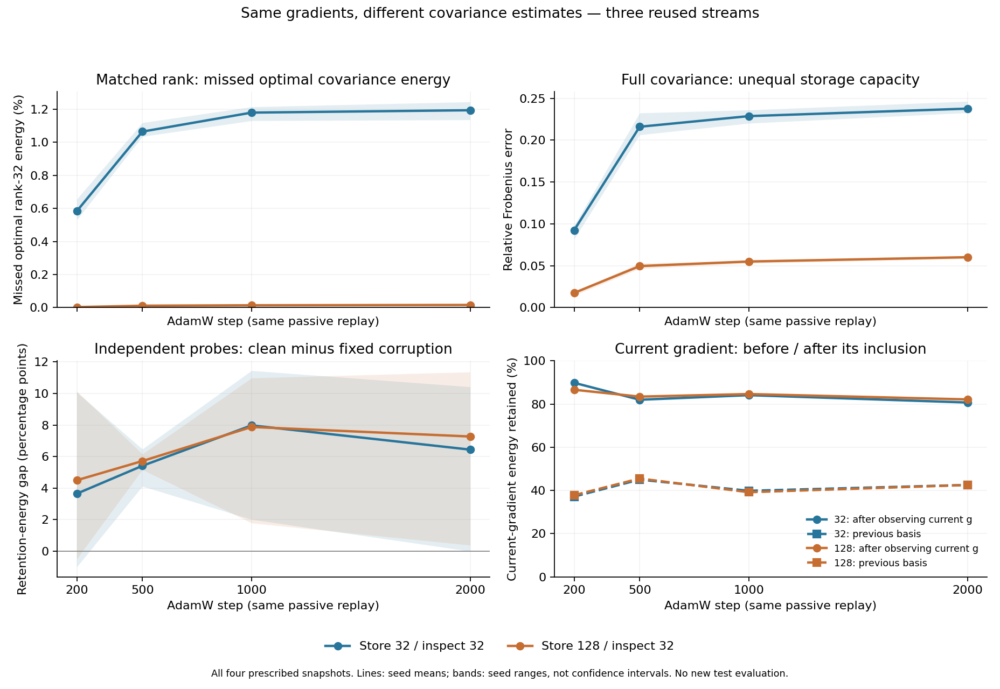

# Same-gradient covariance replay: wider estimation is more faithful, not a learning result

6 September 2026. **Completed prospective three-stream diagnostic; independent
raw/summary and numerical reference audits pass.**
This continuation was not in the initially emailed report. Production code,
earlier frozen experiments and that PDF remain unchanged.

## Main result and its limits

On the same three AdamW gradient streams, increasing covariance storage from 32
to 128 columns while inspecting rank 32 raises final mean captured energy from
**98.8071% to 99.9839% of the optimal rank-32 reference energy**. All three paired
differences are positive. This directly measures estimator fidelity without the
different-training-trajectory confound of iterations 003/004.

The denominator matters: optimal rank 32 itself contains only about 60.41% of
the full reference trace at this final state. The result is not 99.98% retention
of all gradient variation, useful signal or learning performance. The finite-
history reference is a mathematical target, not a population or semantic oracle.

The secondary clean-minus-fixed-corruption retention gap improves by 0.8321
percentage points at the final state and 0.4713 points when averaging the four
prescribed states within seed. It does **not** improve at every state: three
of twelve paired observations are adverse. At the final state, clean-gradient
retention itself falls in two seeds; corruption retention falls more. Better
selectivity by this difference therefore need not mean retaining more clean
gradient. These are diagnostic energy ratios, not measured task improvements.

A separate, large ordering effect appears in both widths: across the four
states, the current gradient's energy retention is about 84% after that gradient
has updated the basis, versus 41% under the saved previous basis. This establishes
substantial self-inclusion in these observations; it does not establish that a
lagged-basis training policy would perform better.

Direct evidence is the unchanged [frozen summary](summary.json), all raw
`results/snapshot-seed{3,4,5}-step{200,500,1000,2000}.json` records and the
execution manifest (artifact not distributed in this public snapshot). The [raw audit](raw-summary-audit.json)
rederives the full summary. Every numerical metric and unfavorable state remains
available; none is replaced by an outcome-selected window.

The figure shows all four prescribed states. Bands are ranges across the three
reused seeds, not confidence intervals; the lower-right panel shows means only.
The upper-left transform is 100 times one minus the primary capture fraction,
not a new primary metric. Its final primary point is step 2000. Version 2 only
shortens a crowded axis label; the original figure, source and manifests are
preserved. No metric, data or plotting window changed.

## What was held fixed

The [protocol](protocol.md), [analysis plan](analysis-plan.md), passing synthetic
tests, independent code reviews and launch decision (artifact not distributed in this public snapshot) preceded
the confirmation. Replays use the exact same seed bundles 3,4,5 and AdamW recipe
as iteration 004: MNIST, 5,000 training examples, the 50,890-parameter 784–64–10 ReLU
MLP, batch 64, 2,000 steps, learning rate .001, weight decay .01 and nominal .9 uniform
label replacement. Realized wrong-label fractions are 81.08%,81.28%,80.62%.

Two canonical stable observers see each raw gradient once. Storage caps are 32
and 128; both inspect only 32 leading columns. Covariance decay is .99, relative
eigenvalue floor 1e-8, absolute floor 0, scheduled repair 100 and the existing
startup convention. Observers never alter the gradient delivered to AdamW,
parameters, optimizer moments or future batches. These are not two additional
training policies, three new seed replications or twelve independent datasets.

Snapshots at 200,500,1000,2000 capture parameters **before** the AdamW update but
**after** observing the current gradient. Before observation the previous basis
is copied. At the same pre-update parameters, one 256-example training probe
bundle supplies clean and fixed-noisy-label gradients; their rounded difference
is the corruption residual. Another 256-example clean probe comes from the
disjoint auxiliary pool. These same saved vectors are used for both observers
and the reference, without feeding any probe back into the covariance.

No official test images/labels were opened and no new accuracy, validation
criterion or checkpoint selector was computed. Historical checkpoints are read
only as existing reproduction anchors. The diagnostic therefore cannot revise
the earlier policy outcomes by appealing to a newly favorable stopping rule.

## Reference and three distinct comparisons

The mean follows the exact canonical float32 operation order, and the saved
innovation is c_t=g_t-m_t after updating m_t. All three streams first accept a
nonzero innovation at step 2. The algebraic target on these rounded innovations is

    C_s = c_s c_s^T,
    C_t = beta C_(t-1) + (1-beta)c_t c_t^T.

The first accepted innovation is unweighted at initialization; it must not be
silently assigned the later 1-beta factor. Float64 weighted columns X retain
every prescribed history term. The dual Gram matrix X^T X gives the spectrum
without forming a 50,890-by 50,890 covariance. The target omits production residual
rejection, pruning and mixed-precision representation defects; its differences
from an observer are not attributable to rank truncation alone.

Three quantities answer different questions:

1. **Full covariance error** compares V diag(S²) V^T with C, using every stored
   column and accounting for nonorthogonal V. Width 128 has four times the
   storage capacity; this is not a matched-rank contest.
2. **Matched-rank span capture** uses a float64 QR span Q of the first 32 saved
   columns and reports ||Q^T X||²_F divided by E32, the sum of the leading 32
   reference eigenvalues. QR is analysis-only. The secondary normalized squared
   projector distance is 1-||Q^T U32||²_F/32. A boundary tie can invalidate that
   distance while leaving optimal energy and capture defined.
3. **Native action and retention** apply the saved float32 columns exactly as
   B(B^T v), with float64 reductions. This is not silently replaced by Q Q^T,
   and neither its output nor a subsequent adaptive-optimizer update is assumed
   to be an exact orthogonal projection.

All reference rank/gap gates pass here; there are no null raw scalar metrics.
That observed fact does not remove the frozen null rules for other runs.

## Primary: final matched-rank capture

| Seed | Store 32 capture / E32 | Store 128 capture / E32 | Difference (percentage points) |
|---|---:|---:|---:|
| 3 | 98.865110% | 99.983340% | +1.118230 |
| 4 | 98.756349% | 99.983685% | +1.227337 |
| 5 | 98.799865% | 99.984747% | +1.184882 |
| Mean | 98.807108% | 99.983924% | **+1.176816** |

The paired median is 1.184882 points, range 1.118230..1.227337 and descriptive
sample SD .054999 points. No p-value, confidence interval or equivalence test
was specified or added. Both estimators already capture most of the rank-32
optimum; wider storage recovers about 1.18 points rather than rescuing a wholly
misdirected leading span on this metric.

The optimal rank 32/full-trace fractions are 60.40545%,59.81372%,61.02103% for
seeds 3,4,5. Their mean 60.41340% is a denominator explanation derived directly
from the saved E32 and trace, not an additional selected performance endpoint.

Every earlier paired capture contrast is also positive. The table retains
the fixed-time means rather than selecting the strongest prefix:

| Step | Store 32 capture / E32 | Store 128 capture / E32 | Paired difference (points) |
|---|---:|---:|---:|
| 200 | 99.416765% | 99.997059% | +.580294 |
| 500 | 98.936229% | 99.988531% | +1.052302 |
| 1000 | 98.821341% | 99.985975% | +1.164634 |
| 2000 | 98.807108% | 99.983924% | +1.176816 |

The complete four-snapshot paired mean is .009935114758959687 in fraction units,
or .993511 points. Its unit of aggregation is a within-seed repeated-state mean,
then three seed means—not twelve independent replications.

## Full covariance and subspace geometry

Mean final relative Frobenius error falls from .2376706803 to .0601261062. Mean
final normalized squared projector distance falls from .0962222838 to .0007091417.
The former is unequal-capacity evidence; the latter compares rank 32 spaces.
Both improve in every prescribed seed/state, but their numerical sizes are
not interchangeable with the primary capture deficit.

Near-optimal capture can coexist with appreciable projector distance when
nearby spectral directions have similar energy. Conversely, a substantial full
matrix error need not imply losing a comparable fraction of the leading-rank
optimum. These results justify keeping the three diagnostic layers separate;
they do not identify which source of approximation caused a historical learning
gain or loss.

## Native retention: a smaller, nonuniform change

All entries below are mean retained **squared-norm fractions**, evaluated on
identical saved vectors. The reference uses its float64 rank 32 projector;
observers use their actual saved float32 action.

| Final-state probe | Store 32 | Store 128 | Reference rank 32 |
|---|---:|---:|---:|
| Training clean | .421548 | .430220 | .428649 |
| Training fixed-corruption residual | .357167 | .357517 | .355711 |
| Training noisy | .368333 | .369375 | .369542 |
| Disjoint auxiliary clean | .381265 | .389311 | .387010 |
| Clean minus residual | .064382 | .072703 | .072938 |

The four-snapshot means retain all prescribed states:

| Metric, average within seed then across 3 seeds | Store 32 | Store 128 | Paired change |
|---|---:|---:|---:|
| Clean retention | .431255 | .448501 | +.017246 |
| Fixed-corruption retention | .372581 | .385113 | +.012533 |
| Noisy retention | .415784 | .419938 | +.004153 |
| Auxiliary clean retention | .408756 | .424963 | +.016206 |
| Clean-minus-corruption gap | .058674 | .063387 | +.004713 |

Each seed's complete four-state gap change is positive: .0037290124,
.0024551212,.0079546194. However, the gap worsens at step 500/seed 4 by .0065605263,
step 1000/seed 3 by .0046835205 and step 1000/seed 5 by .0022552365. At step 1000 its
across-seed change is −.0010093236. Nine positive saved-state contrasts do not
justify dropping the other three or treating the twelve as independent trials.

The clean and fixed-corruption vectors are strongly opposed: mean raw cosine
is −.896945 at the final state and −.881220 over the four-state averages. Noisy
gradient energy therefore depends heavily on the cross term in
||g_noisy||²=||g_clean||²+||residual||²+2 g_clean^T residual. Separate retention
ratios alone cannot explain the noisy vector's behavior. Raw and projected
cross terms and closure residuals are preserved, not replaced by a model of
independent additive zero-mean noise. The
label-noise decomposition (artifact not distributed in this public snapshot) explains
why fixed corrupted labels do not provide that model automatically.

## Self-inclusion is much larger than the width contrast

The same current raw g_t is evaluated under B_(t-1) and under B_t after g_t
updates the observer, both at unchanged pre-Adam parameters. All 24 recorded
increments are positive: .273992.. .569645 for width 32 and
.288969.. .500537 for width 128. These are 24 paired state/width observations,
not 24 independent seeds. The contrast spans the complete observer transition,
including centering, covariance update/truncation and scheduled repair (all four
snapshot steps are multiples of 100). It is not a component-level ablation that
isolates the new outer product from those accompanying operations.

| Four-state mean current-gradient retention | Store 32 | Store 128 |
|---|---:|---:|
| Previous basis | .411139 | .412269 |
| After observing current gradient | .841352 | .841799 |
| Increment | **.430214** | **.429530** |

At the final state the increments remain .381691 and .396299. The width contrast
in the increment is negative at step 200 and positive at the later mean states;
its complete four-state mean is −.0006836515. Widening storage does not remove
the large self-inclusion effect.

These measurements concretely support the initial code-level warning: high
retention of the training gradient after using it to update the basis is not
independent validation that the basis represents useful persistent signal.
They also do not prove that the added retained component is label noise. The
update uses a centered innovation, and signal can also move the basis.
Measuring a previous-basis action is not running a lagged training policy;
the latter changes delivered direction, norm, Adam moments and all future
states. No such intervention was performed here. No new Adam-displacement or
leakage scientific comparison is reported; displacement scalars are recomputed
only as historical reproduction checks.

## Related theory: widening has no universal monotonic guarantee

The separate [ideal-truncation note](../ideal-truncation-error-theory.md) and
independent theory audit (artifact not distributed in this public snapshot) do not modify this
protocol. For exact PSD truncation on a common innovation stream, they prove
E_t=beta E_(t-1)+R_t with R_t PSD. Matched-rank capture regret is at most the
sum of the leading-r eigenvalues of E_t. Those are conditional ideal-arithmetic
statements, not certificates for arbitrary mixed-precision native operators.

They also give a six-observation counterexample to monotone improvement with
storage width. Unit covariance additions along A,B,A,B,C,C at beta .9 leave the
rank 1 estimator on the correct C direction, while rank 2 repeatedly rejects C.
The final rank 1 capture fractions are 1 versus .77163158, even though rank 2 has
smaller full covariance error. At beta .85, the same construction also makes
the wider full covariance error worse. The exact rational construction is not
a selected stochastic benchmark. Production residual rejection can introduce
a signed covariance defect even without rounding; exact spectral pruning
alone remains PSD-preserving.

Thus the present consistent width benefit is empirical evidence for these
three realized streams, not a theorem that wider storage must help. Keeping
that boundary is compatible with recommending wider storage as an estimator
diagnostic, but not with adopting it as a universally better optimizer default.

## Verification, provenance and recoverability

Confirmation ran from 13:14:41.968787 to 13:16:53.137456 UTC, elapsed 131.168682
seconds. All three replays finished at 13:16:20.192729 before any reference
calculation. There were no retries, source changes or relaxed gates. The 19
scientific source bindings match the accepted pilot and all relevant commits:

- Source freeze: `de1ba26d43a6df80162ee9530d8b64c9ac08acf3`.
- Parent launch decision/pilot evidence: `bc29741aa9e15eacddd148e99a640c7d338040d9`.
- Actual execution revision: `fa384618a2a3d8177960be419a144214aa2b21fc`.

The harness passed all 6,000 exact per-step historical scalar comparisons,
300 warmup parameter/raw/applied-gradient hash records, three historical core
hashes and twelve named saved-checkpoint comparisons. Full historical parameter
and gradient vectors were not saved after warmup. Therefore this checks every
available retained anchor and scalar, **not independently saved full-vector
equality at every historical step**. The new raw/innovation streams and parameter
hashes strengthen future auditability without retroactively supplying missing
old vectors.

The independent raw audit verifies 91 unique artifact hash/size bindings,
all 12,000 raw/innovation row hashes, 6,000 historical raw-gradient norms, twelve
saved checkpoint hashes and twelve pre-Adam snapshot links. It reaggregates all
293 summary groups, including all individual values, masks, descriptive sample
SDs and separately named energy-weighted ratios. Full-core equality in the
pilot and some historical displacement checks remain source/live-assertion
evidence; those unsaved full states were not independently reconstructed.

The [independent numerical audit](reference-results-audit.json) reconstructs
all 6,000 sequential float32 means/innovations bitwise, all twelve weighted
Grams/full spectra and saved leading dual/mapped spaces, 384 observer metrics
and 96 reference metrics. It imports none of the producer, summary or production
helpers. The first bounded run passes in 21.336 seconds. Across 972 float64
comparisons the largest absolute difference is 1.4122e-13; 456 native comparisons
have maximum difference 3.33e-16, inside its prospectively frozen audit tolerances.
This independently verifies the saved-vector numerical layer, not a new
historical full-trajectory or dataset evaluation.

The production-run diagnostics themselves are comfortably inside the frozen
gates: maximum dual residual 1.221e-15, covariance-vector residual 1.152e-15,
mapped orthogonality error 1.907e-14, full dual orthogonality error 1.337e-13 and
spectral Frobenius discrepancy 1.058e-15. The smallest normalized rank 32 boundary
gap is .0004105425, above 1e-6. Numerical positive ranks at the final state are
1750,1752,1746; small modes are retained in covariance energies even when they
are ineligible for inverse-square-root mapping.

Peak RSS is 5,760,053,248 bytes; peak GPU allocation is 2,048,461,824 bytes and
reserved memory 3,804,233,728 bytes, below the frozen caps. All 78 new bulk files
are under `/tmp/spectral-experiment-artifacts/spectral-iteration005-full-p3hptw75`, total
3,303,070,440 bytes. They comprise six streams, twelve state bundles and sixty
reference arrays. Raw JSON totals about 3.04 MB and is retained directly in Git.
No old evidence was deleted. Bulk arrays are local, ignored by Git and bound
by exact paths, shapes, dtypes, phases and hashes; a Git clone alone does not
contain those arrays. The delivered original report/PDF is unchanged.

## What changes in the research picture

This closes a specific diagnostic gap: on common neural gradient streams,
wider estimation here does track the prescribed finite-history leading space
more faithfully. The improvement is measurable and uniform in covariance
fidelity, modest and temporally mixed in clean/corruption retention, and not
a learning-policy or population-oracle result. The earlier clean underfitting,
stopping-metric reversal, adverse width seed and negative application findings
remain evidence.

The strongest next mechanistic question is the ordering of observation and
projection. A prospectively specified current-versus-lagged-basis intervention
could test whether the large self-inclusion effect changes learning, while
separating direction from norm and retaining both validation stopping rules.
It would require its own frozen design, control, pilot and seed-level analysis.
It is a proposed next loop, not an executed or recommended production change.
