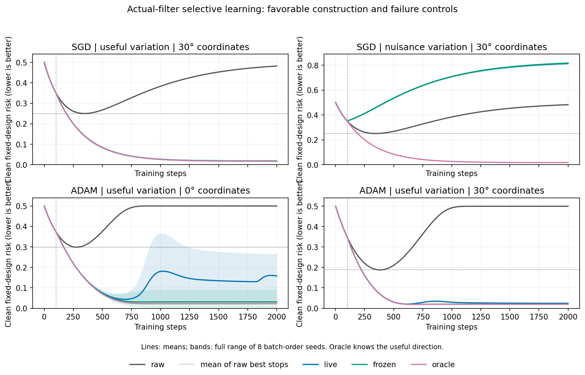

# I8 outcome: selective learning works in a constructive case, with an Adam surprise

7 September 2026. **Completed CPU experiment, eight batch-order seeds per
stochastic cell; deliberately favorable fixed-design regression, not neural
generalization evidence.**

## Executive finding

The actual stable spectral filter can do more than slow training down. In a
constructed case where useful structure generates identifiable gradient
variation, it continues learning that structure while largely freezing fixed
corruption fitting. Its final clean risk is 0.01766 versus 0.24930 at the
unfiltered optimizer's *best* stopping point: about 93% lower, with a win in
every one of eight order seeds under each of two coordinate rotations.

That is a concrete positive bridge from the earlier projected-GD theorem to
the implemented temporal filter, not proof that this mechanism explains the
neural results. Reversing which direction varies makes the filter learn the
wrong thing and causes large harm. A second, unexpected result is equally
important: rotated-coordinate Adam plus the filter succeeds even with no
batch variation. Thus useful batch variation is one sufficient construction,
not a necessary explanation for every successful filtered trajectory.

Confidence is high in these finite toy outcomes and their arithmetic, moderate
in selective continuation as part of the broader account, and still low in
any unique causal explanation of the existing neural comparisons.

## What was fixed before seeing outcomes

[Protocol](protocol.md), [runner](run_selective_toy.py), focused tests and
[analysis](analyze_selective_toy.py) were committed at `b02e06d` before launch.
The canonical filter source was unchanged. There are 512 trajectories: two
optimizers, two coordinate angles, four fixed finite-batch designs, four arms
and eight seeds. Each has 2,000 steps; warmup is 100, learning rate .002, CPU
float64. Adam uses betas (.9,.99) and epsilon 1e-8, with no weight decay.

The clean target is u, total corrupted-training optimum u+v, and the full
training Hessian is I. Useful/nuisance directions are orthogonal. Only batch
order changes with seed; labels and finite design stay fixed. Four-step blocks
have exactly balanced useful-only, nuisance-only, both, or no curvature variation.
The live and frozen learned arms never receive clean labels or the oracle basis.

The primary comparison is canonical **live SGD in the useful-variation design**
against paired raw SGD, each angle reported separately. It subtracts the raw
curve's minimum over 0–2000 from live's minimum over 101–2000. Raw therefore gets
the larger stopping window. Frozen, oracle, Adam and other variation designs
are mechanistic controls, not additional primary opportunities to select a win.
All comparisons grant access to clean risk for stopping and are not unbiased
validation/test selection. Equal nominal LR is not actual-step matching or a
complete hyperparameter search.

## Primary result and selective continuation

At both 0° and 30°, mean live endpoint/best risk is 0.01765815, range
0.01543884–0.02083674. Mean paired difference against raw best is −0.23163793,
range −0.23416034 to −0.22832168; all 8 seeds win at each angle. The angles are
paired coordinate transformations, not 16 independent data replications.
Across the entire SGD panel, corresponding full curves differ by at most
9.94e-15 between angles, as expected for coordinate-equivariant SGD/projection.

The mechanism is visible in parameter coordinates. In live useful-SGD at 30°,
mean useful coefficient rises from 0.18153 at warmup to 0.98230 at the endpoint,
while nuisance changes only from 0.18143 to 0.18678. The learned direction's
squared useful alignment is already 0.99913 at warmup and approaches 1.0.
The filtered model is still imperfect on corrupted training labels (endpoint
training risk 0.33087): low clean risk does not come from fitting the whole
training target or stopping all learning at warmup.

Freezing the learned basis after warmup also works: mean endpoint 0.01740,
versus 0.01663 for oracle-u projection. Ongoing rotation is therefore unnecessary
for this favorable case, although it can change the finite trajectory. The
oracle is a privileged positive control, not a deployable or universally best
post-warmup projector; see the signed-tilt calculation in theory (artifact not distributed in this public snapshot).

## Failure and ambiguity controls

All entries below are mean clean fixed-design risks, lower better. This table
shows 30°; 0° SGD agrees to numerical precision. “Live best” uses the specified
post-warmup window. The no-variation rows are deterministic calculations repeated
under eight unused order seeds, not replicated stochastic evidence.

| SGD variation | Raw best | Live best | Live endpoint | Frozen endpoint | Oracle endpoint | Live wins |
|---|---:|---:|---:|---:|---:|---:|
| Useful | .249296 | .017658 | .017658 | .017402 | .016625 | 8/8 |
| Nuisance | .249498 | .351803 | .813175 | .816383 | .016642 | 0/8 |
| Both | .249254 | .239127 | .439434 | .441223 | .016641 | 3/8 |
| None | .250000 | .250000 | .482090 | .482090 | .016625 | deterministic tie |

The nuisance row is the direct reversed construction: the estimator learns v
instead of u and suppresses useful learning. Both initially has tied population
spikes; the live mean's small best-stop gain coexists with five adverse seeds
and poor endpoint preservation. No-variation SGD follows the original raw
trajectory: when full-batch gradients remain collinear with u+v, centered PCA
does not discover the clean direction.

The analytical scalar-shrinkage floor .25 applies to states alpha(u+v), including
full-batch SGD. It is **not** a universal lower bound for stochastic SGD or Adam.
The actual raw SGD best values slightly below .25 are retained, not rounded into
an incorrect theorem. Primary differences always use the actual paired curve.

## Adam: benefit survives, but its mechanism and stability depend on coordinates

| Variation | Angle | Raw best | Live post-warmup best | Live endpoint | Live wins |
|---|---:|---:|---:|---:|---:|
| Useful | 0° | .298425 | .039795 | .157719 | 8/8 |
| Useful | 30° | .187845 | .020689 | .024247 | 8/8 |
| Nuisance | 0° | .203212 | .329786 | .725328 | 0/8 |
| Nuisance | 30° | .157899 | .323366 | 1.084211 | 0/8 |
| Both | 0° | .249892 | .249005 | .471538 | 3/8 |
| Both | 30° | .190482 | .171005 | .370120 | 5/8 |
| None | 0° | .250000 | .250000 | .500000 | deterministic tie |
| None | 30° | .131339 | .001003 | .001014 | deterministic win |

Useful Adam benefits at both angles, but the axis-aligned live arm deteriorates
after its best point: endpoint range .02245–.26498. Its frozen learned control
has mean endpoint .03132, versus .01986 at 30°. The corresponding oracle endpoints
are .02244 and .01974. These controls show that continuing basis adaptation is not
uniformly beneficial. They do not by themselves isolate a particular moment,
covariance or small-gradient mechanism behind the later deterioration.

Mean post-warmup out-of-applied-subspace step-energy fractions are 12.28% for
live useful Adam at 0° and 1.91% at 30°. Oracle-input Adam still has 1.60% and 1.72%
respectively. These are seed-first means of each trajectory's **summed squared
energy ratio**, not mean per-step angles or the earlier neural leakage estimand.
Projected SGD's corresponding numerical leakage is effectively zero.

The Adam bridge (artifact not distributed in this public snapshot), derived while the run was live, explains why
rank-one input projection need not constrain Adam steps: after moment forgetting
and when epsilon is negligible, coordinatewise normalization replaces direction
u by sign(u). At 30°, the ideal intermediate step can be 15° away from u. The
finite-run aggregate need not equal that ideal angle's 6.70% leakage: transient
moments, gradient sign changes and epsilon matter. Favorable Adam outcomes do
not convert the projected-GD theorem into an Adam theorem.

Lines are seed means and bands show the full order-seed range; panels have
separately labeled vertical scales. Dotted references are means of each raw
trajectory's best risk, not the minimum of the mean curve. The first internal
preview `learning-curves.png` clipped the adverse SGD trajectory; it is retained
only as a superseded preview, not the figure used here.

## The no-batch-variation surprise changes the hypothesis ranking

The deterministic Adam 30° result cannot be attributed to useful minibatch
heterogeneity because there is none. It does not contradict the full-batch
**SGD** obstruction. Adam breaks that argument's collinear-trajectory premise.
Indeed, for this exact isotropic loss, `g_t=theta_t-w`, so centered temporal
gradient innovations are exactly centered parameter-trajectory innovations
under the matching EMA initialization. The observer can learn a direction
from the optimizer's own changing path.

This suggests a second constructive account: the filter can preserve or reshape
an early optimizer-induced trajectory whose geometry happens to favor the clean
target. This is an interpretation of the measured deterministic outcome, not a
uniquely identified dynamical explanation. It also need not be semantically
correct. As an explicitly **post-hoc arithmetic reinterpretation**, keep this
same training objective and final state but regard v as clean and u as the
fixed corruption. Endpoint clean risk becomes 0.941611 instead of 0.001014. Both
clean/corruption decompositions produce exactly the same corrupted training
loss. No new training or label redraw was performed for this calculation.

The updated ordering is therefore:

1. **Selective continuation is a real available mechanism.** The favorable
   construction now works with the actual temporal estimator and learned basis,
   not only an oracle theorem. Transfer to neural training remains provisional.
2. **Adam/trajectory-induced bias is a substantive second route.** It can help
   without batch variation and can change or destabilize learned projection.
   Covariance capture alone cannot distinguish this route from useful spikes.
3. **Generic useful-signal detection remains unsupported.** The reversed and
   identical-training-loss reinterpretations show why utility needs an external
   target or assumption. This does not negate the constructive positive result.

## Verification, resources and next work

All 512 trajectories completed once in 300.93s; the systemd journal reports
303.101 CPU seconds and 341.8 MiB charged peak memory. No GPU, cloud compute,
paid API or Modal reservation was used. The project budget remains$0 spent,
$0 reserved, $100 available. No I7 process was restarted; both failed
preparation attempts and frozen checkouts remain unchanged.

Five focused prelaunch tests passed in main and independent review; counts are
not added. The completed analysis verifies all file hashes, all 512 full-curve
minima/endpoints, exact paired warmups and constant frozen-basis alignment.
Snapshot risk reconstruction differs by at most 2.22e-16. The primary contrast
and unequal stopping windows were clarified before source freeze. Independent
raw/narrative audit is recorded in [review](review.md).
The stored displacement-energy ratio arithmetic verifies, but its complete
per-step energy sums cannot be independently reconstructed from sparse snapshots.

Direct evidence: manifest (artifact not distributed in this public snapshot),
all trajectory records (artifact not distributed in this public snapshot),
all-step clean-risk curves (artifact not distributed in this public snapshot),
completion/hashes (artifact not distributed in this public snapshot), [full summary](summary.json).