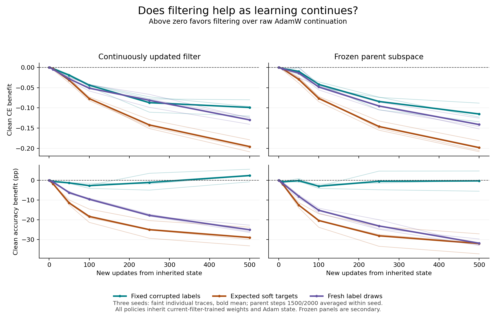

# I10: persistent-label fitting, restricted adaptation, and state dependence

7 September 2026 — Codex, Spectral Optimizer Investigation.
Prospective source/protocol freeze: `dc452ea`. Acquisition complete and audited.

## High-level finding

The filter almost prevents additional fitting of the particular corrupted labels,
but that protection is not the same as continuing useful learning. From the
primary, already-filtered starting states, another 500 filtered updates preserve
accuracy slightly better than removing the filter, with mixed seed signs; they
still produce worse clean probability loss. When persistent corrupted labels
are removed, raw AdamW adapts much better than either learned restriction.

There is important favorable counterevidence: adding filtering to late
**raw-trained** states improves both clean loss and accuracy relative to further
raw training. The method's value depends on the state and stage of learning,
not only on the current label-noise rate. This strengthens a conditional
anti-memorization account, but weakens the stronger claim that this filter
reliably continues learning useful shared structure without sacrificing it.

These are three paired seed bundles on reused MNIST training data, not 189
independent replications, a new test-set benchmark, or a general optimizer verdict.
No production default changes. Cloud spending remains $0 of the authorized $100.

## Design and direct evidence

The [frozen protocol](protocol.md) branches from all 24 complete I9 anchors:
three seeds, raw/current32 training histories, and steps 100/500/1500/2000.
Each anchor crosses three objectives with three policies for 500 new updates:

| Objective | Meaning |
|---|---|
| Fixed | The same saved corrupted labels used in I9 |
| Soft-q | Expected targets `.1 × clean one-hot + .09` |
| Redraw | Fresh independent 90%-replacement draws at each example occurrence |

The policies are raw AdamW, actual current32, and the unchanged parent basis
frozen32. They inherit the exact model, Adam moments/counters, observer and RNG.
Step-100 raw/current states are identical and explicitly aliased: 216 logical
cells require only 189 physical branches, totaling 94,500 new updates.
No I7/I9 experiment, source trajectory or completed I10 branch was restarted.
No official MNIST test data was used. Soft and redraw require known clean labels
and are mechanism controls, not proposed deployable alternatives.

Evaluations use all 5,000 examples in each train/auxiliary/validation split at
horizons 0, 1, 10, 50, 100, 250 and 500. All 500 per-step diagnostics and final
complete states are retained. See launch provenance (artifact not distributed in this public snapshot),
lossless original JSON (artifact not distributed in this public snapshot),
[complete analysis](analysis-001/summary.json), and
[report tables with every seed](analysis-001/report-tables.json).

## All six predeclared primary estimates

Primary: current-trained parents at steps 1500 and 2000, averaged within each
seed before averaging the three seeds, horizon 500. Positive favors filtering:

`B_CE(o) = auxiliary clean CE(raw,o) − auxiliary clean CE(current32,o)`;
`B_acc(o) = auxiliary accuracy(current32,o) − auxiliary accuracy(raw,o)`.

Here raw is **removing filtering from an inherited filtered-training state**,
not an end-to-end unfiltered baseline. Accuracy entries below are percentage
points; CE is in natural-log units. Interaction = fixed benefit minus comparator
benefit. These six estimates remain separate; there is no composite success score.

| Primary | Seed 100 | Seed 101 | Seed 102 | Mean |
|---|---:|---:|---:|---:|
| Fixed CE benefit | −0.096692 | −0.120184 | −0.080011 | **−0.098962** |
| Fixed accuracy benefit, pp | +2.410 | −0.750 | +5.650 | **+2.437** |
| Fixed−soft CE interaction | +0.102619 | +0.088125 | +0.098761 | +0.096502 |
| Fixed−soft accuracy interaction, pp | +35.590 | +29.210 | +29.370 | +31.390 |
| Fixed−redraw CE interaction | +0.026563 | +0.020300 | +0.045088 | +0.030650 |
| Fixed−redraw accuracy interaction, pp | +28.380 | +25.660 | +28.350 | +27.463 |

The CE primary is adverse in every seed average. Accuracy is favorable on average
but mixed. Positive interactions mean filtering is **less harmful under fixed
labels** than under the controls; they do not turn the negative fixed-label CE
effect into a benefit. A separately implemented aggregation of the same original
branch JSON reproduces all seed values; neither calculation replayed forward
evaluations. Tensors were used to verify complete-state integrity.

## What the objective controls reveal

Same primary parents, horizon 500; all nine endpoint levels are shown. Each cell
contains auxiliary clean CE / clean accuracy (%).

| Objective | Raw continuation | Current32 | Frozen32 |
|---|---:|---:|---:|
| Fixed | 1.907762 / 44.227 | 2.006724 / 46.663 | 2.022859 / 43.967 |
| Soft-q | 1.875237 / 87.783 | 2.070701 / 58.830 | 2.073304 / 55.780 |
| Redraw | 1.982303 / 74.520 | 2.111916 / 49.493 | 2.123448 / 42.690 |

All start at 2.014174 CE / 48.030% accuracy. Under fixed labels, the positive
current-versus-raw accuracy difference is **less deterioration**, not an absolute
accuracy improvement from the parent. Both controls substantially improve raw
classification; projection restricts that adaptation. Soft-q current still
improves accuracy from its parent, but much less than raw and with worse clean CE.
Do not equate its lower probabilities with a measured calibration result.

Native benefits on soft-q are −0.195464 CE / −28.953 pp accuracy; on redraw,
−0.129613 CE / −25.027 pp. Redrawing retains severe stochastic label noise yet
does not create a filter advantage here. Thus generic handling of fresh label
variance is not an adequate explanation of the observed fixed-label protection.
The controls also change the conditional objective after the switch and all
states inherit prior corruption-trained features and moments.

Validation independently of the auxiliary split gives the same qualitative
pattern: current-versus-raw fixed benefit −0.100145 CE / +1.830 pp; soft-q
−0.195258 / −28.967 pp; redraw −0.130882 / −25.120 pp. These are paired evaluation
splits, not independent training replications.

## Learning horizon and the frozen-space control

Thin curves are individual seed means over the two parents; thick curves are
the three-seed mean. All prescribed horizons and full outcome ranges are shown.
No endpoint or metric was selected after observing outcomes.

The fixed current CE benefit remains negative at every positive measured
horizon and reaches −0.098962. Its accuracy benefit is negative through horizon
250 and positive only at 500 in the mean. The fixed-minus-redraw CE interaction
is **not monotone**: it is negative at horizons 1 and 250, positive at the other
positive horizons. Growing separation on accuracy is not proof of monotonically
improving clean-loss selectivity.

Frozen32 endpoint benefits are −0.115097 CE / −0.260 pp on fixed, −0.198067 /
−32.003 pp on soft-q, and −0.141145 / −31.830 pp on redraw. Updating the basis is
less harmful than freezing it at these aggregate endpoints, but neither filter
outperforms raw on clean CE in the primary parents. Frozen suppression of
memorization shows continued basis adaptation is not necessary for that
suppression; it does not show freezing is a successful learning policy.

## Fixed-realization fitting versus useful progress

On the training split define `R_zeta = L_fixed − L_q`. At these shared parents,
`R_zeta = −0.052355`. The endpoint decomposition under fixed training is:

| Policy | L_fixed | L_q | R_zeta | Change in R_zeta |
|---|---:|---:|---:|---:|
| Raw | 2.100462 | 2.371124 | −0.270663 | −0.218308 |
| Current32 | 2.259762 | 2.308632 | −0.048870 | +0.003485 |
| Frozen32 | 2.260654 | 2.310529 | −0.049876 | +0.002480 |

Raw increasingly fits the fixed realization and worsens L_q; both filters
largely hold those quantities near the parent. That is real restrictive
anti-memorization behavior. But current32's L_q changes only from 2.309299 to
2.308632 and its fixed objective slightly worsens from 2.256944 to 2.259762.
This window shows mostly preservation, not strong continued shared-objective
learning. Raw's additional realization fitting coexists with better clean CE
but worse accuracy: no individual residual scalar settles utility.

## Mandatory secondary: the starting state changes the answer

The following are all source/parent fixed-label means at horizon 500. Benefits
use the same signs as above. CE / accuracy percentage points are shown.

| Source | Parent step | Current32 benefit | Frozen32 benefit |
|---|---:|---:|---:|
| Raw/current identical alias | 100 | −0.104492 / +4.780 | −0.153507 / +3.307 |
| Raw | 500 | +0.000066 / +7.733 | +0.007540 / +8.533 |
| Raw | 1500 | +0.094669 / +4.513 | +0.094699 / +4.100 |
| Raw | 2000 | +0.088002 / +2.227 | +0.057862 / +1.353 |
| Current32 | 500 | −0.110774 / +4.533 | −0.118662 / +3.960 |
| Current32 | 1500 | −0.095457 / +3.333 | −0.116898 / −0.147 |
| Current32 | 2000 | −0.102467 / +1.540 | −0.113296 / −0.373 |

From late raw-trained parents, adding current filtering has seed-first mean
benefits **+0.091335 CE and +3.370 pp accuracy**, favorable in every seed average.
That is genuine favorable conditional evidence, not part of the primary and
not pooled with it. Soft/redraw remain adverse from those late raw parents.
The complete [summary](analysis-001/summary.json) retains every objective,
source, anchor, horizon, seed and frozen comparison.

One plausible reading is that protection becomes useful after raw fitting has
progressed further, whereas previously restricted states retain room for useful
unfiltered adaptation. This is an inference, not identified mediation: source
histories also change weights, moments, observer geometry and output confidence.
There is slight aggregate recovery from the raw parent: auxiliary CE moves
from 2.015749 to 2.004166 and accuracy from 32.417% to 32.833%. Its seed signs
are mixed (CE improves in one of three seed means; accuracy in two), so this
does not establish consistent recovery or improvement beyond the best earlier
stopping point. Both reviewers and a separate main-agent scalar calculation
checked this qualification; a first draft's overly categorical wording was
corrected before publication.

## Mathematical interpretation: persistent force, not extra logit curvature

For a categorical target t, logits z and probabilities p = softmax(z),

`ell_t(z) = logsumexp(z) − t^T z`.

Write the fixed one-hot target as `t_i = q_i + zeta_i`; since each target sums
to one, `1^T zeta_i = 0`. Therefore the decomposition used above sharpens to

`R_zeta(theta) = −(1/n) sum_i zeta_i^T z_i(theta)`.

This is exact, not a small-error approximation: the log-normalizer cancels.
Fixed corruption supplies a persistent linear forcing term in output/logit
space. Fresh redraw averages that forcing to zero conditional on the current
state and sampled inputs; soft-q removes its label-draw randomness altogether.
Fixed labels do not average away conditional on the realized training dataset,
especially once the model depends on those labels.

At the **same** logits, fixed and soft CE have identical logit Hessian
`diag(p) − p p^T`. In parameter space, with logit Jacobian J_i,

`g_fixed − g_q = −(1/n) sum_i J_i^T zeta_i`,

`H_fixed − H_q = −(1/n) sum_(i,k) zeta_ik Hess_theta z_ik`.

The latter vanishes for an affine-logit/frozen-J model and last-layer-only
directions. It need not vanish across layers of this ReLU MLP: even within an
activation region, logits are bilinear in the two layers. At activation
boundaries a classical Hessian need not exist. Equal same-state logit curvature
also says nothing about curvature along subsequently different trajectories.
These independently reviewed identities distinguish a persistent target force
from the unsupported claim that fixed labels inherently add logit curvature.

### Equal mean gradients do not imply equal Adam trajectories

For redraw at fixed state/input, `E[g_T] = g_q`. A predictable fixed linear
projector preserves this identity. If its projected mean is P mu and covariance
is P Sigma P^T, its coordinate second moments are
`(P mu)^2 + diag(P Sigma P^T)`. Adam uses those second moments nonlinearly;
the native self-inclusive `P(g)` can additionally change the mean itself.

A simple exact counterexample uses a scalar binary logit with `p=q=1/4`,
`Y~Bernoulli(1/4)`, and zero initial Adam moments. The soft gradient is zero.
The redraw gradient `g=q−Y` also has mean zero, but the bias-corrected first
Adam data step has expectation

`−eta [(.75×.25)/(.25+epsilon) − (.25×.75)/(.75+epsilon)] → −eta/2`.

This illustrates noncommutation of target averaging and Adam, not an estimate
of I10's inherited-state effect. Thus redraw-versus-soft is a meaningful
variance/optimizer comparison, not a proof that any difference is pure semantic
denoising. Related theory and primary literature are discussed in
[I9's mathematical interpretation](../iteration-009/results.md).

### Why inherited second moments remain a live hypothesis

For Adam's uncorrected second moment and incoming filtered gradients h,

`v_H = beta2^H v_0 + (1−beta2) sum_(j=1)^H beta2^(H−j) h_j^2`.

At beta2=.999 and H=500, the old moment's coefficient is .60638; the analogous
beta1=.9 coefficient is about 1.32e−23. This does not measure the old moment's
contribution to the delivered update: new gradients, bias corrections and
earlier path divergence also matter. Nor does `.99^500 = .00657` prove that the
native truncated covariance space forgot its history. New gradient scale,
truncation, residual rejection and stabilization affect relative dominance.

I10's mean data-step norms illustrate why controls are needed: under fixed
labels they are .063722 raw, .040328 current and .027196 frozen; under soft-q,
.007539, .004507 and .003891. These are different evolving states, not matched
movement interventions. For current32, branch-energy-weighted data leakage
against its current basis is .60627 fixed, .59652 soft and .62688 redraw.
Ratios are energy-weighted within each branch, then equally averaged over
parents within seed and over seeds—not a pooled cross-branch energy ratio.
Even frozen32 leaks about .54–.56 outside its retained gradient space after Adam.
Magnitude and leakage do not identify harmful direction or causal mediation.

## Revised hypotheses and next discriminators

1. **Conditional protection against fixed-realization fitting: supported here.**
   Both filters suppress its further fitting, and late raw-trained parents gain
   relative clean utility. Whether useful learning can continue beyond a strong
   stopping baseline remains unresolved; the primary filtered-state results
   do not establish that stronger claim.
2. **Restriction of adaptation, with a time-dependent tradeoff: supported as a
   description.** Removing the persistent realization lets raw learn much more
   from the same features; fixed-label CE and accuracy disagree. Longer fixed
   continuations could show a delayed loss crossover as raw memorization grows.
   A future test should extend all relevant paired states at fixed horizons,
   not rerun source training or choose a favorable seed/metric.
3. **Inherited Adam/observer state mediates adaptation: plausible, untested.**
   A prospective saved-state factorial should separate retaining/resetting m,
   v and the counter, with the exact intervention declared before outcomes.
   Counter reset changes bias correction; it must not be silently bundled with
   moment deletion. Matched actual movement remains a distinct control.
4. **Generic fresh-noise denoising or free preservation of useful learning:
   weakened.** Severe redraw noise alone does not produce a benefit; both live
   and frozen restrictions substantially impede soft/redraw adaptation. Neither
   this negative result nor the positive source reversal is a universal theorem.

The I8 constructive SGD advantage and deterministic Adam route remain valid
positive evidence in their designed settings. I9's adverse immediate-direction
primaries remain adverse. I4/I6's contradictory selected-checkpoint results
remain separate. I10 sharpens the neural mechanism question rather than ending
the research or changing the production optimizer.

## Audit, resources, and reproducibility limits

- Eight focused CPU tests and an independent prelaunch review passed. The
  source-identical nine-condition synthetic GPU smoke completed once, followed
  by one full run; no retries or parameter changes after seeing outcomes.
- Full run completed at 14:36:27 UTC in 608.875482 s. Shared smoke/full artifacts
  before final completion metadata: 1,659,801,490 bytes, below 2 GiB. Peak PyTorch
  GPU allocation: 150,386,688 bytes. Journal-reported cgroup memory peak: 2.4G;
  configured RAM cap 6 GiB, no swap, whole-unit cap 1,800 s. GUI apps untouched.
- [Independent audit](analysis-001/audit.json): 2,272,006 scalar/metadata checks,
  422 file-hash verifications, 213 complete-state digests, full 189/216 coverage,
  all nine initial evaluations identical in each of 21 physical parent groups,
  correct Adam/observer counters and unchanged frozen observers.
- [Separate report audit](analysis-001/report-audit.json): all 11 acquisition
  source files still match both the worktree and frozen commit; all 205 JSON
  archives roundtrip byte-for-byte. 156,907,390 original JSON bytes compress to
  17,195,085 bytes. The entire raw step evidence is retained, not only summaries.
- Independent original-JSON aggregation reproduces all six primary seed values
  and the objective/source/horizon patterns. Plot and collector were separately
  reviewed. Artifact integrity does **not** mean independent training or forward
  replay: finite evaluations were not recomputed from data; per-step vectors
  were not retained, so leakage is checked through saved scalar identities.
- Complete final tensor states remain hash-indexed on the desktop's large
  volume, not included in a Git clone and not backed up. Archived plans permit
  later targeted verification. The initial manifest's `running` field is
  superseded by its hash-bound `completion.json`.
- The independent analysis took 13.286 s on CPU, exit 0, no persistent handle.
  Scalar collection, report aggregation and plotting are postprocessing only.
  The one attempted read of a nonexistent `progress.jsonl` was an inspection
  path mistake; progress came from the existing service journal. It did not
  touch acquisition or trigger a restart.

No paid cloud resources were launched or reserved. The broad investigation and
its original two-hour continuation reminder remain active.
