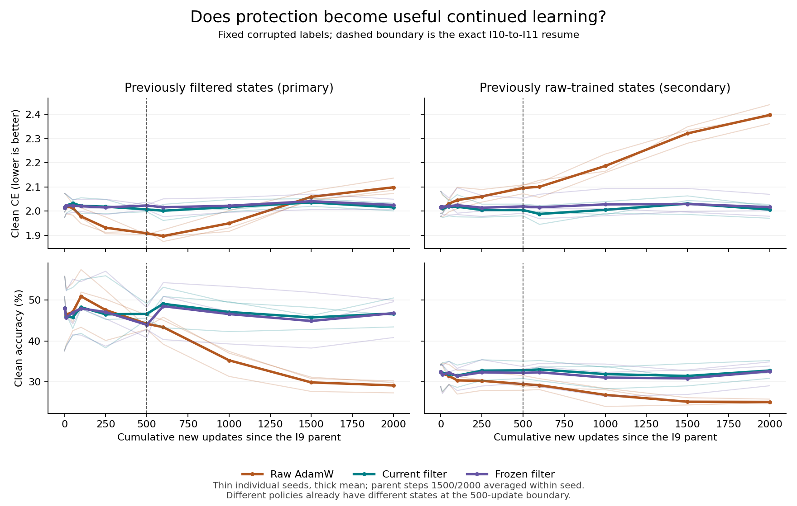

# I11 — Longer continuation reveals endpoint protection, not a best-stop gain

Codex — Spectral Optimizer Investigation, 7 September 2026.

## Executive finding

The earlier adverse clean-cross-entropy result reverses when training continues
long enough: at 2,000 updates from the saved I9 parent, current filtering beats
continued raw AdamW by **0.083070 clean CE and 17.627 accuracy points**, with
both benefits positive in every seed average. This is a real favorable outcome
for protection against prolonged memorization in this setting.

The stronger selective-learning claim does not follow. Filtered accuracy is
46.76%, close to its 46.66% at the I10 boundary and below its 48.03% original
parent; filtered CE slightly worsens during I11. Raw training instead deteriorates
strongly. Against raw's optimistically selected sampled stopping points, current
filtering loses CE in every seed and accuracy in two of three seeds (mean
accuracy gap −4.193 points). The single small favorable accuracy gap is retained.

**Implication:** the best-supported neural account is conditional preservation
against persistent-label fitting, not demonstrated continued learning beyond a
strong stopping comparator. The favorable actual-filter I8 toy remains a valid
constructive mechanism; I11 bounds its neural transfer in this particular recipe.
Next, separately test inherited optimizer memory versus ongoing restriction,
without confusing a moment reset with a neutral restart.

## Design and evidence

The [prospectively frozen protocol](protocol.md), committed as `b02de57`,
extends every fixed-label I10 final state: **63 physical / 72 logical branches**,
three seeds100–102, all original raw/current-trained I9 parents at steps
100/500/1500/2000, and raw/current32/frozen32 continuation policies. Step100
source aliases are identical executions, not independent observations.

Each receives 1,500 new updates, producing **94,500 new updates** and a
cumulative 2,000-update continuation from its I9 parent. This is a new extension,
not a restart of I9 or I10. Full weights, Adam moments/counters, observer, modes,
gradients and RNG are restored exactly. Each I11 initial evaluation equals its
own I10 endpoint exactly before the first new update. Frozen operators remain
the original I9-parent bases, not newly frozen I10-boundary bases.

The same corrupted labels and train/auxiliary/validation splits are reused.
New batch-index plans are shared across policies and source histories within
seed/parent-step. The concatenation is a two-stage shared stream, not one
originally uninterrupted random draw. No official-test data, source retraining,
new learning rate, soft/redraw extension or optimizer reset is involved.

I11 is an adaptive follow-up motivated by I10, not independent confirmation of
the original I10 primary. Its primary compares cumulative policy regimens from
the same I9 parents; policies already have different states at the I11 boundary.
It does **not** isolate the causal effect of just the extra 1,500 updates.

Direct evidence:

- [All stitched curves, absolute changes and mandatory effects](analysis-001/summary.json).
- [Seed-first report tables](analysis-001/report-tables.json).
- [Independent state/scalar audit](analysis-001/audit.json) and
  [worktree/frozen-source/archive audit](analysis-001/report-audit.json).
- Lossless original-JSON index (artifact not distributed in this public snapshot), including all
  94,500 new per-step diagnostics; complete states stay hash-indexed on big/tmp.
- Launch provenance and resource limits (artifact not distributed in this public snapshot).

## Primary results and duration crossover

Average the two late **current-trained** parents1500/2000 within each seed,
then report the three seeds and their mean. Positive benefit favors current32:
`B_CE=CE_raw−CE_current`, `B_acc=accuracy_current−accuracy_raw`.
Accuracy benefits below are percentage points, not relative percentages.

| Cumulative horizon | CE seed100 | CE seed101 | CE seed102 | CE mean | Accuracy seed100 | Accuracy seed101 | Accuracy seed102 | Accuracy mean |
|---:|---:|---:|---:|---:|---:|---:|---:|---:|
| 500, prior I10 | −0.096692 | −0.120184 | −0.080011 | −0.098962 | +2.410 | −0.750 | +5.650 | +2.437 |
| 600 | −0.105398 | −0.121429 | −0.087064 | −0.104630 | +4.030 | +5.790 | +7.330 | +5.717 |
| 1000 | −0.045477 | −0.090106 | −0.066660 | −0.067414 | +10.970 | +12.150 | +12.370 | +11.830 |
| 1500 | +0.032126 | +0.013382 | +0.023706 | +0.023071 | +15.180 | +15.430 | +17.080 | +15.897 |
| **2000, primary** | **+0.104024** | **+0.059669** | **+0.085517** | **+0.083070** | **+16.150** | **+20.300** | **+16.430** | **+17.627** |

The late adverse CE phase crosses to positive in all three seed averages between
the measured1000 and1500 horizons; no exact crossing time is inferred. All remain
positive at2000. Seed100 had a tiny positive one-step CE contrast before turning
negative, so1500 is not its first-ever favorable observation. Accuracy is mixed
at500 and positive in every seed at600 and all later measured points. Earlier
accuracy values include adverse and mixed signs; the complete11-point grid is
retained in the summary. No p-value, composite score or selected successful metric.

Mean benefit changes from500 to2000 are +0.182032 CE and +15.190 accuracy points.
Those changes are descriptive, conditional on the earlier experiment, and do
not replace its correctly reported adverse CE primary.

## Absolute learning versus preservation

| Policy | Clean CE | Clean accuracy (%) |
|---|---|---|
| Raw | 2.014174 → 1.907762 → 2.098219 | 48.030 → 44.227 → 29.133 |
| Current filter | 2.014174 → 2.006724 → 2.015150 | 48.030 → 46.663 → 46.760 |
| Frozen filter | 2.014174 → 2.022859 → 2.025055 | 48.030 → 43.967 → 46.817 |

During I11, current CE worsens by0.008425 and accuracy rises only0.097 points.
Relative to the original parent, CE is worse by0.000976 and accuracy lower by
1.270 points. Raw worsens CE by0.190457 and loses15.093 accuracy points during
I11. Thus the growing relative advantage predominantly reflects raw
deterioration, not substantial aggregate clean improvement under current filtering.
Frozen accuracy does recover2.850 points from its own500 endpoint, while its
CE slightly worsens; do not erase this metric-specific progress.

Current-policy seed-level levels preserve heterogeneity:

| Seed | CE at0 /500 /2000 | Accuracy % at0 /500 /2000 |
|---:|---|---|
| 100 | 2.072652 /1.999803 /2.032252 | 37.570 /45.260 /43.460 |
| 101 | 1.996328 /2.023114 /2.012562 | 50.850 /45.580 /50.550 |
| 102 | 1.973542 /1.997256 /2.000635 | 55.670 /49.150 /46.270 |

### Optimistic sampled raw stopping comparator

Within each seed, first average the raw curves over the two primary parents
at each of the11 grid points. Then separately choose minimum CE and maximum
accuracy, with the earliest exact tie. The same auxiliary data perform selection
and comparison: this is descriptive hindsight, not an unbiased deployable
stopping rule or the continuous-time optimum. Parent h0 is an eligible stop.

| Seed | Raw min CE (horizon) | Current final CE | CE benefit | Raw max accuracy % (horizon) | Current final accuracy % | Accuracy benefit pp |
|---:|---:|---:|---:|---:|---:|---:|
| 100 | 1.903111 (500) | 2.032252 | −0.129140 | 43.370 (100) | 43.460 | +0.090 |
| 101 | 1.893888 (600) | 2.012562 | −0.118674 | 51.990 (100) | 50.550 | −1.440 |
| 102 | 1.873825 (600) | 2.000635 | −0.126811 | 57.500 (100) | 46.270 | −11.230 |
| Mean | — | — | **−0.124875** | — | — | **−4.193** |

The small favorable seed100 accuracy gap does not override two adverse seeds,
all-adverse CE, or the optimistic selection caveat. Nor does a loss to this
comparator establish the performance of an actual out-of-sample stopping policy.

## Persistent realization fitting remains suppressed

Training means for the primary cohort at cumulative2000:

| Policy | Fixed-label CE | Expected-soft CE Lq | Rζ = fixed−soft | Fixed-label accuracy % |
|---|---:|---:|---:|---:|
| Raw | 1.565762 | 2.777330 | −1.211568 | 48.920 |
| Current | 2.261156 | 2.307309 | −0.046153 | 16.907 |
| Frozen | 2.259892 | 2.308554 | −0.048662 | 17.097 |

Parent Rζ was−0.052355. Raw drives it strongly negative, while either filter
almost prevents more fitting to that realization. Current Lq improves slightly
from2.309299 at the parent and2.308632 at500; it does not show the strong useful
adaptation seen under raw soft/redraw I10 controls. The claim is almost-stopped
realization fitting, not literally frozen parameters or exactly zero learning.

The exact identity `Rζ=−mean ζ_i^T z_i(theta)` remains applicable: fixed
corruption supplies a persistent output-space force. It adds no same-state
logit Hessian relative to soft targets, although parameter curvature and
diverged trajectories may differ. See [I10's derivation](../iteration-010/results.md)
and the new history/reset analysis (artifact not distributed in this public snapshot).

## Source and frozen-basis boundaries

Mandatory cumulative2000 means at **every** original anchor are below. Each
entry is CE benefit /accuracy benefit in points, compared with raw continuation
from the same I9 source and parent. All underlying seed values,11 horizons,
absolute changes, training losses and confidence descriptors remain in the
complete summary; the table is not a favorable subset.

| I9 source | Parent step | Current benefit | Frozen benefit |
|---|---:|---:|---:|
| Shared raw/current alias | 100 | +0.071923 /+21.453 | **−0.014059** /+16.600 |
| Raw | 500 | +0.238950 /+19.253 | +0.242596 /+20.193 |
| Raw | 1500 | +0.346544 /+8.207 | +0.361762 /+8.467 |
| Raw | 2000 | +0.436496 /+7.167 | +0.400935 /+6.547 |
| Current | 500 | +0.075462 /+22.480 | +0.036463 /+16.793 |
| Current | 1500 | +0.060444 /+16.287 | +0.056781 /+15.793 |
| Current | 2000 | +0.105695 /+18.967 | +0.089547 /+19.573 |

Late raw-source current benefits grow to+0.391520 CE and+7.687 accuracy points,
both positive in each seed average. But current's mean own CE changes
2.015749→2.004166→2.006067 and accuracy32.417%→32.833%→32.787%.
There is small aggregate recovery versus the original raw parent, with mixed
seed signs, and slight deterioration during I11. Raw instead ends at
CE2.397587 /accuracy25.100%. The favorable conditional intervention remains;
it is not evidence that the filter reconstructs all useful features already lost.

By2000, current endpoint benefits are favorable on both metrics across all
source/parent groups and individual seeds. This removes the endpoint sign
reversal at this later horizon, not the historical I10 reversal at500. Duration
and source history remain distinct conditions, not conflicting results to pool.

Frozen filtering broadly protects endpoints too, with the adverse shared-parent100
CE result preserved. The live-versus-frozen effects depend on source, anchor and
metric; these data do not establish that continued basis rotation is essential.
The basis was already learned, so this is not a random-subspace control.

Actual Adam motion still escapes the gradient subspace. During the new1500
updates, primary-cohort data-step leakage is0.620385 for current relative to its
current basis, and0.587510 for frozen relative to the original frozen basis.
For current relative to the original parent basis it is0.862105. Ratios are
computed by summing squared outside/total step energy within each branch, then
equally averaging parents within seed and seeds—not pooling all branches'
energies. Large leakage does not identify the cause of protection or measure
harmfulness. Scalar identities were checked; unstored vectors were not recomputed.

## Conceptual update and next test

The new mathematical and related-work note (artifact not distributed in this public snapshot) separates weight/
feature history, Adam moments/counters and observer history. Warm-start and
plasticity literature provides competing explanations, not a ready-made causal
answer for this filter. Its independently reviewed reset algebra shows that
zeroing moments while retaining an old Adam counter can produce a first data
step about2.79–2.94 times a genuinely fresh optimizer at the proposed parents,
when epsilon is negligible. A v-only reset can produce a larger transient if
the retained momentum is large relative to the new gradient.

The next high-value discriminator is a separately specified m/v/counter
factorial from saved states, using the existing inherited I10 baselines rather
than rerunning them. It should keep absolute adaptation and startup behavior
visible in both raw and current arms. The [candidate design](next-moment-design.md)
is not yet executed; a numerical-failure policy and prospective protocol are
needed before launch. A null reset effect would not refute every role for
history, and a positive effect would not establish a universal optimizer fix.

Confidence is moderate for this three-seed, small-neural-task duration pattern,
limited for its causal decomposition or transfer. The prior I8 constructive
success, I9 adverse local directions, I10 soft/redraw costs, and I4/I6
selected-checkpoint contradictions remain. No default changes, universal
denoising, statistical equivalence, or new literature-novelty claim follows.

## Verification and resources

One synthetic GPU split/serialized-resume smoke passed all three policies,
following seven focused CPU tests. Full completion15:16:30UTC,537.811827s;
configured host cap6GiB with no swap, TorchGPU cap4GiB, shared new-artifact cap1GiB.
Recorded peak Torch allocation157,663,744B; journal cgroup peak1.5G;
shared artifacts680,903,071B immediately before completion record. These are
different accounting measures, not interchangeable full-process GPU/RSS claims.

Independent CPU analyzer: **3,096,535 checks,299 file hashes,147 complete-state
digests**,63/72 coverage, exact seam/residual checks; max scalar leakage identity
error4.34e−19. Separate report audit verifies all16 source files against both
worktree and frozen commit. All79 original JSON files are byte-exact gzip
archives:159,755,713 original bytes→18,588,241 compressed bytes. The unchanged
generic I10 collector was reused; no I10 source file or experiment changed.

Limits: recorded finite evaluations were not independently forward-replayed;
per-step displacement vectors were not stored; raw/current use of the original
frozen diagnostic reference is bound by reviewed source/provenance rather than
recomputed vector geometry. Complete tensors remain on the large volume, not
in the Git clone and not backed up. The unit is inactive/MainPID0, the GPU is
released, and no experiment is restarted. Cloud spend/reservations remain
**$0 of the cumulative $100 budget**. The research goal and two-hour reminder
remain active; this completes I11, not the open-ended investigation.

Independent original-JSON aggregation reproduces the primary effects, absolute
changes, selected raw horizons and all source/parent boundaries. Separate final
science review finds no material narrative error. The mathematical reset note
also passes independent review. Post-run seven synthetic CPU tests pass in1.190s
(handle47159terminal); no acquisition source changed. Knowledge lint passes.
