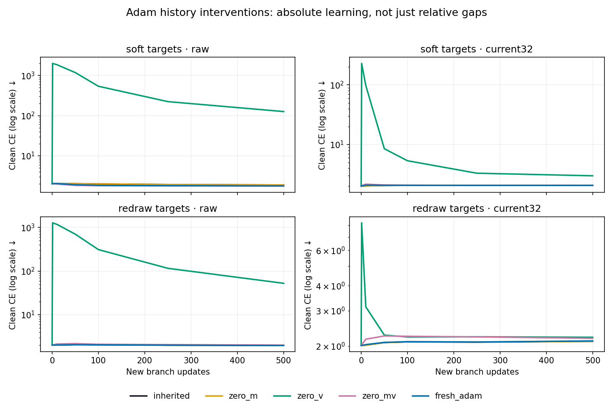

# I12 — Adam history matters, but a positive contrast is not a learning rescue

Codex — Spectral Optimizer Investigation, 7 September 2026.

## Finding and implication

Deleting Adam's second moment while retaining its first moment produces an
extreme finite startup shock. Filtering reduces the damage relative to raw
Adam, so **all four registered relative contrasts are positive in every seed**.
But both policies deteriorate: this is not restored useful filtered learning.

Removing both moments, with or without resetting the counter, is much less
destructive. Under soft targets, filtered classification improves modestly
relative to inherited Adam, with mixed seed-level gains; under fresh redraws,
it worsens. The substantial filtered-versus-raw adaptation deficit survives
even a full Adam reset. Inherited optimizer state therefore matters, but it is
not a sufficient explanation of the adaptation restriction in this recipe.

This is **three-seed adaptive, same-state intervention evidence**, not an
independent benchmark replication or an optimizer recommendation. The leading
account is ongoing gradient restriction interacting with Adam's scaling and
learning path. A better filter remains a live possibility; the next useful
question is how to retain more useful learning without restoring memorization.

## What was actually tested

The [prospective protocol](protocol.md), frozen with acquisition code at
`6c40f99`, uses six late current-trained I9 states: seeds100–102 and parent
steps1500/2000. For soft expected targets and fresh redraw targets, compare raw
and current32 policies under four edits: zero first moment (`zero_m`), zero
second moment (`zero_v`), zero both with old counter (`zero_mv`), or zero both
and counter (`fresh_adam`). All other complete state is preserved exactly.

All **96 new branches completed500updates**, with no nonfinite numerical
failure, retry, clipping or learning-rate adjustment. Zero numerical failures
means all scheduled endpoints exist; it does **not** mean all branches were
stable or scientifically favorable. The very large finite adverse outcomes
remain in every table and contrast.

The **24 inherited I10 comparators were reused, never rerun**, with the exact
six I10 batch/redraw plans. Each branch's h0 predictions equal its original
reference. The first delivered gradient matches across all four edits within
each of24 seed/parent/objective/policy groups. These checks isolate the initial
Adam-state intervention; subsequent gradients legitimately diverge.

There is no new source training, official MNIST test-set use, fixed-target I12
branch, frozen-policy branch, raw-source parent or production code change.
Soft targets use known clean labels as a mechanism control, not a deployable
method of identifying corrupted labels.

## Registered primary: the directional prediction succeeds for the wrong practical reason

Define utility as negative auxiliary clean CE or auxiliary accuracy, and
`B_a = U(current32,a) - U(raw,a)`. The primary is
`Delta_v_minus_m = B_zero_v - B_zero_m` at500. Parents are averaged within seed,
then the three seed means are averaged. Accuracy figures below are percentage
points; CE figures are utility differences, not percentages.

| Primary | Seed100 | Seed101 | Seed102 | Mean |
|---|---:|---:|---:|---:|
| Soft CE | +166.129004 | +92.724067 | +111.637708 | **+123.496926** |
| Soft accuracy, pp | +41.61 | +26.53 | +32.92 | **+33.6867** |
| Redraw CE | +1.278172 | +83.421744 | +66.782036 | **+50.493984** |
| Redraw accuracy, pp | +28.90 | +26.04 | +36.99 | **+30.6433** |

All six individual-parent contributions also have positive signs for each
primary. The large cross-seed magnitude differences remain visible; there is
no significance claim, pooled target score or selected replacement metric.
Exact parent/seed values are in the
[independent full analysis](analysis-001/summary.json), reproduced separately
by the [report aggregation](analysis-001/report-audit.json).

## Absolute endpoints explain those large numbers

The common h0 auxiliary mean is CE **2.014174**, accuracy **48.030%**.
All means below use the same two-parents-then-three-seeds weighting.

| Targets | Adam state | Raw CE ↓ | Current CE ↓ | Raw accuracy | Current accuracy |
|---|---|---:|---:|---:|---:|
| Soft | inherited | 1.875237 | 2.070701 | 87.783% | 58.830% |
| Soft | zero_m | 1.874487 | 2.071458 | 87.800% | 58.453% |
| Soft | zero_v | 126.291410 | 2.991455 | 18.380% | 22.720% |
| Soft | zero_mv | 1.762457 | 2.056910 | 93.340% | 62.227% |
| Soft | fresh_adam | 1.773482 | 2.069522 | 93.570% | 61.070% |
| Redraw | inherited | 1.982303 | 2.111916 | 74.520% | 49.493% |
| Redraw | zero_m | 1.976511 | 2.110814 | 75.260% | 49.053% |
| Redraw | zero_v | 52.571434 | 2.211753 | 18.113% | 22.550% |
| Redraw | zero_mv | 2.008223 | 2.185010 | 68.780% | 35.623% |
| Redraw | fresh_adam | 1.976666 | 2.121484 | 74.630% | 45.537% |

For zero_v, current accuracy loses25.31pp with soft targets and25.48pp with
redraw from h0; raw loses29.65pp and29.917pp. Current CE also worsens in every
seed average. The favorable relative gap describes **less severe damage**,
not a benefit from applying this intervention to current32 itself.

The smaller favorable results must also be retained. Soft zero_mv improves
current accuracy by3.397pp relative to inherited Adam; its seed effects are
+8.18,−0.22,+2.23pp. Fresh Adam gives+2.240pp (+7.91,−2.04,+0.85pp).
Soft zero_mv improves current CE relative to inherited by0.013791 on average,
but seed signs are mixed and mean CE still worsens from h0. These are real
conditional gains, not evidence that filtered learning is literally absent.
Even inherited soft filtering improves accuracy10.80pp from h0 while worsening
CE: class ranking and probability-loss quality are distinct outcomes.

The corresponding raw soft gains are larger: raw reaches93.34–93.57% versus
current61.07–62.23%. With fresh Adam, filtered-minus-raw accuracy is−32.50pp
under soft targets and−29.093pp under redraw. The same initial weights can
support substantial raw learning, so irreversible loss of all useful model
capacity is not a sufficient explanation. Weight/geometry interactions with
the restricted update remain possible.

Under redraw, both zero_mv and fresh Adam hurt current accuracy and CE relative
to inherited in **every seed average**: accuracy changes−13.870pp and−3.957pp
on average. The validation split gives the same qualitative pattern; for
example fresh-Adam accuracy is93.250% raw versus60.897% current for soft, and
74.287% versus45.287% for redraw. This is not independent data-set replication.
All training, validation, confidence and seven-horizon measurements are retained
in [report tables](analysis-001/report-tables.json) and the raw archives.

Figure: three-seed means after within-seed parent averaging. Each panel has its
own **logarithmic CE scale** so the large finite zero_v excursions are visible.
Log scaling was a post-outcome presentation choice, not a new estimand or an
exclusion of extreme values. Fine differences are quantified in the table.

## The mathematics predicted the startup pathology

The prospective mathematical note (artifact not distributed in this public snapshot) was committed at
`53fde81` before inspecting I12 outcomes. At a common initial delivered gradient
`h`, zero_v keeps the numerator `beta1*m+(1-beta1)*h`, but changes the denominator
to `|h|*sqrt((1-beta2)/c2)+epsilon`. A small h therefore does not imply a small
update when inherited m is nonzero. This is not neutral history erasure.

Measured first **decay-adjusted data-step norms** make the shock explicit:

| Adam state | Soft raw | Soft current | Redraw raw | Redraw current |
|---|---:|---:|---:|---:|
| inherited | 0.03662 | 0.03647 | 0.04390 | 0.04054 |
| zero_m | 0.00523 | 0.00398 | 0.02529 | 0.01919 |
| zero_v | **623.672** | **156.428** | **603.754** | **66.373** |
| zero_mv | 0.45807 | 0.54669 | 0.46189 | 0.55888 |
| fresh_adam | 0.16145 | 0.19918 | 0.16154 | 0.20023 |

Large finite steps appear immediately, and the trajectories retain their
consequences. The soft CE primary declines from approximately1764.03 at h1 to
123.50 at h500; redraw declines from1266.21 to50.49. Shrinkage is not recovery
to a useful zero_v endpoint. No unstable arm was retuned after this observation.

Zero_mv versus fresh Adam also behaves consistently with the predicted old-
counter startup amplification, approximately2.79–2.94 for non-negligible h and
negligible epsilon here. Ratios of observed mean vector norms are not exact
coordinatewise tests of that asymptotic factor; the dedicated synthetic tests
check the actual recurrence at counters4/1500/2000.

Gradient projection still does not confine the actual Adam update. The current
policy's within-branch data-step energy outside its contemporaneous basis is
59.65%/62.69% for inherited soft/redraw, versus98.05%/99.23% for zero_v.
Fresh Adam still has74.16%/67.35% outside energy. These are ratios of summed
energies within branch, then equal parent/seed means—not pooled total energy
or an average of instantaneous ratios. Large energy outside the basis does not
by itself say whether those directions are useful. The stored scalar identities
were audited; per-step displacement tensors were not saved for independent replay.

## Factorial and counter effects are not additive mediation

At fixed counter, the exact difference between marginal v-removal and
m-removal effects equals the registered primary. The full decomposition is:

| Target/metric | Marginal m removal | Marginal v removal | m×v interaction | Counter: fresh−zero_mv |
|---|---:|---:|---:|---:|
| Soft CE utility | −61.797958 | +61.698969 | −123.592902 | −0.001587 |
| Soft accuracy, pp | −17.9233 | +15.7633 | −35.0600 | −1.3867 |
| Redraw CE utility | −25.270579 | +25.223405 | −50.531778 | +0.031969 |
| Redraw accuracy, pp | −19.3867 | +11.2567 | −36.4133 | +4.0633 |

The giant nonadditive interaction is driven by zero_v's incompatible old-
numerator/new-denominator startup. In particular, the adverse marginal m effect
does not mean that deleting m alone was harmful on that scale: zero_m itself
closely tracks inherited. It depends on the other factorial context. The
redraw counter-accuracy effect also has mixed seed signs (+4.56,−5.19,+12.82pp).
All individual-parent and horizon-specific effects are in the full summary.

## What this changes, and what it does not

1. **Directly supported:** Adam-state deletion can radically change the joint
   raw/filter dynamics. First-moment deletion alone has small endpoint effects
   here; v-only deletion causes the predicted severe finite shock.
2. **Not demonstrated:** inherited v is the main removable barrier to useful
   current learning. The positive registered contrast is dominated by raw damage,
   while even fresh Adam leaves a large filtered adaptation deficit. Mixed
   soft-target improvements prevent the opposite overclaim that memory never
   matters for useful learning.
3. **Leading provisional explanation:** the ongoing delivered-gradient policy,
   in interaction with Adam and model geometry, restricts adaptation as well as
   memorization. This experiment does not separate ongoing rank restriction,
   observer history, discarded gradient mean and coordinatewise scaling.
4. **Constructive next hypothesis:** centered-covariance projection may discard
   a useful persistent mean as well as unwanted variation. A mean-preserving
   innovation filter could restore learning; it may also restore memorization.
   Compare both outcomes and a matched leaky-projection control before claiming
   an improvement. The [bounded candidate](next-mean-design.md) proposes36 new
   branches against36 existing references. It is not executed I12 evidence.

I8's useful selective-learning toy remains a constructive existence result.
I9's adverse local probes, I10's source/target reversal, I11's duration protection
without a mean hindsight-best-stop gain, and the earlier I4/I6 contradictions
remain unchanged. Related warm-start papers in the mathematical note motivate
competing parameter-history explanations; none diagnoses this spectral recipe.
No generic denoising, novel-method, best-stop-superiority or deployment claim.

## Evidence, checks and resource accounting

- Full acquisition:16:02:11.936UTC,486.570005s,48,000 new updates, zero failures.
  Source freeze`6c40f99`; complete launch chronology and consumed handles are in
  launch.md (artifact not distributed in this public snapshot). No experiment was restarted and no cloud compute used.
- [Independent audit](analysis-001/audit.json):1,434,944 checks;328 hashes over
  1,380,376,520bytes;150 full-state digests (6 original,24 edited,24 inherited
  finals,96 new terminals);24/24 first-gradient groups agree; exact h0 seams.
  Residual identity error0, leakage scalar identity error at most2.22e−16.
- Lossless collection (artifact not distributed in this public snapshot):all107 original JSON files,
  79,554,960bytes compressed to9,375,459bytes, including every step diagnostic.
  Original complete tensor states remain hash-indexed on the desktop large
  volume, not in a git clone and **not backed up**.
- [Report audit](analysis-001/report-audit.json) checks16 acquisition sources
  against worktree and frozen commit, every gzip byte roundtrip, and independent
  primary aggregation. A separate reviewer reproduced the original-JSON science.
  Main visually inspected the chart. No independent model forward, per-step
  displacement-vector replay or first-gradient-tensor recomputation is claimed.
  Post-run14/14 focused CPU tests pass; knowledge-base lint passes. A latent
  postprocessor missingness issue was corrected and tested before the real audit;
  no observed branch had missing endpoints and no acquisition was repeated.
- The desktop run used150,925,824bytes peak TorchGPU allocation, journal cgroup
  peak1.7GiB/no swap, and1,106,582,188shared artifact bytes before completion,
  below the declared limits. GPU is released; unrelated desktop apps untouched.
  Cloud spend/reservations remain **$0 of $100**. The open-ended goal and two-
  hour reminder remain active; this experiment is complete, not the investigation.
