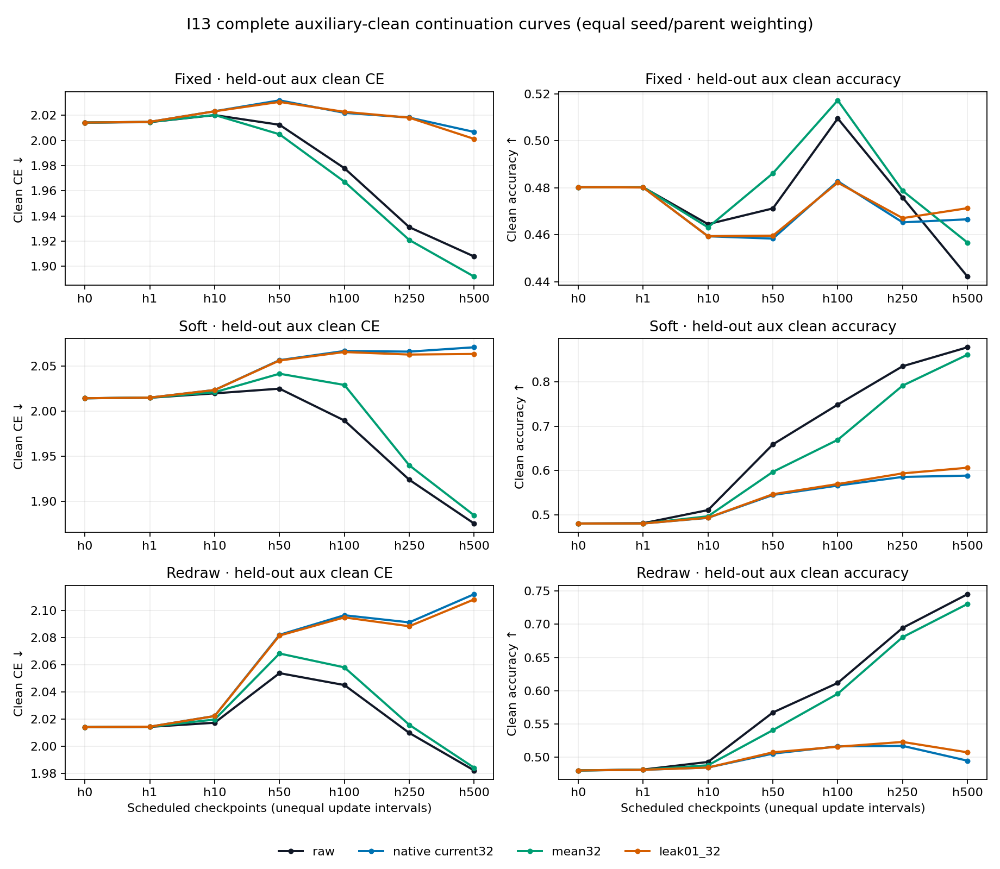

# I13 — restoring the mean restores learning, and much of memorization

Codex — Spectral Optimizer Investigation, 7 September 2026.
Three reused randomized seed bundles; conditional saved-state experiment on
small MNIST, not a fresh-dataset benchmark or production recommendation.

## Main finding

Preserving the observer's running mean outside its learned subspace substantially
restores useful adaptation. Unlike I12's positive-but-damaging moment-reset
contrasts, this is real aggregate improvement from the common starting states
on both clean loss and accuracy under expected-soft and fresh-redraw targets. The
improvement is much larger than that from a one-percent gradient-leak control.

The cost is also clear: with fixed corrupted labels, the mean-preserving policy
resumes nearly as much realization-specific fitting as unfiltered AdamW. It
does not separate useful persistent information from persistent training errors.
It improves fixed-label clean cross-entropy relative to all three comparators,
but its accuracy advantage over the original filter is mixed and negative on
average. Under soft/redraw targets it approaches, rather than generally beats,
unfiltered training.

The constructive lesson is that the original restriction discards information
that can support considerable further learning. The observed tradeoff is
consistent with **blocking versus admitting slowly varying outside-space information**, not
an established universally better denoiser. A separate current-stable
SGD/SGDm/AdamW comparison is the next priority; older cross-optimizer tests
already exist, with important limitations.

## Design and evidence

The [prospective protocol](protocol.md) froze acquisition at commit `d91dba8`.
Six original I9 current-filter-trained complete states—seeds 100, 101, 102,
at steps 1500 and 2000—supply all weights, Adam moments/counters, observer and
RNG history. Each new branch reuses its exact I10 500-step batch/redraw plan.
No source training, I12 reset endpoint, or completed comparator was restarted.

There are 36 new branches: six parents × three targets × two new policies,
each continued for 500 updates. All 36 inherited raw/current I10 comparators
are reused. Targets are the same fixed corrupted labels, their expected soft
targets, or a fresh corruption redraw per training step. The latter two are
mechanistic controls, not clean-label-free deployable alternatives.

With post-ingest observer mean `mu=.99*mu_old+.01*g` and the native current
rank-32 linear action P, the four policies are:

| Policy | Gradient delivered to inherited AdamW |
|---|---|
| Raw | `g` |
| Native current32 | `Pg` |
| Leak01 | `Pg + .01*(g-Pg)` |
| Mean32 | `Pg + mu-Pmu` |

At a common state, `mean32-leak01=.99*(mu_old-Pmu_old)` exactly in real
arithmetic, even without exact orthogonality of P. The observer sees the same
raw gradient exactly once. Later trajectories, means, bases and Adam states
diverge, so a trajectory contrast is the effect of a complete policy, not an
additive mediation estimate for one vector component.

For every numerical result below, average the two parents within each seed,
then average the three seeds. The parent cells are not six independent seeds.
Positive CE benefit means lower clean CE; accuracy differences are percentage
points. All horizons `{0,1,10,50,100,250,500}`, target regimes, seed values and
metrics remain in the [complete audited summary](analysis-001/summary.json).
There is no p-value, selected primary horizon, composite, or official-test
evaluation. Supporting report tables are independently reconstructed from the
lossless original JSON archive (artifact not distributed in this public snapshot).

## Four registered endpoint effects

Mean32 minus native current32, auxiliary clean utility at 500 updates:

| Target / metric | Seed 100 | Seed 101 | Seed 102 | Mean |
|---|---:|---:|---:|---:|
| Soft CE benefit | +0.184885 | +0.203755 | +0.170501 | +0.186380 |
| Soft accuracy, pp | +31.29 | +28.73 | +21.82 | +27.28 |
| Redraw CE benefit | +0.123702 | +0.137098 | +0.122066 | +0.127622 |
| Redraw accuracy, pp | +24.32 | +23.96 | +22.40 | +23.56 |

All four effects are favorable in every seed and every individual parent cell.
That repeated sign is strong evidence for this conditional intervention, not
independent replication across datasets or a tuned optimizer competition.

### Absolute learning, not just relative protection

The common parent mean is clean CE **2.014174** and accuracy **48.030%**.
Here are all four policies' auxiliary endpoints; changes are from that parent,
with ordinary CE changes negative when improved:

| Target | Policy | CE | CE change | Accuracy, % | Accuracy change, pp |
|---|---|---:|---:|---:|---:|
| Fixed | Raw | 1.907762 | −0.106412 | 44.227 | −3.803 |
| Fixed | Native | 2.006724 | −0.007450 | 46.663 | −1.367 |
| Fixed | Leak01 | 2.001195 | −0.012978 | 47.137 | −0.893 |
| Fixed | Mean32 | 1.891793 | −0.122381 | 45.673 | −2.357 |
| Soft | Raw | 1.875237 | −0.138937 | 87.783 | +39.753 |
| Soft | Native | 2.070701 | +0.056527 | 58.830 | +10.800 |
| Soft | Leak01 | 2.063280 | +0.049106 | 60.610 | +12.580 |
| Soft | Mean32 | 1.884321 | −0.129853 | 86.110 | +38.080 |
| Redraw | Raw | 1.982303 | −0.031871 | 74.520 | +26.490 |
| Redraw | Native | 2.111916 | +0.097742 | 49.493 | +1.463 |
| Redraw | Leak01 | 2.108079 | +0.093905 | 50.750 | +2.720 |
| Redraw | Mean32 | 1.984293 | −0.029880 | 73.053 | +25.023 |

Mean32's soft absolute gains are positive on both metrics in all three seeds.
Redraw accuracy also improves in all three, but redraw CE progress is
**+0.090842, +0.018781, −0.019982** in utility units: seed 102 deteriorates
despite improving relative to native. Fixed-label accuracy progress is likewise
mixed (**+6.55, −2.24, −11.38 points**). Validation data show the same signs
for these seed-level absolute-progress comparisons; all validation results,
including unfavorable ones, are retained in the
[independent report tables](analysis-001/report-tables.json).

The figure shows means at all scheduled checkpoints, not fitted smooth curves
or independent observations. The four registered mean-minus-native gaps grow
at every sampled horizon, as do their mean-minus-leak counterparts. This is
consistent with a cumulative effect, not a proof of its temporal mechanism.

### The historical-mean addition matters beyond the tested leak

At the endpoint, mean32 exceeds leak01 by **0.178959 CE / 25.50 accuracy points**
under soft targets, and **0.123786 CE / 22.303 points** under redraw. Every seed
mean is favorable on both metrics in both regimes. The direct `.01` leak alone
therefore does not explain the observed recovery. This distinguishes the tested
historical-mean policy from that specific leakage control, not from every
possible amplitude, momentum or temporal-smoothing alternative.

Against raw, however, mean32's soft benefits are **−0.009084 CE / −1.673 points**,
and redraw benefits **−0.001990 CE / −1.467 points**. Soft is adverse in all seed
means on both metrics. Redraw accuracy is adverse in all three; redraw CE is
slightly favorable in seed 100 and adverse in the other two. Thus the strong
mean-versus-native rescue should not become a claim of superiority to raw.

## Fixed labels: useful loss improvement, lost protection

Fixed-target mean32 improves auxiliary CE against native by **0.114931**,
against leak01 by **0.109402**, and against raw by **0.015969**, with favorable
seed means in all three comparisons. Accuracy tells a different story: mean32
minus native is **−0.99 points**, with seed values **−1.14, +3.03, −4.86**.
Against leak01 the mean is **−1.463 points**, also mixed; against raw it is
**+1.447 points**, favorable in every seed mean. Do not select CE to hide the
accuracy cost, or accuracy to erase the probability-loss improvement.

The exact loss residual `R_zeta=L_fixed-L_soft` measures realization-relative
fitting at a given model. More negative values mean greater fitting
of that realization relative to the expected soft target; this is not itself
a clean generalization metric. From a common mean **−0.052355**, fixed-target
endpoints are:

| Raw | Native current32 | Leak01 | Mean32 |
|---:|---:|---:|---:|
| −0.270663 | −0.048870 | −0.050811 | −0.261183 |

Mean32 resumes substantial realization fitting in every seed. Its endpoint is
close to raw, whereas native and leak01 remain close to the parent. The mean
policy therefore restores useful adaptation and persistent-error fitting
together. This is the main limitation of calling it a selective rescue.

Corrupted-label training accuracy corroborates this: the common **17.153%**
becomes **25.150% mean32 / 25.807% raw**, versus **17.140% native / 17.310%
leak01**. Mean32 fixed CE falls by 0.149114 while its soft CE rises by 0.059714;
raw changes are −0.156483/+0.061825. Mean maximum training confidence rises
from 0.157537 to 0.209769 under mean32, close to raw's 0.209301, versus
0.159010/0.159280 for native/leak. Mean true-label probability nevertheless
rises to 0.167800 under mean32, exceeding raw's 0.165526. Renewed realization
fitting can coexist with a useful clean-probability improvement at this horizon.

## Mechanism probes: direction helps locally, without clean specificity

There are 18 common-state parent-by-target probe groups, using actual inherited
Adam proposals and four reciprocal **data-displacement** norm controls. These
are isolated one-step measurements, not norm-matched 500-update trajectories.
For auxiliary clean loss, negative changes would mean immediate improvement:

| Target | Native actual loss change | Mean32 actual loss change | Mean32−native at native data-step norm |
|---|---:|---:|---:|
| Fixed | +0.000714207 | +0.000643177 | −0.000078029 |
| Soft | +0.000774120 | +0.000703694 | −0.000076687 |
| Redraw | +0.000524902 | +0.000453415 | −0.000075335 |

The relative mean32 improvement holds in all six parent cells per target,
both at actual norms and at the native norm. Both directions still increase
auxiliary-clean loss locally. Mean32 also improves the relative fixed/soft/
clean training-probe loss changes across these groups: the direction is not
selectively beneficial only for clean labels. Full reciprocal controls and
both auxiliary losses are retained in the report tables.

The initial mean step is only about 0.47% larger, and its relative directional
benefit survives direct norm matching. Over the complete paths, however, mean
data-step norms differ substantially from leak01: their ratios of aggregated
means are about **1.394 fixed, 2.436 soft, 0.966 redraw**. Redraw therefore
improves strongly without a larger mean step norm. These observations reject
a simple universal “larger average step” description, not all magnitude or
trajectory-mediated explanations.

The incumbent outside mean has positive dot products at all six common parents
with clean, auxiliary-clean, fixed, soft, and fixed-minus-soft gradients. Mean
cosines with auxiliary clean and realization residual are **0.1078** and
**0.1247**, respectively. It carries mixed information from the outset.
At the fixed-target mean32 endpoint, its residual cosine is **0.2044** (all six
positive), while its soft-gradient cosine is **−0.1741** (none positive).
Auxiliary-clean alignment is much weaker (**0.0140**, five of six positive).
Conversely, soft/redraw mean32 endpoints have auxiliary-clean cosines
**0.1182/0.0865** (all positive) and residual cosines **−0.0441/−0.0431** (all
negative). This objective-dependent specialization supports the tradeoff
interpretation. Gradient alignment alone does not determine an Adam step or
identify long-run mediation.

Actual data steps remain far from confined to the learned basis. The following
fractions use **summed outside squared-step energy / summed total squared-step
energy within each branch**, then equal parent/seed weighting—not averages of
per-step fractions or one cohort-wide energy ratio:

| Target | Raw | Native | Leak01 | Mean32 |
|---|---:|---:|---:|---:|
| Fixed | 0.746710 | 0.606270 | 0.605434 | 0.680872 |
| Soft | 0.845358 | 0.596517 | 0.587992 | 0.910140 |
| Redraw | 0.807528 | 0.626877 | 0.623769 | 0.703029 |

These are each policy's **own current basis**. They are not fixed-common-space
contrasts or measures of semantic noise. Along mean32 paths, mean outside-mean
gradient norms are 0.045508/0.015680/0.026528 for fixed/soft/redraw, versus
native-projection norms 0.681337/0.025651/0.369715. The historical mean can be
small in gradient norm but still matter after accumulated adaptive updates.
All component norms, total-step/frozen-basis leakage and all seed values remain
in the report tables.

## Mathematical interpretation and ranked hypotheses

The prospective mean note (artifact not distributed in this public snapshot) and
timescale derivation (artifact not distributed in this public snapshot) were committed before inspecting
outcomes; the latter was emailed while the experiment was running. They
predicted the possibility of both recovery and renewed memorization.

For fixed orthogonal P, mean32 delivers raw gradients in P and an exponential
moving average in Q=I−P. With plain SGD, no extra momentum or weight decay,
this is ordinary descent inside P and normalized heavy-ball dynamics outside.
The outside-space transfer function is `.01/(1-.99*z^-1)`: its gain on a
persistent signal is one, compared with zero for native projection and .01
for the leak. Thus low-pass smoothing can admit useful stable descent without
permanently rejecting stable corruption. Moving bases add a rotation term;
actual Adam adds nonlinear coordinate scaling and another memory timescale.
The fixed-basis equations are explanatory limiting cases, not fitted laws for
these neural trajectories.

After this experiment, the leading hypotheses are:

1. **Useful outside-mean information, with a memorization cost — supported.**
   Mean32 beats both native and the matched direct-leak policy, makes absolute
   soft/redraw progress, and restores near-raw fixed-realization fitting.
2. **Temporal smoothing changes the learning/protection timescale — plausible.**
   The exact limiting mathematics explains this pattern constructively, but
   I13 does not independently vary mean decay, basis rotation or Adam geometry.
3. **A better selective tradeoff may exist — open.** Fixed-label CE improves
   even versus raw at this horizon. That is a genuine favorable result, but
   mixed accuracy and near-raw realization fitting give no general best-stop
   or long-horizon protection guarantee. Do not discard this positive CE
   evidence simply because the variant is not universally superior.
4. **The one-percent leak suffices — disfavored for this recipe.** Its small
   effects leave most of the mean32 adaptation gain unexplained as a policy
   contrast. Arbitrary larger leakage or tuned scalar alternatives were not
   tested.
5. **Inherited Adam state alone explains the original restriction — inadequate.**
   I12 leaves large deficits even with fresh Adam, whereas I13 improves with
   inherited state intact. Ongoing delivery matters. This is not a measured
   fraction of Adam mediation, and non-Adam neural transfer remains untested
   under the current stable, paired multiseed protocol.

## Integrity, scope and next work

All 36 branches completed: **18,000 new training updates**, zero numerical
failures, 657.400 seconds for full acquisition. Local peak Torch GPU allocation
was about 176 MiB; no cloud compute or reservation was used. Cumulative paid
experiment spend remains **$0 of the authorized $100**.

The [independent CPU audit](analysis-001/audit.json) passed 1,186,651 checks,
499 file hashes and 2,748 state/tensor digests. It covers all 18 paired probes
and 258 signed-alignment records; 78 alignment bases can be replayed from
retained full states, while 180 intermediate bases are digest-only. Saved
losses were not independently forward-evaluated, and actual Adam proposals
were checked from retained displacement vectors rather than rerun. Per-step
leakage is scalar-audited because per-step vectors were not retained.

All 53 original new JSON files are losslessly compressed and hash-indexed in
git. Bulk complete states and probe tensors remain on the verified large
volume, bound by hashes, but are **not backed up** and are not included in a
Git clone. Acquisition and audit attempts are complete and must not restart.
Production optimizer code and the earlier delivered reports are unchanged.

The [separate scalar report audit](analysis-001/report-audit.json) verifies all
53 new archive roundtrips, 36 inherited comparator archives and all 23 frozen
source files against both worktree and commit. Its independently reconstructed
four primaries agree exactly with the prior analyzer. It adds the explicit
cohort leakage aggregation above; the earlier analyzer only retained per-branch
fractions. Neither reporting pass reruns training, model/data forwards, the
optimizer, or the original tensor audit.

The historical cross-optimizer review (artifact not distributed in this public snapshot)
already identifies direct SGD/SGDm/Adam/RMSprop/Lion/local-Muon neural pairs:
some severe-noise successes, clean/moderate-noise and other-base failures, all
single-seed legacy code with test-selected rates. Those are evidence, not a
substitute for current-stable confirmation. The
[next design](next-cross-optimizer-design.md) proposes a small fresh-source
SGD/SGDm/AdamW × raw/native × clean/fixed-noise × three-seed comparison, with
baseline-only calibration, paired plans, matched decay semantics and separate
fixed-endpoint versus validation-selected reporting. It is not yet launched.
Mean32 transfer is a separate question; adding every variant now would obscure
the native filter's dependence on optimizer family and expand the experiment.
