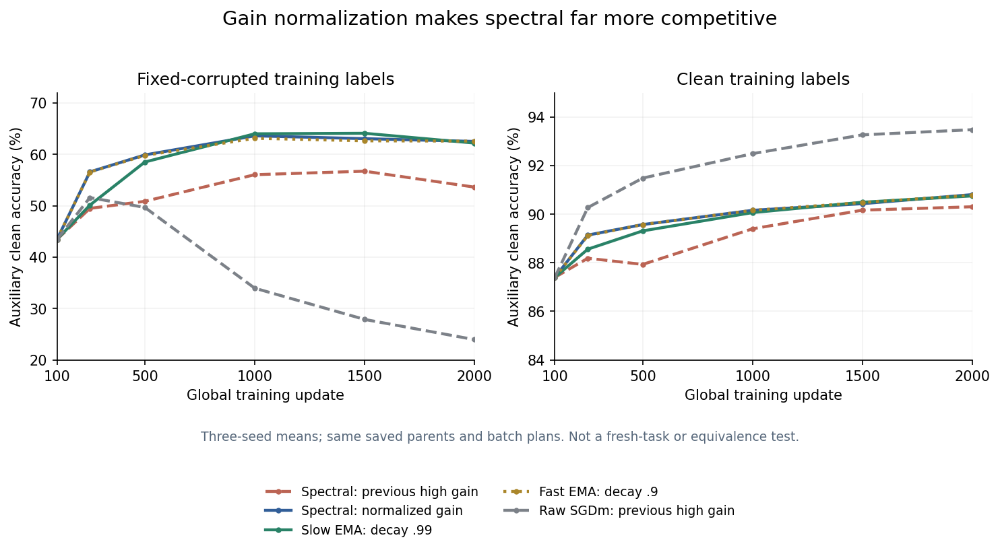

8 September 2026. **Three-seed, adaptively reused MNIST panel.** Full independent
integrity audit and the additional independent report-arithmetic corroboration
both pass. This is a continuation result, not a claim that
the overall investigation is finished or an optimizer default should change.

## Main finding

The gain-normalized spectral policy is much more competitive than its earlier
high-gain version, but does not establish an advantage over the jointly
validation-selected scalar family. Six of eight registered mean effects favor
scalar, including all four fixed-corruption comparisons. The two spectral-
favorable means are clean-target outcomes under accuracy selection, with mixed
seed signs. Most differences are small; there is no registered equivalence
margin or statistical superiority claim.

Importantly, the earlier statement that endpoint EMA `k=0` beats spectral on
both metrics and targets in every seed **does not transfer to this normalized
spectral policy**. Here spectral beats `k=0` in all four endpoint means, although
only fixed-target CE improves in every seed. This is a material refinement of
the moving-average explanation, not grounds to erase the earlier experiment.

Evidence: [audited summary](analysis-001/summary.json),
[integrity audit](analysis-001/audit.json),
complete raw JSON archive index (artifact not distributed in this public snapshot).

The figure shows three-seed means for two representative scalar policies,
normalized spectral and inherited high-gain references. The intermediate scalar
policies are retained in the tables and complete audited curves below. It is
not a plot of confidence intervals or a claim of equivalence.

## What was compared

The [unchanged scientific protocol](protocol.md) continues six accepted I14
SGDm step-100 states: seeds200/201/202 × clean/fixed-corrupted training labels.
Four new policies each run1900 more updates, giving24 branches and45,600 new
updates. Six old I16 `k=0` curves are reused without training or terminal-forward
replay. Every policy sees the same saved batch plan from its parent; later
gradients and observer directions are trajectory-dependent.

Scalar data delivery is `(1-.9*k)*b`, where
`b=.9*k*b_old + k*g + (1-k)*mu`, `mu=.99*mu_old+.01*g`.
The spectral policy uses mean-preserving current delivery and projected old
history, followed by actual-action normalization `d=(I-.9*A_t)*b`.
All retain learning rate.03 and manual parameter multiplier.9997. The design
conditionally matches unit stationary gain and parameter shrinkage, not
realized path length, noise variance, inherited-state transients or moving-action
response. No rank repair, extra arm or outcome-dependent choice was introduced.

Scalar selection searches four k values × six scheduled horizons; spectral
searches six horizons. Selection uses validation metrics only, separately
minimum CE and maximum accuracy, with earlier horizon/lower-k ties. Auxiliary
clean outcomes are held out of selection. Unequal search opportunities and
adaptive panel reuse remain limitations.

## All eight registered primary effects

Positive means favor spectral. CE entries are differences in **negative CE
utility**; accuracy entries are percentage points. Seeds are ordered200/201/202.

| Training target | Validation selector | Auxiliary utility | Seed effects | Mean |
|---|---|---|---|---:|
| Clean | Minimum CE | −CE | −.000419, −.000617, −.000175 | −.000404 |
| Clean | Minimum CE | Accuracy, pp | −.060, −.140, +.100 | −.033 |
| Clean | Maximum accuracy | −CE | −.000521, +.002454, +.001045 | +.000992 |
| Clean | Maximum accuracy | Accuracy, pp | +.100, −.060, +.280 | +.107 |
| Fixed corruption | Minimum CE | −CE | −.002894, −.003508, −.003720 | −.003374 |
| Fixed corruption | Minimum CE | Accuracy, pp | −.500, −.040, +.480 | −.020 |
| Fixed corruption | Maximum accuracy | −CE | −.001454, +.001532, −.001320 | −.000414 |
| Fixed corruption | Maximum accuracy | Accuracy, pp | −2.160, −2.080, +.320 | −1.307 |

The prospective strongest opposing prediction (artifact not distributed in this public snapshot)—spectral ahead
on both fixed-target metrics under both selectors—is not met. That is a
panel-conditional prediction failure, not universal evidence against routing.
Under fixed-target accuracy selection, scalar selects `(k,h)` of(.5,1000),
(0,2000),(.9,1000); spectral selects1000,2000,1000. Mean auxiliary accuracy is
65.640% versus64.333%. Under fixed-target CE selection, scalar selects
(1,2000),(1,2000),(.9,1500); spectral selects2000,2000,1500. All twelve choices,
all32 selected per-k comparisons and all16 endpoint effects remain in the summary.

## Fixed-horizon performance and genuine progress

At h2000, every new spectral branch improves both auxiliary CE and accuracy
from its own h100 parent. This is useful continued learning, not merely
preservation against another branch's deterioration.

| Policy | Clean CE | Clean accuracy | Fixed CE | Fixed accuracy |
|---|---:|---:|---:|---:|
| Reused slow EMA k=0 | .345110 | 90.753% | 1.952483 | 62.207% |
| Normalized k=.5 | .343801 | 90.800% | 1.947816 | 62.787% |
| Normalized k=.9 | .343717 | 90.793% | 1.946802 | 62.640% |
| Normalized k=1 | .343645 | 90.787% | 1.946202 | 62.587% |
| Normalized spectral | .344083 | 90.807% | 1.947968 | 62.527% |

Mean h100 accuracy across the shared parents is87.400% clean and43.460% fixed. Spectral gains3.407 and
19.067 percentage points, respectively, while CE falls. Its fixed endpoint
accuracy is.320 points above the slow EMA mean, but seed effects are+.640,
−2.080,+2.400 points; do not call this consistent superiority.

The [previous high-gain spectral reference](../iteration-016/analysis-001/summary.json)
had clean/fixed endpoint accuracy90.307%/53.633% and CE.352839/1.984795. The
normalized spectral version therefore gains.500/8.893 percentage points and
improves both mean CEs. This paired algorithmic intervention changes all later
states, not just a scalar on a common frozen gradient stream. Unnormalized raw
SGDm still has higher clean accuracy93.480%; the normalized family does not
remove the broader clean-learning trade-off.

## Movement remains substantially unequal

These are equal-seed means of per-branch cumulative **data-update** energy and
path length over updates101–2000; they exclude nominal shrinkage. They are not
final displacement or semantic-denoising measurements.

| Target | Policy | Sum squared data-step norms | Sum data-step norms |
|---|---|---:|---:|
| Clean | k=0 | .016787 | 5.420 |
| Clean | k=.5 | .097813 | 13.408 |
| Clean | k=.9 | .085738 | 12.610 |
| Clean | k=1 | .056504 | 10.256 |
| Clean | Spectral | .050534 | 9.667 |
| Fixed | k=0 | .006486 | 3.395 |
| Fixed | k=.5 | .061345 | 10.710 |
| Fixed | k=.9 | .054008 | 10.049 |
| Fixed | k=1 | .034146 | 7.994 |
| Fixed | Spectral | .027915 | 7.208 |

The old spectral energy/path values were4.037521/85.769 clean and1.944694/60.124
fixed. Normalization sharply reduces both, yet new spectral dose still exceeds
the slow EMA. Similar endpoint metrics do not imply equal trajectories or
equivalent filters. The clean/fixed training `R_zeta` diagnostics and every
scheduled curve, component energy, action-complement statistic and late window
are retained in the audited summary. Fixed endpoint `R_zeta` is−.074371 spectral,
−.071673 slow EMA and−.076532 normalized k1: fitting the realized corruption is
slightly different, not eliminated or semantically identified.

## Updated interpretation

1. **Amplitude and regularization are a stronger explanation of the old large
   gap.** The normalization intervention substantially improves spectral's fixed
   result and compresses differences across the family. It does not estimate a
   mediated fraction or uniquely isolate effective regularization from movement.
2. **A particularly long EMA is not necessary for a competitive result here.**
   Normalized k1 is itself a fast EMA of gradients with decay.9 after mapping
   the inherited buffer; k0 is a slow EMA with decay.99. Both are competitive
   with normalized spectral at these horizons despite differing temporal kernels.
3. **The positive directional case remains real but conditional.** The separate
   reviewed tracking construction (artifact not distributed in this public snapshot) proves a
   routed advantage over every shared-decay EMA with a population selection
   signal. It does not claim that this MNIST panel or the native finite estimator
   realizes that construction.
4. **Moving-action state transport is still unresolved.** The pre-outcome
   counterexample (artifact not distributed in this public snapshot) and constant-preserving alternative (artifact not distributed in this public snapshot)
   show that stationary normalization is not the strongest possible moving
   response. I17 does not test that alternative, fresh-task transfer or equal
   whole-program tuning budgets. I8's constructive toy and I15's useful progress
   remain evidence, not superseded failures.

The [next native-tracking design](next-native-tracking-design.md) proposes a
small common-stream test of finite-observer learnability and response transport,
including adverse cells below the derived drift/noise boundary. It is not yet
an admitted experiment and does not change the completed I17 comparison.

## Integrity, resources and deviations

Acquisition finished once,24/24 branches,45,600 updates, zero numerical failures,
997.489 seconds; no earlier live/completed experiment was restarted. An explicit
pre-scientific resource-only amendment (artifact not distributed in this public snapshot) increased the
agent-set forecast allowance after the original gate failed; it reused the
consumed smoke, its unchanged timing formula and the exact24 scientific sources.
Actual confirmation bound was2400 cooperative/2700 systemd seconds plus5 seconds
stop grace,6GiB host, zero swap, one CPU and4GiB Torch GPU cap. Cloud cost$0.

The independent CPU audit passes10,467,438 checks,556 file-hash verifications
and40 complete-state tree digests, with zero errors/warnings and no model or
optimizer replay. Audit SHA39f198ccd3342d860bb4860289a1ec993652df719b289caf4f1c8496a7758440;
summary SHA24902e326e920d5c9ba3690e41e77fc8f6e6846d3e357f83994a52cd99aecb1a.

All48 original JSONs are losslessly archived:392,294,569 source bytes become
45,939,773 gzip bytes with byte-exact round trips. Main's first archival command
used a relative output path and was rejected before preflight or creation;
the corrected absolute-path invocation completed without code changes or
scientific replay. Both handles are preserved in launch provenance (artifact not distributed in this public snapshot).
Collection SHA0f9342d471d6b9dc955cce7eb1d9b9c7d9a75b93d09fb8be357cc6478ae3d400.

The [additional independent raw-scalar report corroboration](analysis-001/report-audit.json)
passes21,566 numeric/discrete comparisons with maximum numerical difference0,
covering all8primaries,12choices,32per-k selected contrasts,16endpoints,
30trajectories,960scheduled metric rows and20path summaries. It does not replay
the primary state-integrity audit or load any tensor. No new neural default,
causal identity, general equivalence or overall-goal completion is inferred.
