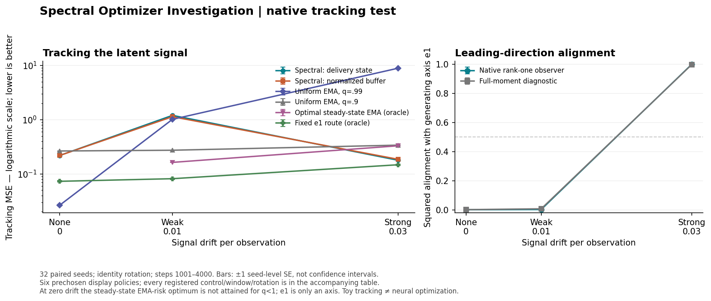

# I18: native directional tracking works conditionally, after a costly startup

8 September 2026. **Multi-seed synthetic tracking evidence, not neural training.**
Acquisition, independent integrity/algebra audit and independent report-arithmetic
corroboration are complete and passing.

## Main finding and its qualification

The actual finite streaming observer learns the useful changing direction in
the predeclared strong-drift case. Its constant-preserving response (`native_cp`)
has late-window mean squared tracking error **0.178266**, versus **0.329201** for
the analytically steady-state-optimal single EMA. Every one of the 32 paired
seed comparisons favors CP. This is approximately **45.8% lower late error**,
and the registered conjunction of useful alignment and superiority to all
predeclared uniform/scalar controls is met.

**This is not a whole-run win.** The registered startup and transition windows
are adverse. Combining all 4,000 observations gives descriptive mean error
**0.472476 for CP versus 0.336579 for the optimal-EMA comparator**. This whole-run
description is post-hoc, not a replacement primary endpoint; 24 seeds favor EMA
and eight favor CP over the whole run. The experiment
therefore demonstrates a conditional late mechanism with a substantial cost
to learning the direction, not an immediately better smoother or optimizer.

At weak drift, the observer instead follows the high-variance nuisance direction
and CP is much worse than EMA. A separate, pre-outcome theoretical note also
constructs a stronger scalar trend-correcting filter outside the registered
single-EMA/scalar-mixture class. Neither limitation erases the native late-stage
success; both restrict what it establishes.

Direct evidence: [accepted full summary](analysis-001/summary.json), especially
`strong_drift_registered_conjunction`, `primary_identity_late_paired_contrasts`,
`equal_seed_mse_summaries` and `equal_seed_alignment_summaries`;
[integrity/algebra audit](analysis-001/audit.json);
[all 228 policy/window/rotation means](plots-001/all-policy-window-means.csv).

## What was tested

The [frozen protocol](protocol.md) specifies a two-dimensional, externally
generated signal `s_t = (a(t-1), 0)` observed with independent Gaussian noise
of coordinate variances 1 and 4. Drift is `a = 0, .01, .03`. There are 32
independent noise seeds, reused across drift cells and a 45-degree rotation
sensitivity check: **192 streams, not 192 independent seed replications**.
Every stream has 4,000 observations. No parameter optimization, forward pass,
backward pass or neural training occurs.

The unchanged native stable rank-one observer uses decay .99 and estimates
centered temporal variation. The experimental response keeps a slow running
mean and treats the learned direction differently from its complement.
`native_cp` preserves a matched constant input even while that direction moves.
`native_i17` has the earlier stationary-gain-normalized response, whose moving
direction introduces an additional history-transport term. Both are specified
in [tracking_core.py](tracking_core.py); neither is a new production default.

Controls include raw observations, three uniform EMAs, four scalar mixtures,
the analytical steady-state-optimal uniform EMA for each nonzero drift, and
two fixed-direction oracles. The useful oracle is given the true changing
direction; the nuisance oracle is given the wrong direction. The optimal EMA
uses known signal/noise parameters, not observed late-window outcomes. It is
optimal for the theoretical steady-state single-decay class, **not claimed
optimal for this finite 4,000-step initialization**. Zero drift has no finite
steady-state optimum within `q < 1`, so that comparator is omitted there.

Primary window: observations **1001–4000**. Startup **1–100** and transition
**101–1000** were also frozen and retained. Means and standard errors pool
independent seed-level measurements equally. Within-stream observations,
rotations and reused control endpoints are not counted as new independent seeds.

## Complete late-window control comparison

Identity rotation; 32-seed mean squared error, lower is better. Exact values,
seed-level statistics and all other windows are in the linked JSON/CSV above.

| Policy | Zero drift | Weak drift .01 | Strong drift .03 |
|---|---:|---:|---:|
| Raw | 4.992916 | 4.992916 | 4.992916 |
| EMA .9 | .264020 | .272574 | .338280 |
| EMA .99 | .026380 | 1.011605 | 8.862637 |
| EMA .999 | .138611 | 79.158222 | 709.977230 |
| Optimal single EMA | — | .162732 | .329201 |
| Scalar k=0 | .026380 | 1.011605 | 8.862637 |
| Scalar k=.5 | .496340 | .752028 | 2.782551 |
| Scalar k=.9 | .428927 | .449694 | .611586 |
| Scalar k=1 | .264020 | .272574 | .338280 |
| Useful-direction oracle | .072898 | .081451 | .147158 |
| Nuisance-direction oracle | .217502 | 1.202727 | 9.053759 |
| Native I17 response | .218101 | 1.132087 | .185603 |
| Native constant-preserving response | .218067 | 1.197366 | .178266 |

`k=0` and `k=1` duplicate EMA .99 and .9 respectively; they are not extra
independent confirmations. Strong-drift optimal EMA decay is .915443393;
weak-drift decay is .958116610.

For the strong case, comparator-minus-CP paired mean effects are:

- Optimal EMA: **+.150935 ± .001893 standard error**, 32 favorable seeds.
- I17 response: **+.007337 ± .000171**, 32 favorable seeds.
- Useful oracle: **−.031108 ± .001407**, all 32 favor the oracle.

These are descriptive paired effects, not multiplicity-adjusted significance
claims. The full primary set contains 35 contrasts, including adverse cells.
At weak drift, optimal-EMA-minus-CP is **−1.034633 ± .004057** and
I17-minus-CP is **−.065279 ± .001924**; all 32 seeds favor those comparators.
Thus removing the moving-action history term is not universally beneficial.

## Startup and finite-horizon cost

Strong drift, identity rotation, equal-seed mean MSE:

| Window | Native CP | Optimal EMA | Useful oracle | Native I17 |
|---|---:|---:|---:|---:|
| Startup 1–100 | 1.460655 | .632947 | 2.318898 | 1.454941 |
| Transition 101–1000 | 1.343377 | .328243 | .182835 | 1.363293 |
| Primary late 1001–4000 | .178266 | .329201 | .147158 | .185603 |

The post-hoc whole-horizon mean weights these windows by 100, 900 and 3,000
observations. It is adverse for CP even at strong drift: .472476 versus .336579.
The whole-run optimal-minus-CP paired effect is −.135896 ± .033338 standard
error (24 negative/eight positive seeds). At weak drift the corresponding means
are 1.161006 and .178684, all 32 favoring EMA. These whole-horizon calculations
were independently recomputed from raw output/s arrays in the
[report corroboration](report-check-001/report-audit.json). Finite
initialization affects the scalar and oracle controls too; the useful oracle's
poor first 100 steps illustrate why asymptotic risk is not startup performance.
No break-even time beyond this horizon has been measured.

This figure shows only the **predeclared late window**, not whole-run advantage.
Error bars are ±1 seed standard error, not confidence intervals. The display
subset and source were frozen before reading the numerical outcomes; all
policies/windows remain in the CSV. Manifest (artifact not distributed in this public snapshot) records
23 plotted points and exact input/output hashes.

## What the mathematics and observations say together

1. **Conditional directional learnability is now observed, not merely assumed.**
   At strong drift, mean squared alignment with the useful axis is .998460 for
   the finite native observer and .996762 for the full-moment diagnostic. The
   pre-existing population construction correctly predicted useful direction
   selection above a drift/noise boundary. The native response comes close to,
   but does not match, the useful oracle's late error.
2. **The same covariance criterion is wrong in the adverse regime.** Weak-drift
   native alignment is .003469 and full-moment alignment .008098. Yet the useful
   oracle reaches .081451 versus optimal EMA .162732. Directional headroom
   exists; the variance-based selector fails to find it. At zero drift, the
   reported e1 alignment (.001685) is a reference-axis diagnostic, not alignment
   with a genuinely changing signal.
3. **History transport is real but not uniformly damaging.** The exact
   response-transport identity (artifact not distributed in this public snapshot) separates CP
   from I17. Its saved-array residual is at most 2.68e−13. CP modestly improves
   strong-drift late error, but worsens weak-drift error. A claim that the term
   explains all earlier spectral deficits would be false.
4. **A single EMA is not the strongest scalar comparison.** The separately
   reviewed trend-corrected scalar note (artifact not distributed in this public snapshot)
   derives `D = 2 EMA(g) − EMA(EMA(g))`. On an affine signal it cancels
   asymptotic lag using signed temporal weights. At decay .99 its theoretical
   steady-state MSE here is .062562, below the fixed useful route's .145632.
   It is outside the single-EMA class, was **not an I18 arm**, and may overshoot
   or fail on curved/changing signals. This is theory, not a finite-run result.

Paired rotation effects on late CP/I17 mean MSE are at floating-point noise
scale (absolute means below 1.4e−15). This supports numerical equivariance of
this test, not independent replication or generalization to another task.

The strongest current interpretation is **conditional directional routing plus
temporal response**, not generic semantic denoising and not “EMA always wins.”
The I8 selective-learning toy, I15 positive learning results and I16/I17 neural
scalar comparisons remain separate evidence with their own boundaries. I18
does not revise any neural endpoint or identify a neural causal mechanism.

## Provenance, confidence and next work

The next test should compare directional routing with genuine scalar trend
correction, measure learning-time costs, and deliberately break the affine
assumption. The prospective next design (artifact not distributed in this public snapshot) is not a launched arm
or an invitation to rerun I18. The overall investigation remains active.
