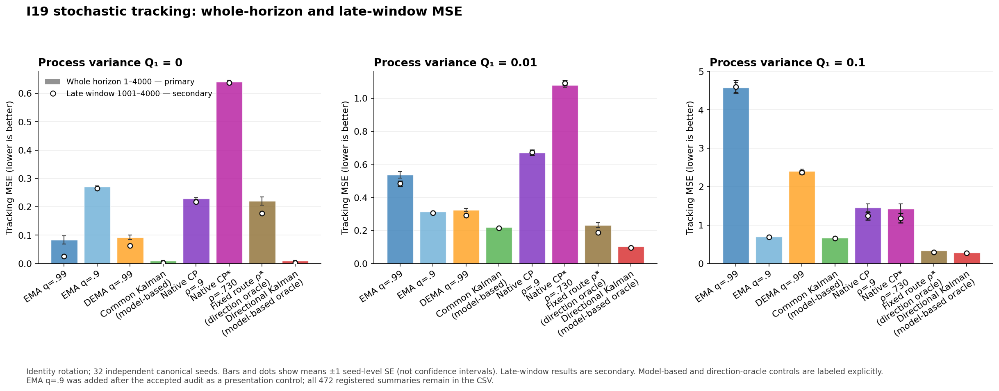

# I19: directional headroom survives, but the native stochastic tracker misses it

8 September 2026. **32-seed synthetic tracking evidence**, not neural training.

## Finding

The native observer satisfies the registered strong-process **late alignment**
prediction, but neither native constant-preserving response beats a simple
EMA with decay .9 on mean whole-horizon or late error in that cell. This is not
only a startup penalty. Meanwhile, useful-direction oracles outperform the
common temporal controls in the strong cell, consistent with the constructive
theory. A useful population direction and some native direction learning are
therefore insufficient for competitive finite tracking in this configuration.

The slow .99 EMA is itself very poor under stronger unpredictable change.
The conclusion is **not** that a long moving average always beats spectral
filtering, or that spatial selectivity has no value.

## Design and accepted evidence

The [frozen protocol](protocol.md) uses seeds19000–19031, each with one
canonical4000×3 Gaussian draw, across process variances Q1=0,.01,.1 and two
paired rotations. There are192 streams and768,000 observations, but only32
independent seeds. Signal changes only on the first generating axis, with
measurement variance diag(1,4). All policies start from the same first noisy
observation. Whole steps1–4000 are primary; startup1–100, transition101–1000
and late1001–4000 are secondary. No policy/seed/window was removed.

Acquisition completed in1093.768s with no failures. The independent NumPy
[audit](analysis-001/audit.json) passes83,505 checks over162,557,632 numeric
values, including all56 saved arrays, exact source/stream provenance and
state/output recurrences. All192 streams are accepted; no observer or RNG
replay occurred. The [summary](analysis-001/summary.json) retains all15,104
per-seed/window metrics,472 equal-seed MSE summaries,896 paired CP contrasts
and112 registered identity/whole primary contrasts.

Accepted SHA-256:

- Summary:135502cc7fc6a69bba7c16fd0ddcf53d10255a78065c0d2198fbe156fb76ba9f
- Audit:c549fc5d10dec4d644c857821e6e1e67a26ad6469e821f0d7cae4588671b28f2
- Completion:6a69b9f96f81dcd1066954f53f703280794c88ea29c32beed0c01fa329b4740e

Full source freezes, physical root and consumed process handles are in
launch.md (artifact not distributed in this public snapshot). Arrays remain on the desktop large volume, not in a
Git clone and not backed up. Separate saved-output
[report corroboration](report-check-001/report-audit.json) now passes196,664
scalar/discrete comparisons across every registered row, with maximum absolute
difference5.400e−13 within the prospectively fixed scale-aware tolerance.
This corroborates arithmetic/provenance, not a second observer-state audit.

## Primary: mean error over the whole horizon

The [complete 472-row CSV](plots-001/all-policy-window-means.csv) preserves all
policies/windows/rotations. Eight policies are displayed in the figure; adding
EMA .9 to the seven-policy presentation was disclosed after outcome access,
not a changed experiment or a selected primary test. Every original contrast
remains in the accepted summary. Panel scales differ.

Identity rotation; mean squared vector error, lower is better. Complete
uncertainties and seed values are in the linked summary; the selected table
is descriptive and does not replace the full registered comparison roster.

| Policy | Q1=0 | Q1=.01 | Q1=.1 |
|---|---:|---:|---:|
| EMA .9 | .271223 | .313665 | .694234 |
| EMA .99 | .083499 | .536660 | 4.580361 |
| DEMA .99 | .091984 | .324522 | 2.407822 |
| Analytic steady common EMA | not defined | .230180 | .665104 |
| Common Kalman, model-based | .009863 | .220254 | .663074 |
| Native I17 response | .228651 | .669145 | 1.474972 |
| Native CP, rho=.9 | .228737 | .669705 | 1.451344 |
| Native CP*, rho=.729844 | .641107 | 1.079888 | 1.427746 |
| Fixed useful route, rho=.9 | .117403 | .159845 | .540414 |
| Fixed useful route, rho=.729844 | .220423 | .231762 | .334247 |
| Directional Kalman, model-based oracle | .009863 | .103720 | .279242 |

The common Kalman control uses known process/noise totals but the same scalar
weight in both coordinates. The directional controls know the generating
direction, and the Kalman variant also its coordinate noise/process laws.
They are privileged model-based comparisons with matched first-observation
initialization, not unrestricted finite-horizon optima or deployable learned
competitors. The .9 EMA requires none of that direction/model information.
CP* was chosen analytically for the strong cell before outcomes, then kept
fixed across all cells; it is not a data-selected winner.

In the strong cell, paired `comparator MSE - native MSE` gives:

| Comparison | Mean effect ± seed SE | Native-favorable / comparator-favorable seeds |
|---|---:|---:|
| EMA .9 minus CP | −.757110 ± .103852 | 1 / 31 |
| EMA .9 minus CP* | −.733513 ± .127682 | 4 / 28 |
| Common Kalman minus CP | −.788270 ± .103249 | 1 / 31 |
| Common Kalman minus CP* | −.764673 ± .126929 | 3 / 29 |
| Native I17 minus CP | +.023628 ± .005202 | 29 / 3 |
| CP minus CP* | +.023597 ± .025415 | 23 / 9 |

SE is across the32 paired seeds, not a confidence interval or a multiplicity-
adjusted test. CP* has only a small mixed-seed mean advantage over CP in the
strong cell, and is worse in **every seed** in both lower-process cells.
Both CP policies lose to common Kalman in every seed at Q1=0 and.01. CP at
Q1=0 nevertheless beats EMA .9 in every seed: do not erase this comparator-
specific positive, or mistake a selected mean ordering for universal failure.

## Secondary: later learning does not recover the mean risk advantage

| Strong-cell policy | Startup MSE | Transition MSE | Late MSE |
|---|---:|---:|---:|
| EMA .9 | .901230 | .701499 | .685154 |
| Common Kalman | .730030 | .671884 | .658199 |
| Native CP | 2.106322 | 2.083420 | 1.239888 |
| Native CP* | 2.099539 | 2.172542 | 1.181915 |

Late common-Kalman comparisons still favor that comparator in28/32 seeds
against CP and26/32 against CP*. Strong late useful fixed-route risks are
.493358 at rho=.9 and.290390 at rho=.729844; the directional Kalman is.272044.
Thus favorable oracle headroom survives finite initialization and is not
merely a stationary theorem. These remain exogenous synthetic comparisons.

Strong-cell native squared alignment with the useful axis rises from.433486
at startup to.755563 ± SE.039265 late, above the registered .5 threshold.
The full-moment diagnostic reaches only.615854 ± SE.019982 late. The prediction
was explicitly alignment-only: it did not promise a whole-horizon risk win.
At Q1=.01, native/full late alignment is.002660/.005082; at Q1=0 the reference-
axis scores are.001692/.002255, where there is no moving signal to discover.
Absent/tied directions are separately masked rather than counted as learned.

The maximum absolute **mean** paired rotated-minus-identity MSE across the
reported cells/windows/policies is1.294e−14. This is numerical rotation
consistency in this2D setting, not extra independent replication or a general
invariance theorem for neural optimizers.

## Mathematical interpretation and competing hypotheses

1. **Directional potential is real under stated conditions.** The separately
   reviewed stochastic theorem (artifact not distributed in this public snapshot) proves fixed
   useful-route risk .499048 below the .658872 stationary lower bound for all
   admissible deterministic shared unit-gain causal LTI kernels, signed DEMA
   included. It does not bound adaptive, nonlinear or time-varying controls.
   The finite oracle results support that constructive example; native results
   show the implementation does not realize it here.
2. **Finite direction accuracy is a plausible bottleneck, not an identified
   causal fraction.** The pre-outcome Gaussian moment calculation (artifact not distributed in this public snapshot)
   gives population gap1.97005 but full-moment SD(M11)4.03081 under fixed
   forgetting. Serial correlation persists. The later
   fixed-angle calculation (artifact not distributed in this public snapshot) shows that, for
   a data-independent stationary direction, squared alignment must exceed
   .96557 at rho=.9 or.92998 at rho=.729844 to beat the common-LTI bound.
   Native moving/self-inclusive alignment cannot simply be plugged into that
   formula. It motivates precision as a question; it does not prove mediation.
3. **Rank truncation is not yet a demonstrated culprit.** Native late alignment
   actually exceeds the full-moment diagnostic here. Longer covariance memory,
   reduced action variation, confidence-dependent routing or less extreme
   complement smoothing might help, but all introduce other tradeoffs.
4. **Temporal tuning remains essential.** DEMA removes deterministic affine
   lag under the earlier theorem, but unpredictable increments still cost
   error; the slow EMA/DEMA results here are adverse. Neither a single slow
   average nor the spectral CP* tuning is robust across the three signal cells.

These findings preserve I18's favorable affine late result and its whole-run
reversal, I8/I15 constructive positives, and all I16/I17 neural comparisons.
They do not justify a production optimizer change or conclude the overall goal.

## Next discriminator

Use a bounded saved-stream counterfactual to separate direction estimation
from response design, with all original controls retained. The independently
derived separate mean/covariance memory formula supplies a principled candidate,
but slower startup and poorer response to a changing true direction must be
kept as adverse cases. A remedy designed after these outcomes needs fresh-seed
confirmation before an efficacy claim. No such follow-up is launched by this
report. No cloud spend, restart or additional user approval was needed here.
