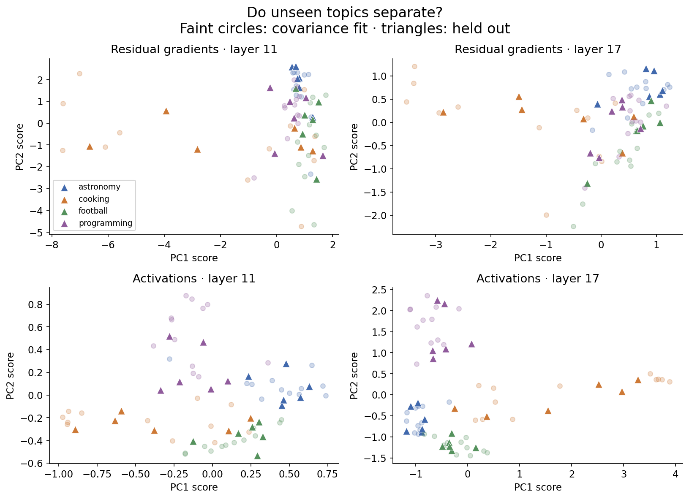
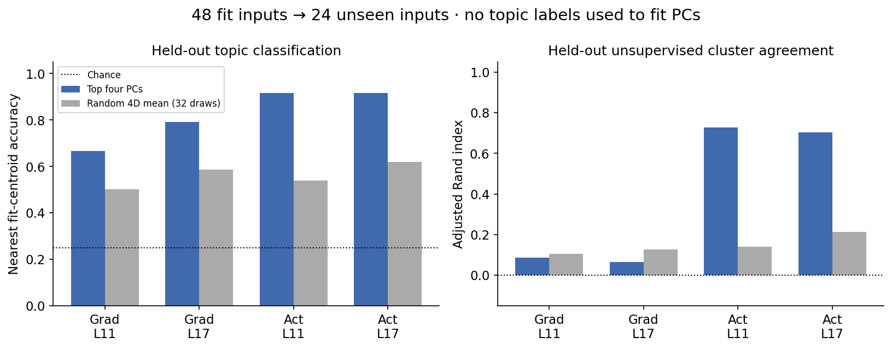
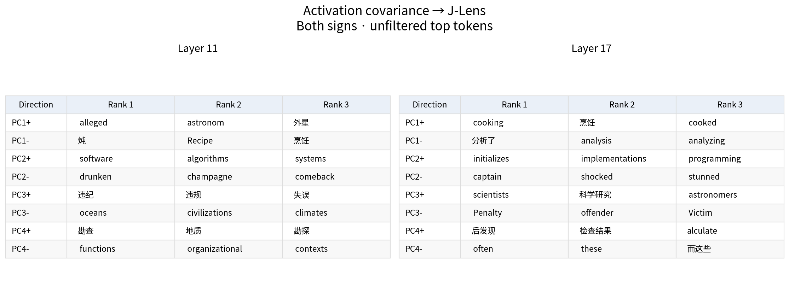
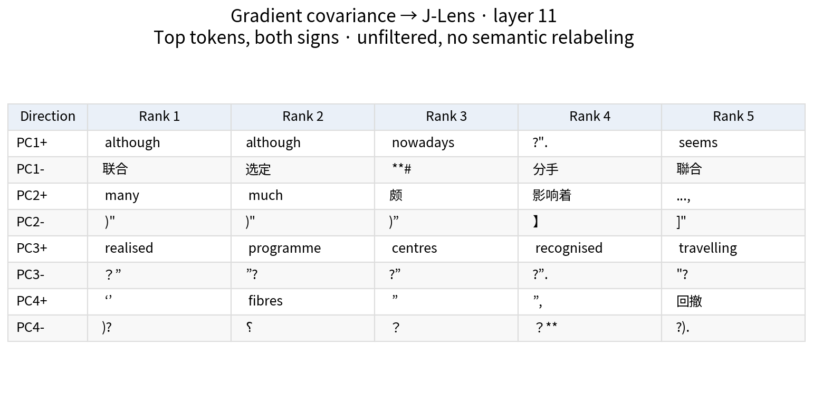
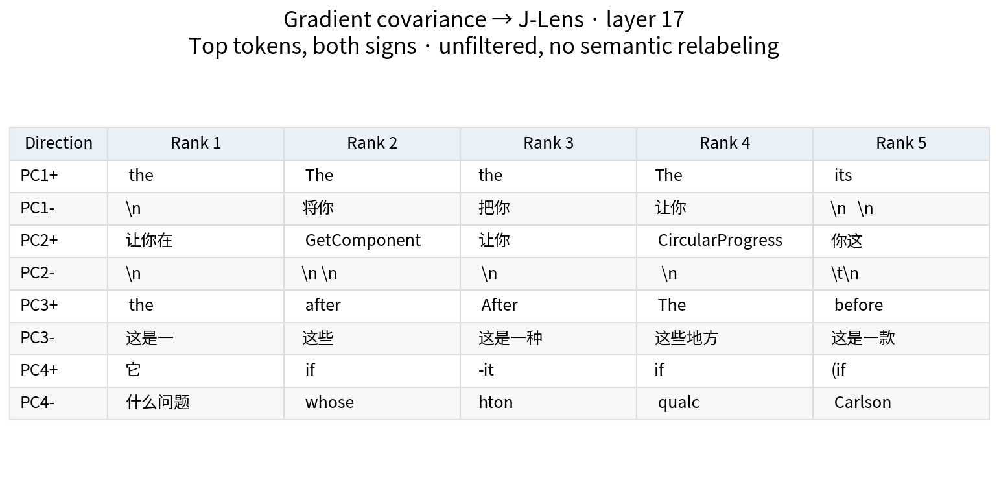
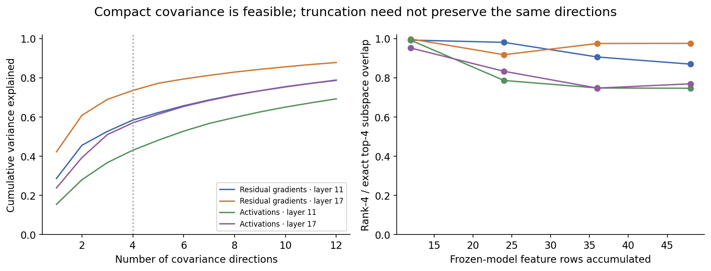

# J-Lens covariance pilot: activation concepts, weak gradient clusters

**Provisional, one frozen model and one fixed authored dataset.** The basic
covariance-to-J-Lens construction works. Activation covariance gives readable
topic directions and substantial held-out group separation. The tested residual
gradient covariance retains some topic information but does not produce clean
unsupervised topic clusters. This is a useful first result, not a test of full
parameter-gradient spectral clustering or a demonstration of safety selectivity.

## Measured results

All numbers below come from [metrics.json](metrics.json), computed from
features.npz (artifact not distributed in this public snapshot), with analysis_arrays.npz (artifact not distributed in this public snapshot)
and [readouts.json](readouts.json). The split and objective were fixed in
dataset.json (artifact not distributed in this public snapshot) and [protocol.md](protocol.md) before acquisition.

| Feature rows | Layer | Top-four variance | Held-out centroid accuracy | Random-four mean accuracy | Held-out KMeans ARI | Random-four mean ARI |
|---|---:|---:|---:|---:|---:|---:|
| Residual gradient | 11 | 58.39% | 16/24 (66.67%) | 50.26% | 0.0867 | 0.1052 |
| Residual gradient | 17 | 73.52% | 19/24 (79.17%) | 58.72% | 0.0640 | 0.1277 |
| Activation | 11 | 43.01% | 22/24 (91.67%) | 53.91% | 0.7273 | 0.1403 |
| Activation | 17 | 56.96% | 22/24 (91.67%) | 61.98% | 0.7037 | 0.2143 |

The centroid classifier uses fit-group labels; PCA and KMeans do not. KMeans
uses the known number of groups (four). Random controls are 32 seeded
orthonormal four-dimensional projections on these same inputs, not 32 independent
dataset replications. Accuracy chance is 25%; ARI chance expectation is zero.
No significance claim or best-layer selection is made.

## What the directions say

At layer 11, activation PC1 has astronomy-related tokens on one sign and
recipe/cooking tokens on the other; PC2 includes software and algorithms.
At layer 17, activation PCs include cooking, programming, astronomy, and
penalty-related readouts. These are descriptive readings of unfiltered rankings;
some directions/signs are vague or mix concepts. The evidence includes both
signs because an eigenvector's orientation is arbitrary.

The gradient PC readouts are much less obviously topic-like. They include
punctuation, function words, British spellings, and the common target “The”.
This interpretation is qualitative and was not scored by a blinded semantic
grader. Distinct token lists alone cannot establish semantic clusters.
The maximum absolute off-diagonal cosine between full centered J-Lens logit
readouts of the four gradient PCs is 0.171/0.126 at layers 11/17: the readouts
do not collapse into one direction here, but residual orthogonality is not
preserved exactly. Plain-lens and random-direction readouts are retained in
[readouts.json](readouts.json); this pilot does not establish a J-Lens advantage
over plain-lens semantic interpretation.

## Frozen-model streaming

The acquired fit vectors were replayed in one fixed randomized order without
further inference. Exact Welford rank-one scatter updates agree with batch
scatter to relative Frobenius error below 4e-16 in all four cases. This exact
accumulator costs O(d²) memory.

The separate rank-four truncated SVD accumulator uses O(dk) factor storage.
At 48 observations, its top-four subspace overlap with exact PCA is
0.870/0.976 for gradients and 0.746/0.769 for activations at layers 11/17.
Overlap is the average squared cosine of the four principal angles, not a
percentage of variance or semantic accuracy. Neither implementation is an EMA.
This shows feasible accumulation and nontrivial truncation loss; it does not
show that more data improves semantic quality or that rank one is sufficient.

## Scope and checks

Qwen/Qwen3.5-0.8B is frozen, with 72 short English sentences in four deliberately
separated topics, 48 fit and 24 held out. The residual is sampled after blocks
11 and 17 at the final input token. Primary rows are gradients of the negative
log probability of the same next token ` The` (ID561), using the Euclidean
cotangent-to-direction convention. This objective avoids topic labels entering
the target, but measures a specific continuation preference rather than broad
natural training-gradient covariance. Some cooking examples are imperative
while other topics are mostly declarative, leaving a concrete style/topic
confound. Distinct vocabulary and authored sentence patterns also make this
an easy topic test. These are limitations of the current experiment, not
established causes of its effects.

The B×B Gram eigensystem is lifted into the 1024-dimensional residual space.
J-Lens cannot directly consume a full parameter-space vector. This pilot tests
covariance PCA, not a graph-Laplacian spectral clustering algorithm. It neither
updates weights nor establishes an optimizer benefit. The supplied lens fits
the named model and dimensions, with 233 Wikitext prompts; its upstream metadata
does not pin the model-weight commit used during fitting. Our model and lens
download revisions and lens hash are fixed in acquisition.json (artifact not distributed in this public snapshot).

The first and only acquisition completed in 64.784 seconds with 1.5594GiB peak
torch GPU allocation. It asserted unchanged parameter version counters,
absent parameter gradients, finite features/readouts and valid leading
eigenvalues. No paid compute was used. The model used the local PyTorch fallback
for linear attention; the missing fast-path notice was not a failure.

[audit.json](audit.json) records executor self-audit, not an independent-agent
replication: independent SVD of raw features, source/dataset pins, manual
centroid arithmetic, ARI/report checks, and an independent CPU implementation
of the pinned model's RMSNorm/unembedding for all J-Lens and plain readouts.
CPU/GPU BF16 rounding is checked with declared tolerances. All seven plots were
visually inspected; escaped newlines/tabs are literal token-display notation.

## Next smallest test

Use a fresh, style-balanced set of natural passages and gradients of genuine
observed next-token loss, retaining activation PCA and random controls. Keep
the same model, fixed layers and rank; approximately one local GPU minute for
another 72 short inputs, with a ten-minute hard cap. This separates a common-
target/style limitation from a more general failure of gradient directions to
give topic-like J-Lens readouts. No such follow-up has been run.

Sources: [Anthropic method and paper](https://transformer-circuits.pub/2026/workspace/index.html),
[reference implementation](https://github.com/anthropics/jacobian-lens),
[pinned lens repository](https://huggingface.co/neuronpedia/jacobian-lens/tree/0731326edff4ae730ffc5356fe1a4728c748b3a6).
