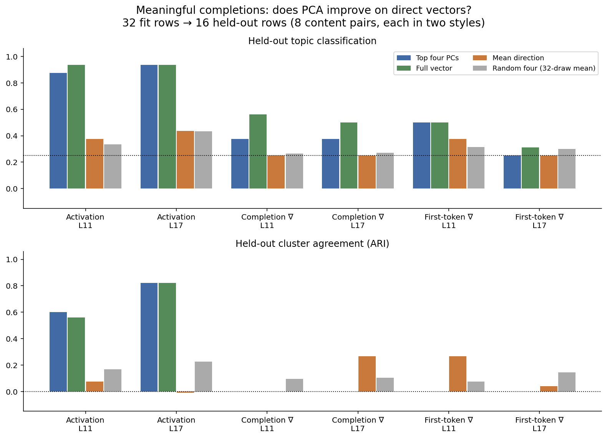
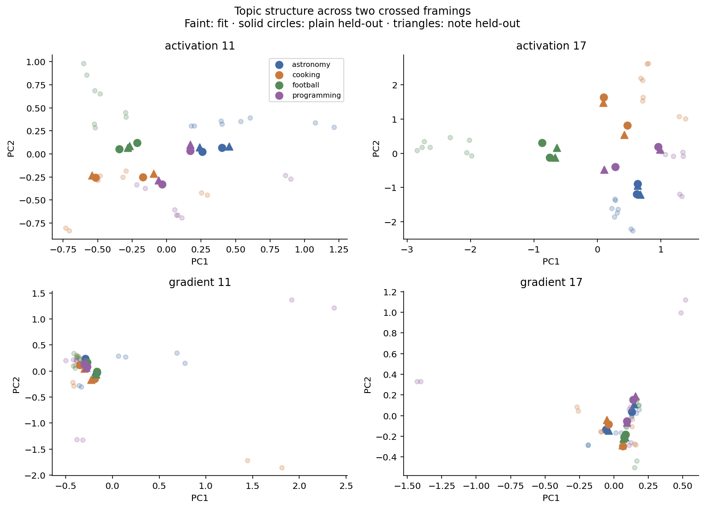
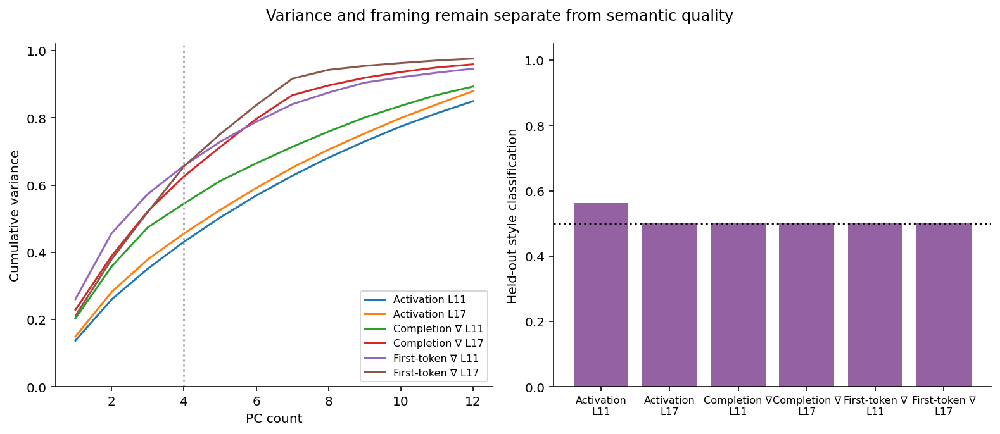
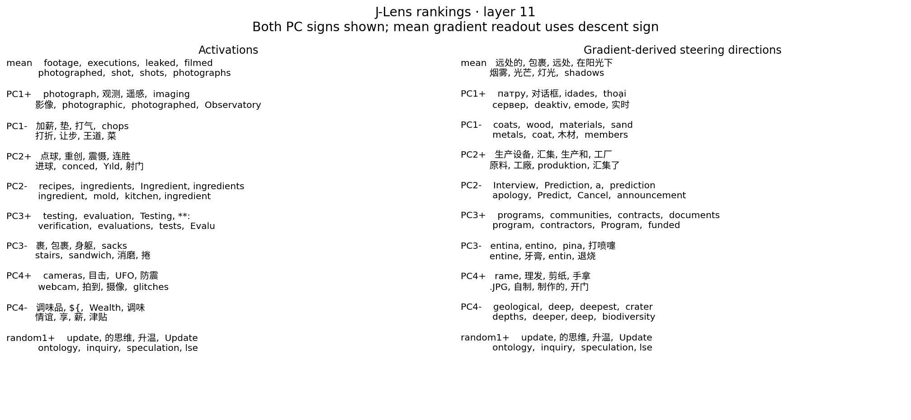
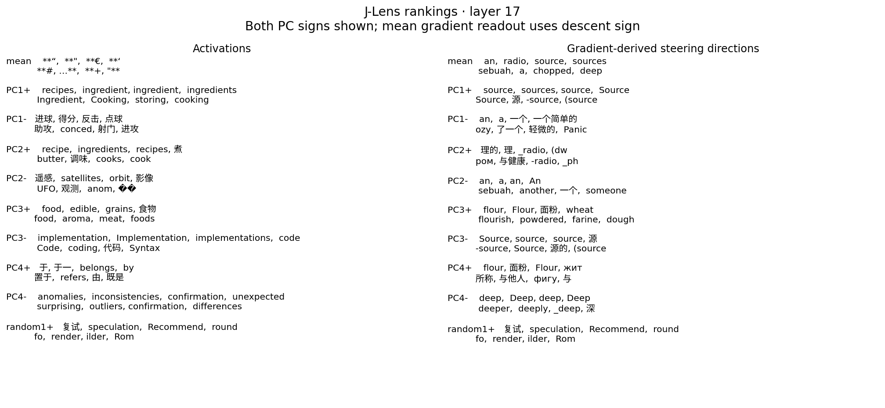
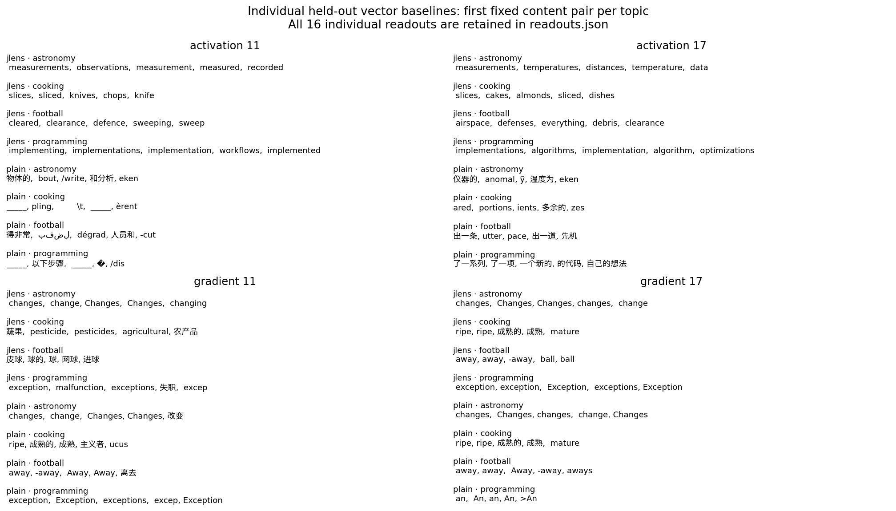

# Meaningful completions preserve activation structure, not gradient clusters

Provisional single frozen-model authored-panel result. All values below are from
[metrics.json](metrics.json), calculated once from features.npz (artifact not distributed in this public snapshot).
48 rows contain24 distinct content pairs, crossed with two framings.32 fit rows
and16 held-out rows contain only8 unique held-out content pairs, not16 independent
examples. The previous pilot is preserved; this is a new dataset and objective.

| Features | Layer | PCA topic accuracy | Full-vector accuracy | Random4 mean accuracy | PCA ARI | Full ARI |
|---|---:|---:|---:|---:|---:|---:|
| Activation |11|14/16|15/16|33.59%|.601|.561|
| Activation |17|15/16|15/16|43.36%|.821|.821|
| Completion gradient |11|6/16|9/16|26.56%|0|0|
| Completion gradient |17|6/16|8/16|27.15%|0|0|
| First-token gradient |11|8/16|8/16|31.45%|0|0|
| First-token gradient |17|4/16|5/16|29.88%|0|0|

PCA is rank4; nearest-centroid classification uses fit labels. KMeans uses four
clusters but no labels in fitting. Random means use32 projection draws, not32
independent experiment seeds. Layer11 activation PCA loses one correct row to
full vectors; layer17 ties. Compression preserves substantial topic information,
but does not improve classification over the full-vector baseline here.
Full-vector individual1NN accuracy is75%/81.25% for activations and18.75%/31.25%
for completion gradients. Mean-direction projection accuracy is37.5%/43.75%
for activations and25%/25% for completion gradients. Constant mean gives25%.

Activation PC rankings include photograph/observatory tokens at11 and
recipe/ingredient tokens at17. Gradient PC rankings remain mixed; the first
direction at17 prominently reads source/sources. These are unfiltered descriptive
rankings, not blinded semantic scores. Every held-out individual, fit mean,
both PC signs, random directions and plain-lens controls remain in
[readouts.json](readouts.json). No measured semantic-readout advantage over plain
unembedding is claimed. Panels show a fixed subset for readability.

Loss is the mean teacher-forced NLL over every completion token; gradients are
at the same final-prefix residual coordinates, layers11/17. Weights are frozen.
J transports activation directions forward; gradients pull back with J transpose.
The gradient rankings identify covectors with Euclidean residual vectors and
read descent steering directions. They are not coordinate-invariant gradient
transport or measured causal logit derivatives. Final norm(Jv) is a descriptive
lens operation, not the final-norm derivative at an actual context.

Acquisition (artifact not distributed in this public snapshot) reports the sole34.144s run,1.598GiB peak torch
GPU allocation, frozen checks and pinned source/model/lens provenance. The
launch receipt (artifact not distributed in this public snapshot) records600s/8GiB/no-swap/oneCPU/no-restart
caps. The transient unit finished and was garbage-collected; no scientific job
remains. No paid spend or model updates. CPU analysis exit0.
Self-check (artifact not distributed in this public snapshot) passes independent SVD and centroid arithmetic,
source hashes, valid completion boundaries and split counts. This is executor
self-check, not independent-agent replication. No acquisition retry occurred.