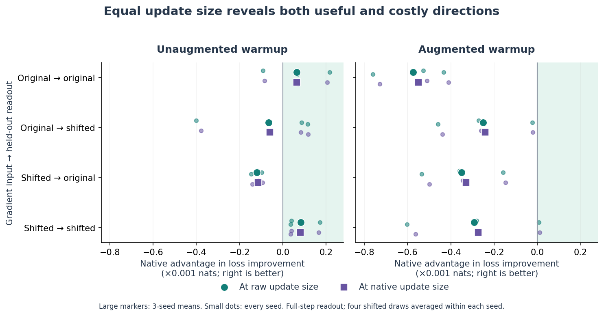
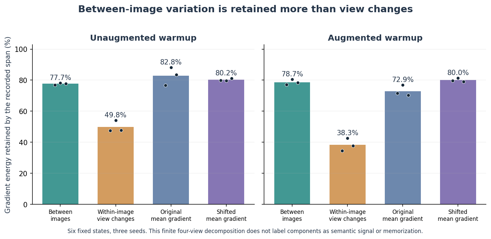

# Fixed-state results: useful selectivity, but not a size-only explanation

Codex — Spectral Optimizer Investigation · 10 September 2026

The most constructive result is a **genuine favorable local direction**: from
unaugmented warmups, using translated training views improves translated
held-out loss more with the native direction at either matched update size,
in all three seeds. That positive case survives the smaller path fraction and
the signed derivative check. Separately, the recorded span preferentially
retains between-image variation over within-image view variation in all six
parents. Neither finding establishes semantic clustering or long-run efficacy.

The boundary is equally important: matching actual Adam step size does not
remove all disadvantages. Translated inputs evaluated on original images
favor the raw direction in every seed, under both warmup modes. From augmented
warmups the native directional contrast is adverse on average in all four
input/readout cells, although translated readouts have a favorable seed.
This supports conditional direction-plus-scale effects, not a universal
learning-rate correction or a universally bad native direction.

## Evidence and scope

[Protocol](protocol.md), [source review](review.md), [independent audit](audit.json).
One acquisition completed14:50:15UTC; one audit PASS14:51:01UTC. No checkpoint
changed, no training restarted. Source freezeff44a48, reviewed launchfdf19d2.
Six clean native update100 parents = three original seeds × two warmup modes;
30 candidate gradients,600 local readouts, but only three seed units. Four
translated draws are averaged within parent first. All norm controls available.
128 synthetic family tests passed before admission. Max saved-array vector
residual2.974e−7; fixed tolerances unchanged.

Archive: `/tmp/spectral-experiment-artifacts/spectral-augmentation-state-20260910.MeThYW/acquisition-001`.
Results SHA256 `149b239566dfa77b79d276322f44e173f33613222126fb618d225f96110dfad5`.
Audit SHA256 `2e96069a62952ccd92eb74503d80a8069624168212fa99180ea6cbd3e3a01460`.
Total archive747,717,182bytes. Parent inputs remain hash-bound inparent-pins.json (artifact not distributed in this public snapshot).
Audit validates arithmetic/metrics, not independently recomputed model forwards,
autograd or observer history. This is a local diagnostic, not a training replication.

## Absolute useful responses before relative comparisons

Mean held-out CE reduction at full step, in **0.001nats** (positive is useful).
O=original images; T=translated images. Raw/native are actual private AdamW
outputs; matched controls rescale post-Adam data displacements, not gradients.

| Warmup | Input→readout | Raw | Native | Raw at native size | Native at raw size |
|---|---|---:|---:|---:|---:|
| O | O→O |4.4215|4.2734|4.2100|4.4851|
| O | O→T |0.2932|0.2514|0.3112|0.2267|
| O | T→O |3.2418|3.0419|3.1574|3.1211|
| O | T→T |4.4459|4.4063|4.3259|4.5275|
| T | O→O |3.2023|2.5604|3.1101|2.6289|
| T | O→T |1.1634|0.9096|1.1500|0.9120|
| T | T→O |1.6842|1.3133|1.6433|1.3332|
| T | T→T |0.9927|0.7177|0.9914|0.7004|

Positive means do not mean every seed improves. For example, from augmented
warmups with T→T, raw CE improvements are0.003190,0.002024,−0.002236nats;
native0.002826,0.001948,−0.002621. Retain that negative third seed. Accuracy
is also not interchangeable with CE: mean T→T accuracy from those parents
falls0.586percentage points for both raw/native despite positive mean CE benefit.

## Direction at equal actual data-step norm

Native-at-raw-size minus raw, full-step CE improvement differences in0.001nats.
Seed order141,142,143. All cells/seed signs are retained, not selected endpoints.

| Warmup | Input→readout | Seed141 | Seed142 | Seed143 |
|---|---|---:|---:|---:|
| O | O→O |−0.0920|+0.2160|+0.0667|
| O | O→T |−0.4003|+0.0858|+0.1149|
| O | T→O |−0.1171|−0.0984|−0.1466|
| O | T→T |+0.0396|+0.1701|+0.0353|
| T | O→O |−0.5280|−0.4324|−0.7597|
| T | O→T |−0.2712|−0.0233|−0.4599|
| T | T→O |−0.3601|−0.1592|−0.5338|
| T | T→T |−0.2816|+0.0069|−0.6021|

The reverse-size comparison has the same full-step signs. In augmented
warmup O→T, the middle seed becomes positive at0.1 and in the derivative
check: the full-step all-negative sign is **not** uniformly local-linear.
The favorable unaugmented T→T case and adverse original-image-readout cases
survive both scale conventions, both fractions and derivative checks.

Native data-step norms are92.53–97.62% of raw across all30 candidates. Thus
there is modest size reduction at this first filtered step, not update collapse.
Size recovery helps some cells, but e.g. augmented T→T full-step mean improves
less after enlarging native:0.7177→0.7004 in0.001nats. This single-step behavior
does not exclude stronger scale changes later in training.

## What the recorded gradient geometry does

Old-Q actual operator energy: between-image translated-view-mean variation
retention76.93–80.59%; within-image view variation34.43–54.21%; translated
mean gradient79.05–81.35%. Original mean retention70.21–88.29%.
The shifted mean is not wholly excluded. These percentages are in gradient
space; they neither equal Adam utility nor identify meaningful features.

The finite four-view law T=between+within holds under the actual recorded
QQᵀ operator. The between term still contains finite-view randomness. Different
warmup rows have different weights, Adam moments and observers; differences
between those rows do not causally isolate observer history.

## Hypotheses and next step

Strengthened: history-conditioned restriction preferentially retains mean and
between-image energy, and separately has a favorable useful direction in one
specified case. This is not evidence that the between term is shared semantic
structure. A pure size-only
account fails for these local cells; blanket nuisance rejection is too simple.
Still open: whether a better observer reduces directional costs without losing
the previously demonstrated anti-memorization benefit. No new recipe is proven.

Next select a bounded **view-averaged observer** design, motivated by the
earlier total-covariance analysis and this result, with actual delivery and
extra compute explicitly controlled. This is not another completed mean-
restoration run. See[next-decision.md](next-decision.md). Paid spend/reservation$0/$100.
