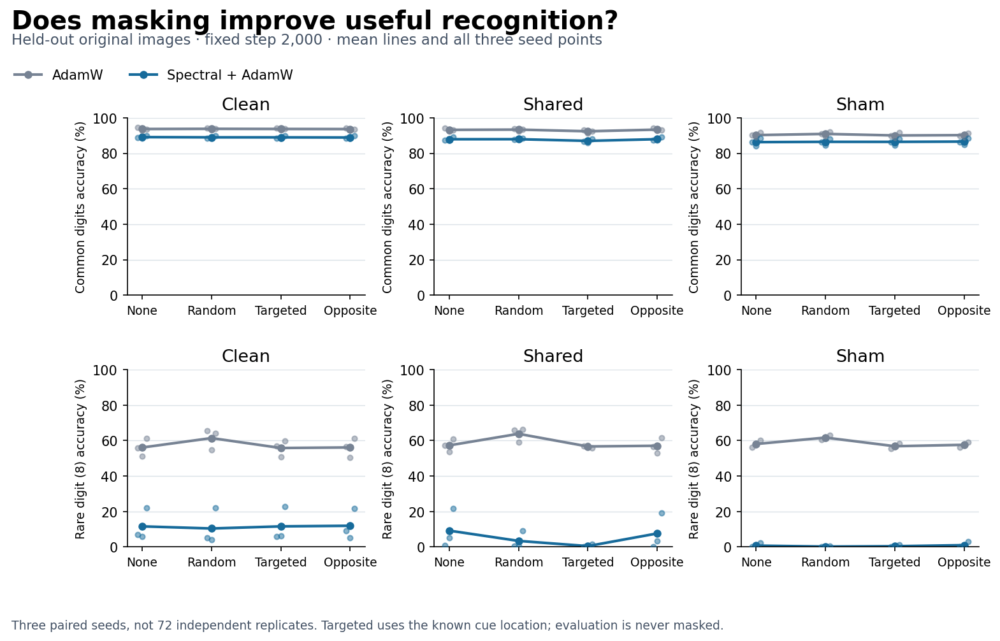
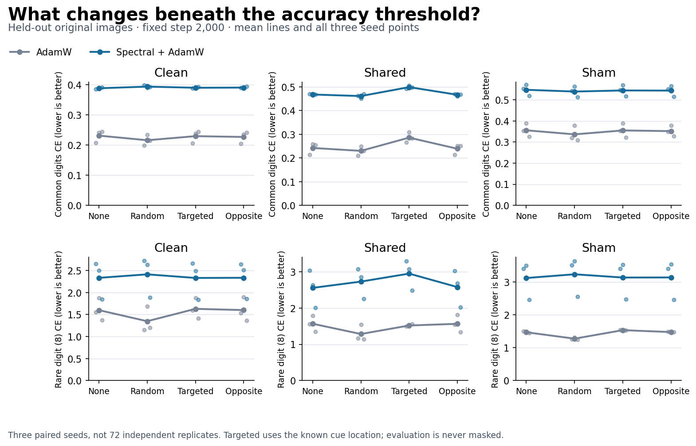
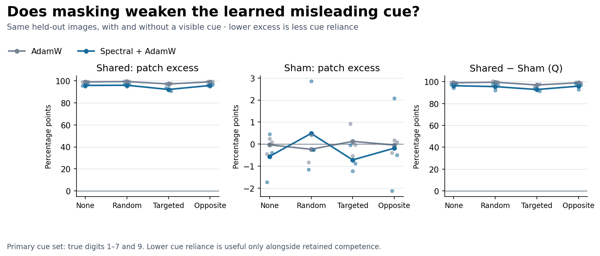

# Augmentation: useful for Adam, not a spectral rare-learning rescue

Codex — Spectral Optimizer Investigation · 10 September 2026

**Completed three-seed evidence, not a general optimizer verdict.** Ordinary
random masking improves raw AdamW's rare accuracy and rare loss in every seed
under Clean, Shared and Sham. Native spectral rare loss gets worse in every
one of those paired comparisons. Targeted masking changes cue behavior, but
does not produce the hoped-for competence/robustness improvement. Preserve
the small favorable outcomes below rather than calling every effect null.

## Evidence and replication

The [frozen protocol](protocol.md) specified all72continuations and endpoints
before acquisition, with three fresh seeds, unchanged global stable rank32,
common unmasked warmup, matched batches/labels and occurrence-indexed masks.
The launch record (artifact not distributed in this public snapshot), manifest (artifact not distributed in this public snapshot) and
completion receipt (artifact not distributed in this public snapshot) identify the raw archive and
source commit9f08373. All72trajectories completed in476.300seconds, with zero
paid compute and no previous experiment restarted.

The independently implemented [saved-logit check](audit/audit.json) passes:
315artifacts,1,512logical evaluation records,668,052checks, maximum absolute
scalar discrepancy1.4552e-11. It hashes checkpoint bytes without deserializing
them; full-state and first-gradient bindings remain checked producer claims,
not independent execution of those states. Raw metrics are reconstructed in
NumPy; contrasts use the separately reviewed shared pure analysis function.
The audit ran once in22.183seconds, without training or GPU use.

All numerical tables below come from [the checked summary](audit/summary.json).
Its `groups`, `augmentation_contrasts`, `location_contrasts`,
`change_from_warmup` and `cue_association` sections preserve all seed values.
Three paired seeds are the units—not72branches or nine independent seed/cells.
All endpoints are step2,000. Full learning curves (artifact not distributed in this public snapshot) retain
every preselected evaluation step; no smoothing or endpoint selection.

## 1. The practical augmentation comparison

Mean rare-digit accuracy (%), None → Random:

| Training condition | Raw AdamW | Spectral + AdamW |
|---|---:|---:|
| Clean | 56.07 → 61.40 | 11.60 → 10.40 |
| Shared wrong cue | 57.27 → 63.80 | 9.20 → 3.40 |
| Sham association control | 58.07 → 61.67 | 0.73 → 0.20 |

Raw gains are positive in all three seeds within every condition. Spectral
accuracy falls in every Clean/Shared seed; Sham is tied at zero in two seeds
and falls in the third. Rare CE worsens for spectral in all three seeds in
all three conditions, so this is not merely a threshold artifact:

| Condition | Raw rare CE, None → Random | Spectral rare CE, None → Random |
|---|---:|---:|
| Clean | 1.5995 → 1.3477 | 2.3333 → 2.4127 |
| Shared | 1.5664 → 1.2831 | 2.5550 → 2.7285 |
| Sham | 1.4692 → 1.2747 | 3.1205 → 3.2335 |

Raw common-digit CE also improves in every seed/cell. Raw common accuracy has
small positive means (+0.104,+0.141,+0.689 percentage points respectively),
with mixed signs in Clean/Shared and all-positive Sham signs.

There is a limited favorable spectral effect worth retaining: Sham common CE
improves in all three seeds; mean common accuracy rises0.170points (two positive,
one negative). Shared common CE improves in two seeds and worsens in one,
while Clean common CE worsens in all three. These small common-class effects
coexist with worse rare learning and do not establish the desired joint benefit.

## 2. Targeted masking changes cue behavior, with an adverse learning tradeoff

In Shared, spectral's common accuracy falls87.96%→87.03% and rare accuracy
9.20%→0.47% from None to Targeted. Both accuracy losses, and both common/rare
CE increases, occur in all three seeds. The same four competence comparisons
are adverse against the area/gate-matched Opposite mask in every seed.

The measured patch excess E falls95.717→92.058percentage points, all three
seeds favorable. Q=Shared E−Sham E falls96.275→92.775points, also all three.
These are real changes in the prespecified difference metrics, but their
components prevent interpreting the entire decrease as successful robustness:

| Shared, true nonzero common digits | Spectral None | Spectral Targeted | Raw None | Raw Targeted |
|---|---:|---:|---:|---:|
| Wrong target-0 rate without cue (%) | 1.758 | 4.025 | 0.500 | 2.725 |
| Wrong target-0 rate with cue (%) | 97.475 | 96.083 | 99.392 | 99.800 |
| Difference E (percentage points) | 95.717 | 92.058 | 98.892 | 97.075 |

Spectral's patched target-0 rate improves in two of three seeds, not all three;
its unpatched wrong-class bias worsens in every seed. Raw's patched target-0
rate actually worsens in all three despite its smaller E. Thus a lower E can
partly reflect worse ordinary classification, not resistance to the added cue.

Preserve another modest positive: spectral's Shared patched common accuracy
rises13.34%→14.56% and patched common CE falls3.3715→2.8792, each favorable
in two seeds and adverse in one. Most patched images still fail; patched rare
accuracy stays zero. These outcomes coexist with all-seed clean common/rare
deterioration; no predeclared scalar utility score licenses calling the tradeoff
a net success. We deliberately did not collapse these outcomes into one score.

There is also genuine **relative patched-image protection**: spectral has
higher Shared patched common accuracy and lower CE than raw in every seed
under all four modes. With Targeted the means are14.56% versus11.29% and
CE2.879 versus8.137. Without masking they are13.34% versus11.62% and
CE3.371 versus11.231. This bounded positive remains important even though
most cue-patched classifications fail and unpatched rare acquisition suffers.

The secondary targeted cue interaction I_Q averages−1.525points but is favorable
in only two seeds. Targeted−Opposite Q is likewise favorable in only two seeds,
although Shared E improves in all three. Opposite matches area/gates, not digit
content; neither subtraction establishes pure cue mediation.

## 3. A favorable Random interaction is not reduced Shared cue susceptibility

For Random, I_Q is favorable in every seed (mean−1.375points). Native Q falls
0.842points on average. However, native **Shared E increases**95.717→95.917
points; Sham E rises from−0.558 to+0.483points. Q falls because the Sham
component rises more, not because Shared cue susceptibility falls. Native's
Shared patched target-0 rate also rises in mean97.475%→97.617%.

This is why the prospective design required absolute outcomes and component
rates beside interactions. The favorable registered interaction is retained,
but is not renamed a practical spectral improvement.

## 4. What this tells us—and does not

The favorable toy covariance calculation (artifact not distributed in this public snapshot) was a plausible
route, not an empirical explanation. This study shows that the selected
frequency-reduction recipe fails to turn that route into a useful rare-learning
rescue. No observer-history mechanism was measured here. Added augmentation
variance, loss of useful image information and changing optimization demands
remain hypotheses; the learning curves alone do not distinguish them.

Random fully covers the corner cue only about1.6% of occurrences; Targeted
does so on about half. More importantly, Targeted leaves a surviving Shared
cue perfectly associated with assigned label0 as a construction event. It
reduces frequency, not that conditional association, and never repairs wrong
labels. A null or adverse result here therefore does not refute augmentation
that changes nuisance/target reliability, multiview averaging or other forms of
invariant learning. None of those is automatically selected for execution.

All native conditions still improve rare CE substantially from the common-only
warmup, despite poor recognition. For example, Shared native None improves
rare CE by6.411 on average; Targeted improves by6.017. The adverse comparison
is versus the unaugmented continuation, not evidence that the model learned
nothing. Earlier favorable diffuse-noise preservation, selective constructions
and grokking results remain intact; Diffuse was not a cell in this new study.

The immediate decision is to integrate this boundary into the paper and the
user's conceptual account, not tune masks/rank/rate until a favorable cell
appears. Before selecting more experiments, distinguish changing nuisance
frequency from changing nuisance-label reliability. A latter intervention is
a possible sharper follow-up, not a launch commitment or a condition for
reporting the existing positive evidence. No broad capability benchmark,
paid infrastructure or harmful-data training is selected.
