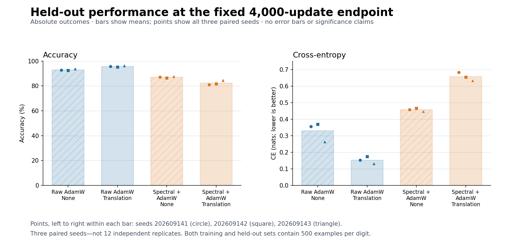
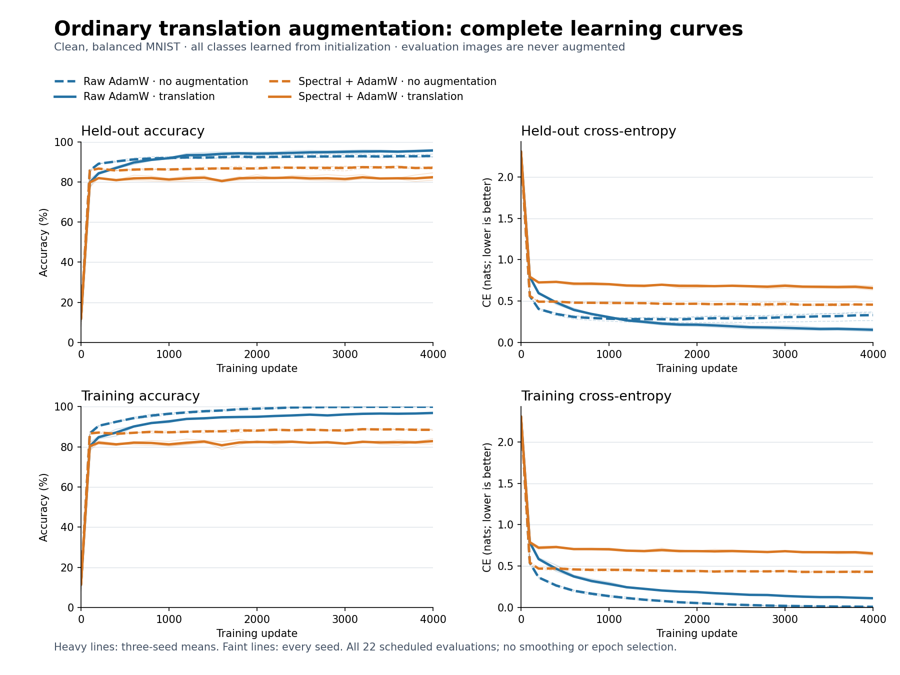

# Ordinary augmentation: useful for AdamW, not for this spectral recipe

Codex — Spectral Optimizer Investigation · 10 September 2026

**Three fresh paired seeds:** small random image translations improve held-out
accuracy and cross-entropy for raw AdamW, but worsen both for current stable
rank-32 spectral filtering. This answers the user's intended clean, balanced
classification question, without artificial cues, corrupt labels or rare classes.
It does **not** show that augmentation cannot help another spectral recipe.

## The useful effect and its boundary

The fixed [protocol](protocol.md) compares four conditions from identical
per-seed initialization. Every class is eligible from update 1; augmentation
is active during the first 100 unfiltered steps as well as later filtering.
Each condition has one view per occurrence and 4,000 updates, not extra examples
or a selected best checkpoint. All evaluations below use original images.

| Policy | Augmentation | Held-out accuracy | Held-out CE | Training accuracy |
|---|---|---:|---:|---:|
| Raw AdamW | None | 92.927% | 0.33046 | 99.993% |
| Raw AdamW | Translation | 95.653% | 0.15355 | 96.900% |
| Spectral + AdamW | None | 87.027% | 0.45716 | 88.513% |
| Spectral + AdamW | Translation | 82.347% | 0.65677 | 82.880% |

Means across seeds 202609141–143. Direct numerical source:
[independent saved-logit audit, including every curve value](audit.json).
The paired augmentation accuracy changes are **+3.02, +2.80, +2.36 percentage
points** for raw, and **−6.26, −4.68, −3.10 points** for spectral. Raw CE improves
by 0.20365, 0.19490, 0.13217 nats; spectral CE worsens by 0.22628, 0.18716,
0.18540. Thus all three seeds agree on both primary outcomes.

The mean accuracy interaction (spectral augmentation benefit minus raw benefit)
is **−7.407 points**; the CE-benefit interaction is **−0.37652 nats**, where CE
benefit is CE(none)−CE(translation). These accompany the absolute outcomes;
they are not a substitute for them or a significance test.

## Important qualification: much of the gap predates filtering

At step 100, before any projection has been delivered, both policies have
identical model/Adam states **within each augmentation condition**. Translation
makes this initial learning phase harder:

| Condition | Held-out accuracy at 100 | Spectral at 4,000 | Further spectral gain |
|---|---:|---:|---:|
| No augmentation | 85.687% | 87.027% | +1.340 points |
| Translation | 79.713% | 82.347% | +2.633 points |

Spectral improves held-out accuracy **and CE** after warmup in every seed in
both conditions. Its translated endpoint deficit relative to no augmentation
is smaller than the pre-filter deficit: 4.680 rather than 5.973 points. So this
is **not no learning**, and the filter did not create or amplify that initial
augmentation deficit. Raw, however, continues learning strongly enough to
reverse the augmentation ordering by the fixed endpoint.

The raw positive control is informative: translation reduces near-perfect
training fit while improving held-out performance. For spectral, low original
training and held-out accuracy together suggest restricted fitting, rather
than a simple excessive-memorization explanation. This is an interpretation
of the readouts, not a demonstrated covariance mechanism.

## What seems most plausible, and how to test it fairly

The strongest current account is that this hard, low-rank policy permits too
little useful continued learning after an early handoff. The translated task
is less learned at handoff, and remains less learned at the endpoint. This
fits the broader history-conditioned learning-allocation account; it does not
establish that the optimizer is specifically suppressing invariance learning.

Several mechanisms remain distinguishable: reduced delivered-gradient scale,
insufficient access to useful directions, a history/covariance estimate dominated
by transformation-dependent variation, or the activation schedule itself.
Centered gradient variance is not the mean descent direction, and the native
observer follows a changing model with truncation/forgetting. The earlier
[fixed-model covariance reasoning](../../research/spectral_optimizer_unified_hypotheses_2026-09-10.md)
is therefore a hypothesis guide, not a measurement made in these trajectories.

A fair next step should **steelman learning before further broad benchmarking**:
use the saved paired warmup states to design a small fixed-state check of useful
gradient access and the clean/translated objective, then choose one targeted
intervention—such as a later handoff or a scale-preserving delivery—rather than
launching an unconstrained rank/learning-rate sweep. A later handoff could simply
inherit more competence from AdamW; any positive result must distinguish that
preservation from additional learning under spectral filtering. No such new
probe or intervention has been run here.

## Reproducibility, compute and limits

- MLP 784→64→10, clean balanced 5,000 training / 5,000 disjoint held-out images
  per seed from official MNIST training files. Held-out splits may overlap across
  seeds. This task/recipe was chosen from the existing investigation, not a new
  independent benchmark suite. Official test data were not opened.
- Translation is ±2 integer pixels, zero fill, no interpolation, one view per
  occurrence. [Training-only visual/input review](visual-review.md) preceded
  acquisition; no exclusions or outcome-driven tuning.
- Raw AdamW vs unchanged canonical stable rank32, decay .99, warmup100,
  lr .001, weight decay .01. Same indexed examples and transformations within
  each paired condition. 22 fixed evaluations per trajectory, 12 trajectories.
- Source freeze `b963c63`; launch HEAD `8cb887a` adds only the prospective plot
  script. Exact attempt/pins (artifact not distributed in this public snapshot). No canonical optimizer edits.
- Acquisition completed once in **124.53 seconds**, with **215,525,618 bytes**
  of retained artifacts. Local RTX3090 only, no cloud spend/reservation.
  Mean training times: raw none 6.34 s, raw translation 7.82 s; spectral none
  12.11 s, spectral translation 13.57 s. Translation preparation is included
  (about 1.45–1.48 s). These are this small audited harness's timings, not a
  throughput benchmark or practical language-model speed claim.
- Independent NumPy audit PASS: **58 artifacts**, **264 trajectory-state rows**
  (each has train and held-out readouts), maximum scalar discrepancy
  **3.64×10⁻¹²**. It independently regenerates splits/draws and recomputes metrics
  from saved logits. State pairing digests are producer assertions; checkpoint
  bytes are hash-checked, not independently replayed. See its explicit limits.
- Raw archive:
  `/tmp/spectral-experiment-artifacts/spectral-general-augmentation-20260910.lSSdQP/acquisition-001`.
  `results.json` SHA-256:
  `7c4f31d0a3bf2b89aa5fbb7be0e5bbe62a2e713faa75afd3241c6fab1db63a5e`.
  Acquisition and audit are terminal/consumed; do not rerun.

This is a useful negative boundary alongside, not a replacement for, the
replicated noisy-label protection and grokking-direction results. No safety,
alignment, general optimizer superiority, optimal-tuning or universal
augmentation claim follows from this one clean-data factorial.
