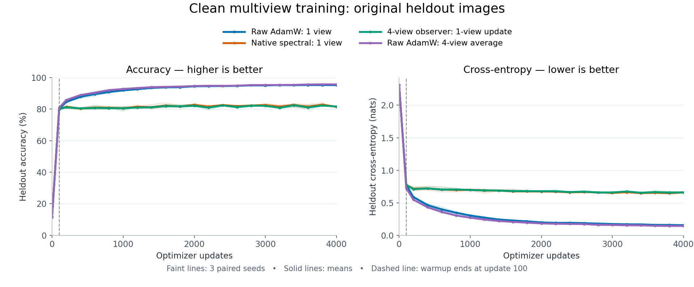
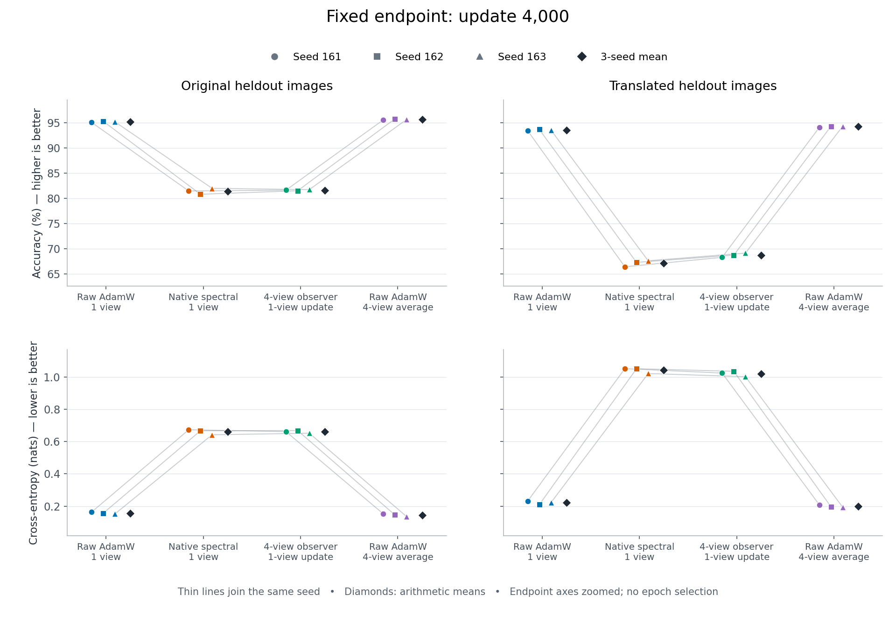

# Four-view observation improves shifted-image learning, not practical performance

Codex — Spectral Optimizer Investigation · 10 September 2026

**Completed and independently audited: three fresh paired seeds, twelve clean
training trajectories.** Estimating the spectral subspace from four views
instead of one gives a consistent improvement on shifted heldout images, but
does not rescue the primary original-image result. Mean primary accuracy is
81.59% versus81.39% for the existing filter and95.63% for simply averaging
the same four views in AdamW. Primary CE is essentially unchanged descriptively,
with mixed seed signs—not an equivalence claim. This is a limited method
improvement, not a competitive optimizer or a new noise-protection result.
All numbers below derive from the [independent audit](audit.json).

## Fixed comparison

[Protocol](protocol.md): MNIST training IDX only, clean true labels,500/class
training and500/class disjoint heldout,50,890-parameter784→64ReLU→10MLP,
4,000updates of64example occurrences. Independent integer zero-fill shifts
dx/dy∈−2..2 from update1. AdamW lr.001,weightdecay.01; unchanged stable
rank32,decay.99,100updatewarmup,hard projection,no normalization. Seeds
202609161/162/163. No official test data, old experiment replay or tuning.

- **Raw1:** AdamW uses one shifted view.
- **Native1:** existing filter observes and delivers that single-view gradient.
- **Observer4:** filter observes the average of four gradients at the same
  parameters, once per update, but projects/delivers the designated first one.
- **Raw4:** AdamW directly uses the average of those same four gradients.

All initial model/prediction identities match. Raw1/native1/observer4 also have
identical model+Adam learning digests and predictions at100; their observers
differ. Raw4 already uses its average during warmup and is not a matched-state
observer intervention. Later comparisons concern whole policies, not an
isolated covariance-variance effect. All22scheduled states and three readout
panels are retained. Original heldout endpoint remains primary.

## Primary: original heldout images at update4,000

Each cell is **accuracy% / CE nats**. Higher accuracy/lower CE are favorable.

| Policy | Seed161 | Seed162 | Seed163 | Mean |
|---|---:|---:|---:|---:|
|Raw1|95.06 /0.16282|95.28 /0.15590|95.18 /0.15123|95.173 /0.156650|
|Native1|81.44 /0.67286|80.78 /0.66627|81.96 /0.64185|81.393 /0.660327|
|Observer4|81.60 /0.66156|81.48 /0.66800|81.70 /0.65151|81.593 /0.660356|
|Raw4|95.54 /0.15239|95.74 /0.14554|95.62 /0.13554|95.633 /0.144492|

Predeclared contrasts use positive signs for benefit: left−right accuracy
in percentage points, right−left CE. No seed or metric is discarded.

| Contrast | Accuracy differences:161 /162 /163; mean | CE benefit:161 /162 /163; mean |
|---|---|---|
|Observer4−Native1|+0.16 /+0.70 /−0.26; **+0.20**|+0.011308 /−0.001730 /−0.009662; **−0.000028**|
|Observer4−Raw4|−13.94 /−14.26 /−13.92; **−14.04**|−0.509163 /−0.522459 /−0.515967; **−0.515863**|
|Observer4−Raw1|−13.46 /−13.80 /−13.48; **−13.58**|−0.498735 /−0.512099 /−0.500281; **−0.503705**|
|Raw4−Raw1|+0.48 /+0.46 /+0.44; **+0.46**|+0.010428 /+0.010360 /+0.015686; **+0.012158**|
|Native1−Raw1|−13.62 /−14.50 /−13.22; **−13.78**|−0.510043 /−0.510369 /−0.490620; **−0.503677**|

Using the extra views directly helps raw AdamW in every seed and metric.
The four-view observer remains far behind even the cheaper single-view raw
control. This is not evidence of practically recovered clean learning.

## Secondary: fixed translated heldout images

| Policy | Seed161 | Seed162 | Seed163 | Mean |
|---|---:|---:|---:|---:|
|Raw1|93.42 /0.23088|93.64 /0.20915|93.52 /0.22176|93.527 /0.220596|
|Native1|66.38 /1.05118|67.26 /1.05076|67.58 /1.02093|67.073 /1.040954|
|Observer4|68.26 /1.02391|68.70 /1.03480|69.10 /1.00147|68.687 /1.020062|
|Raw4|94.06 /0.20797|94.28 /0.19572|94.28 /0.19327|94.207 /0.198985|

Observer4 beats native1 by **+1.88/+1.44/+1.52points**, mean+1.613, and reduces
CE by0.027265/0.015959/0.019452, mean0.020892. This is a consistent positive
learning result in this secondary view distribution, not merely a covariance
capture statistic. Yet raw4 is25.52points better on average, with lower CE in
every seed. The secondary gain does not replace the adverse primary comparison.

## Learning after warmup and training fit

Primary within-policy progress from100→4,000:

| Policy | Accuracy changes,points:161 /162 /163; mean | CE reductions:161 /162 /163; mean |
|---|---|---|
|Raw1|+14.32 /+14.64 /+16.50; +15.153|0.620681 /0.624448 /0.611857;0.618996|
|Native1|+0.70 /+0.14 /+3.28; +1.373|0.110638 /0.114079 /0.121237;0.115318|
|Observer4|+0.86 /+0.84 /+3.02; +1.573|0.121946 /0.112349 /0.111576;0.115290|
|Raw4|+14.32 /+14.32 /+15.78; +14.807|0.570151 /0.589219 /0.583146;0.580839|

Both spectral policies learn useful original-image information after the
shared warmup in every seed; neither is simply frozen. For translated images,
observer4 gains+0.74/+0.28/+3.14points and reduces CE by0.086860/0.063879/0.077769.
Native1 translated accuracy changes−1.14/−1.16/+1.62points despite positive
CE reductions0.059594/0.047920/0.058317. Thus observer4's secondary benefit
includes actual learning, while native1's accuracy and CE disagree.

Original training endpoint accuracy/CE means are96.88%/0.107215raw1,
82.167%/0.647012native1,82.38%/0.648962observer4 and97.667%/0.082548raw4.
Low training and heldout competence together are consistent with restrictive
learning at this setting, not an advantage hidden by excess training fit.
Observer4's training CE is worse in two seeds despite slightly higher mean
training accuracy. These observations do not identify the cause of restriction.

## Work and provenance

Each trajectory uses256,000underlyingexample occurrences. Four-view methods
differentiate16,000batches versus4,000for single-view methods; all12total
120,000batch-gradient evaluations,7,680,000transformedtrainingexample passes.
No independent-example count is multiplied by four for uncertainty estimates.

| Policy | Mean training seconds | Mean augmentation seconds | Mean total branch seconds |
|---|---:|---:|---:|
|Raw1|16.57|1.63|18.62|
|Native1|22.51|1.65|24.58|
|Observer4|36.35|5.68|42.45|
|Raw4|30.69|5.63|36.70|

Times are descriptive sequential local measurements with rotated order,
not randomized speed benchmarks or matched time-to-accuracy comparisons.
The full acquisition took368.497seconds,277,252,073archivebytes,163,040,768bytes
peak torch GPU allocation and1,399,136KiBhosthigh-waterRSS. No paid compute.

Source freeze `3c2c3c23e58c3f1d09929629824709df812bf364`;
attempt (artifact not distributed in this public snapshot),launch handles (artifact not distributed in this public snapshot),[source review](review.md).
Raw results (artifact not distributed in this public snapshot)
SHA256 `a4bf53e3696c9e22eeaa925bddc9034e9d27a39ff3b1a2410ae11531dfcc8d30`.
[Audit](audit.json) SHA256
`0c66a3827ddb7423e4c444e7e92682ac6f24f336138fa22133647236758ee147`:
PASS58artifacts,264logicalstates/792panels,maxmetricerror3.64e−12. The sole
NumPy audit took1.794seconds. Allsourcepins, plans, labels, metrics, counters,
receipts and predicted warmup pairing checked. Checkpoints were only hashed;
model/Adam state digests remain producer assertions, not independently replayed
training. Neither acquisition nor audit was repeated.

## Interpretation boundary

The stronger observation policy yields a modest consistent translated-image
improvement, mixed primary changes and no competitive clean result here.
No noisy-label extension was run, so retained protection is unknown. No claim
of semantic clustering, noise detection, safety or universal method failure
follows. This small unnormalized stable rank32 experiment is not the larger
rank200 recipe behind the strongest historical protection evidence; see the
[cross-regime comparison](regime-comparison.md). Different studies' accuracy
numbers must not be ranked as if they shared models, data and exposure.
