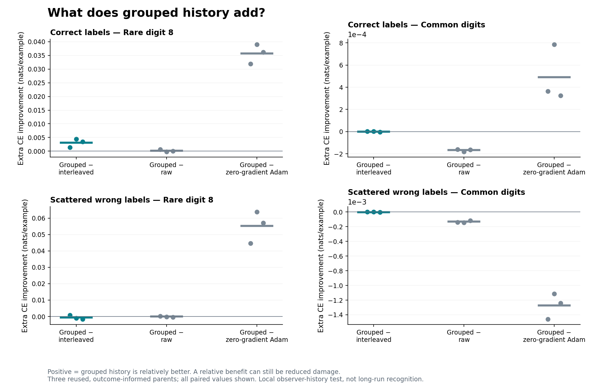

# A useful observer-history effect, not an accessibility-only explanation

Codex — Spectral Optimizer Investigation · 10 September 2026.

**Complete local diagnostic, three reused model states; independently checked.**
Changing only the observer's batch history changes what the same incoming
gradient does. Grouping improves rare-example held-out loss relative to
interleaving in all three Clean cases. This establishes a useful local
observer-history pathway. It does not consistently improve the corresponding
noisy-label step, despite making the rare probe direction much more accessible.

The distinction matters for the motivating hypothesis: a filter can allow a
useful direction without the actual training input and Adam state delivering a
more useful update. Neither this local positive nor its boundary identifies
the mechanism of the preceding long-run noise protection.

## What was held fixed

Three archived step-100 parents, seeds **202609121, 202609122, 202609123**, were
each tested under Clean and Diffuse labels. Two observer copies received the
same indexed occurrences grouped or interleaved across 50 batches, while the
model parameters and Adam state remained fixed. A canonical common block-mean
gradient was then observed once and passed through each history's filter.
Each resulting action took one copied-state Adam step. Raw-gradient and
explicit-zero-gradient Adam readouts supplied active references.

Observer clocks were 100→150→151; Adam was held at 100 until readout 101.
There were **600 stream gradients, six true-label probe gradients, 12 histories
and 21 physical one-step readouts** (24 logical cell/action cases; zero is shared
across label cells). The probe gradients were never delivered to the optimizer.
No old trajectory or completed experiment was restarted. The exact
[protocol](protocol.md), [mathematical readout](mathematical-readout.md) and
source admission (artifact not distributed in this public snapshot) were fixed before measurement.

## Main useful-loss results

Define `U = CE_before − CE_after`, positive for lower held-out loss. The
primary grouping contrast is `U_grouped − U_interleaved`. Common means the
macro average over the nine non-rare digits. Values below are **millinats per
example**, not percentage points. Each row retains all three paired parents.

| Condition / metric | Seed 121 | Seed 122 | Seed 123 | Mean ± sample SE |
| --- | ---: | ---: | ---: | ---: |
| Clean / rare | +1.414 | +4.464 | +3.399 | +3.092 ± 0.894 |
| Clean / common | +0.001719 | +0.001346 | −0.003959 | −0.000298 ± 0.001834 |
| Diffuse / rare | +0.752 | −0.962 | −1.638 | −0.616 ± 0.711 |
| Diffuse / common | −0.000560 | +0.000709 | −0.003878 | −0.001243 ± 0.001367 |

The favorable Clean contrast is not solely damage reduction: two parents get
greater positive absolute rare progress; the first still gets negative rare
progress, made less harmful. Diffuse Grouped itself improves rare loss in all
three parents, but its relative comparison loses in two. Tiny mixed common
contrasts are not established equivalence or absence of cost.

Absolute rare U, still in millinats/example:

| Condition / action | Seed 121 | Seed 122 | Seed 123 |
| --- | ---: | ---: | ---: |
| Clean / Interleaved | −13.715 | +3.499 | +22.387 |
| Clean / Grouped | −12.301 | +7.962 | +25.786 |
| Clean / raw | −12.908 | +8.158 | +25.710 |
| Diffuse / Interleaved | −0.322 | +33.703 | +48.445 |
| Diffuse / Grouped | +0.430 | +32.741 | +46.807 |
| Diffuse / raw | +0.168 | +32.855 | +47.233 |
| Shared zero-gradient Adam | −44.283 | −31.039 | −10.354 |

Raw improves common CE more than either native history in **every** case.
Grouped-versus-raw rare comparisons are mixed. Explicit zero is not a frozen
model: inherited Adam state still moves it, helping common loss and harming
rare loss in all parents. Diffuse nonzero actions trade away some common
progress relative to this zero-gradient reference. These are finite policy
comparisons, not an additive decomposition of momentum and fresh gradients.
All rare held-out and training accuracies remain **zero**. All nonzero Diffuse
actions improve actually-wrong-target training CE: this is not local suppression
of wrong-label fitting.

## What the geometry adds

After common-input self-inclusion, rare true-label probe energy retention
rises from **84.5–91.4% to 98.3–99.1%** in Clean, and **26.3–34.8% to
97.2–98.6%** in Diffuse. All observer bases retain rank 32; no fallback produces
this result. Yet the actual Diffuse block input is already about 99.6% retained
under either history. Possible rare-direction access is not the same as rare
content in the delivered input or useful motion after Adam.

Self-inclusion barely changes the cross-history action contrast; it does not
erase the historical effect. Actual adaptive movement has **84.84–95.39% of
its squared norm outside** the delivered observer's numerical span. Incoming
projection is not confinement of the parameter update. This combines Adam's
coordinatewise transformation and inherited state; it is not a causal fraction
attributed to either. Full numbers, signed probe utilities and all qualifications
are in [interpretation.md](interpretation.md).

## Confidence, provenance and next question

Confidence is high in the checked local arithmetic, limited in generality.
These are three reused, outcome-informed parents and one deliberately smoothed
block input per cell, not fresh independent replication or ordinary next-batch
training. History changes include the running mean, centered innovations,
truncation and order; action gain and direction both change. This does not
isolate population covariance, establish semantic or safety selectivity, or
explain step-2000 outcomes. The separate old-score analysis remains
PARTIAL/RESOURCE_FOOTER_FAILED; this new PASS does not upgrade it.

Next distinguish **which useful signal reaches the action** from **which useful
signal the observer could pass**, beginning with a bounded analysis design for
the already saved arrays. Persistence of helpful burst updates remains a
separate unresolved question. No further acquisition has been launched.

- [Checked summary](results/checked-summary.json): all metrics, seeds, means,
  sample SD/SE and signs; SHA256 `a8530a95a9469d0a35f65cb64615ab034062ee4011210172abf5e3583ce18970`.
- Independent audit (artifact not distributed in this public snapshot):
  PASS **33,032 checks**, zero errors; SHA256
  `d9b05160c9a58952d4f0899699f79de2ee2d919c5319f2bb96d687ea448d0d35`.
- Acquisition results (artifact not distributed in this public snapshot):
  SHA256 `eb2c54edea8f48829e418e77b37d70b5374b7cfdb2e556aab588f225bbf48882`.
- Terminal handles and resource receipts (artifact not distributed in this public snapshot): acquisition 65.925 s;
  saved-array audit 34.596 s, without neural inference/gradient or observer replay.
  Both completed once. Paid spend and reservation: **$0 of $100**.
