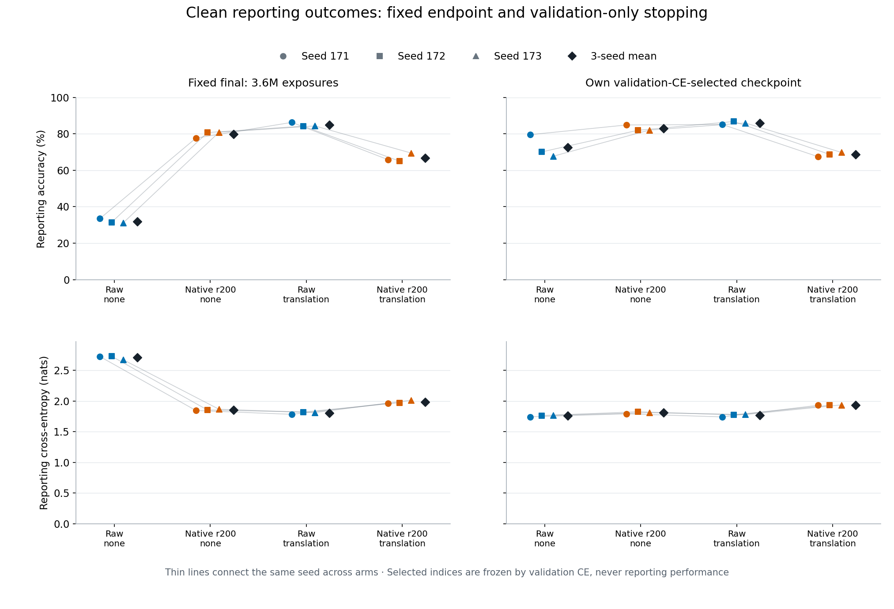
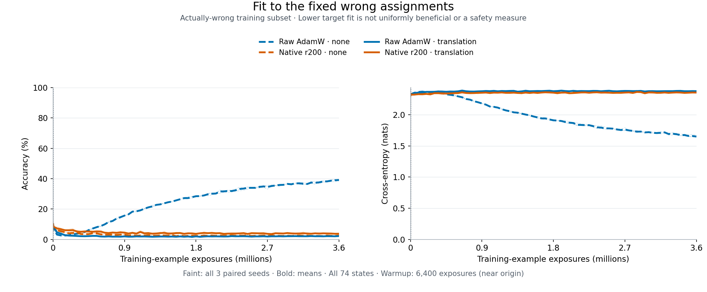

# Strong rank-200 augmentation bridge — results

Codex — Spectral Optimizer Investigation · 10 September 2026

**Spectral filtering supports substantial useful learning under fixed noisy
labels, but does not add benefit to ordinary translation here.** Without
augmentation it reaches 79.753% clean reporting accuracy versus raw AdamW's
32.000%. With translation, raw reaches 84.973% and spectral 66.820%. Every seed
agrees on both fixed-endpoint accuracy and cross-entropy (CE) contrasts.
The adverse combined-recipe result survives validation-only stopping and the
fixed late interval. It is not confined to the earlier small rank-32 recipe.

Direct evidence: [independent saved-array audit](audit.json), particularly
`branches[*].metrics`, `branches[*].selection` and `summary`; [prospective
protocol](protocol.md); completion and audit launch (artifact not distributed in this public snapshot).
Three paired seeds, one MNIST configuration; no significance, equivalence,
semantic selection, safety efficacy or general optimizer recommendation.

## What was tested

Twelve fresh trajectories, seeds 202609171/172/173, raw/native stable global
rank-200 × none/translation, with paired initializations, batches and labels.
235,146-parameter MLP; normalized pixels; AdamW lr .001, weight decay .01;
unchanged canonical stable filter, 100-update warmup, no gain restoration or
moment reset. Translation is zero-filled integer shifts in [-2,2], applied
before standardization; all evaluation images are original.

Per seed: 50,000 train / 5,000 clean validation / 5,000 clean reporting images,
from the official training set only. 90% uniform label replacement means
approximately 81% actually wrong, not 90% guaranteed wrong. The audited plan
JSONs record replacement-selected counts 45,009/45,047/44,983 and actually-wrong
counts 40,481/40,508/40,506 (80.962%/81.016%/81.012%). Assigned labels stay fixed
across all views and passes. Within-seed roles are disjoint; seeds can overlap.

72 passes ×50,000 =3.6 million training-example exposures and 56,304 updates
per arm. This matches historical example exposure, not its exact data roles,
repetition count or 56,280-update trajectory. **Bridge, not exact reproduction.**
Each arm has 74 fixed readouts: initial, update100, and every epoch endpoint.
All twelve validation-CE choices were persisted and verified before reporting
metrics. Selection follows the frozen canonical float64 reduction and earliest
exact tie; none of these choices use reporting performance.

## Fixed primary endpoints and all-seed outcomes

Accuracy is percent; CE is nats/example, lower better. Means are arithmetic
means of the three paired seeds, not pooled independent repetitions.

| Recipe | Final accuracy | Final CE | Validation-selected accuracy | Selected CE | Late mean accuracy | Late mean CE |
|---|---:|---:|---:|---:|---:|---:|
| Raw, none | 32.000 | 2.708446 | 72.487 | 1.757167 | 32.921 | 2.619713 |
| Native200, none | 79.753 | 1.854416 | 82.973 | 1.808122 | 81.063 | 1.868632 |
| Raw, translation | 84.973 | 1.804289 | 85.993 | 1.764379 | 85.692 | 1.804857 |
| Native200, translation | 66.820 | 1.981758 | 68.673 | 1.931696 | 65.984 | 1.989981 |

Late means use exactly epoch endpoints61–72. Selected accuracy and CE are
evaluated at the same own validation-CE-selected checkpoint, not two separate
best checkpoints. All-seed values and stopping exposures:

| Seed suffix | Recipe | Final acc / CE | Selected acc / CE | Selected epoch / million exposures | Late acc / CE |
|---|---|---|---|---|---|
| 171 | Raw, none | 33.52 / 2.722973 | 79.58 / 1.741747 | 7 / .35 | 33.993 / 2.647413 |
| 172 | Raw, none | 31.42 / 2.729277 | 70.12 / 1.762031 | 11 / .55 | 32.393 / 2.621063 |
| 173 | Raw, none | 31.06 / 2.673088 | 67.76 / 1.767724 | 12 / .60 | 32.377 / 2.590664 |
| 171 | Native200, none | 77.68 / 1.844601 | 84.88 / 1.790816 | 68 / 3.40 | 81.218 / 1.854515 |
| 172 | Native200, none | 80.72 / 1.853378 | 81.96 / 1.824381 | 26 / 1.30 | 80.323 / 1.871126 |
| 173 | Native200, none | 80.86 / 1.865271 | 82.08 / 1.809170 | 47 / 2.35 | 81.647 / 1.880255 |
| 171 | Raw, translation | 86.32 / 1.782084 | 85.18 / 1.740080 | 38 / 1.90 | 85.583 / 1.796345 |
| 172 | Raw, translation | 84.24 / 1.819535 | 86.80 / 1.774510 | 50 / 2.50 | 85.812 / 1.808732 |
| 173 | Raw, translation | 84.36 / 1.811247 | 86.00 / 1.778546 | 65 / 3.25 | 85.680 / 1.809496 |
| 171 | Native200, translation | 65.88 / 1.963098 | 67.44 / 1.929671 | 39 / 1.95 | 66.200 / 1.984352 |
| 172 | Native200, translation | 65.06 / 1.970981 | 68.72 / 1.929788 | 49 / 2.45 | 64.602 / 1.977184 |
| 173 | Native200, translation | 69.52 / 2.011195 | 69.86 / 1.935628 | 61 / 3.05 | 67.150 / 2.008408 |

### Registered paired contrasts

Benefits use left-minus-right accuracy (percentage points), right-minus-left
CE. Positive therefore means left is better on either metric. Values below
are in seed order171/172/173, followed by the mean.

| Fixed-final contrast | Accuracy benefits: seeds; mean | CE benefits: seeds; mean |
|---|---|---|
| Native+translation − Raw+translation, **primary** | −20.44, −19.18, −14.84; **−18.153** | −.181014, −.151446, −.199948; **−.177469** |
| Native none − Raw none | +44.16, +49.30, +49.80; +47.753 | +.878372, +.875899, +.807817; +.854029 |
| Raw translation − Raw none | +52.80, +52.82, +53.30; +52.973 | +.940889, +.909741, +.861840; +.904157 |
| Native translation − Native none | −11.80, −15.66, −11.34; −12.933 | −.118497, −.117603, −.145924; −.127341 |
| Augmentation interaction: Native effect − Raw effect | −64.60, −68.48, −64.64; −65.907 | −1.059386, −1.027344, −1.007764; −1.031498 |

The corresponding selected primary benefits are −17.74/−18.08/−16.14 points
(mean−17.320), CE−.189591/−.155279/−.157081 (mean−.167317). Late primary
benefits are −19.383/−21.210/−18.530 points (mean−19.708), CE−.188008/
−.168452/−.198912 (mean−.185124). Neither secondary window rescues the primary.
Every other registered selected/late contrast and its three values is retained
in `audit.json → summary.contrasts`; the absolute table above specifies their
inputs without pooling away contradictory metrics.

**Important selected-metric boundary:** without augmentation, native beats
selected raw accuracy in all seeds (+10.487 points mean), but loses selected CE
in all seeds (benefit−.050955). Augmenting raw improves selected accuracy in
all seeds, while selected CE worsens slightly in two of three (mean+.007211
CE, i.e. benefit−.007211). Thus “augmentation improves every selected metric”
and “spectral dominates early stopping” would both overclaim. Raw+translation
does beat native without augmentation on both reporting metrics in all seeds,
at both the fixed endpoint and own validation-selected checkpoints.

## Does the filter actually keep learning?

Yes, substantially in this regime. The filtered policies improve both clean
reporting metrics beyond their own update100 warmup in every seed. Raw/native
warmup states are identical within each augmentation condition.

| Recipe | Accuracy gain since warmup: seeds; mean (points) | CE decrease: seeds; mean |
|---|---|---|
| Raw, none | −9.08, −10.62, +5.60; −4.700 | −.617898, −.597420, −.492501; −.569273 |
| Native200, none | +35.08, +38.68, +55.40; +43.053 | +.260474, +.278479, +.315316; +.284756 |
| Raw, translation | +64.04, +52.10, +60.42; +58.853 | +.440049, +.365270, +.419684; +.408334 |
| Native200, translation | +43.60, +32.92, +45.58; +40.700 | +.259035, +.213824, +.219736; +.230865 |

Unaugmented native rises from mean36.700% to79.753%; translated native from
26.120% to66.820%. This is not merely freezing the warmup predictor. It does
not establish pure semantic selection, and the larger gain of raw+translation
remains. The unaugmented raw curve initially improves then deteriorates while
fitting more of the wrong assignments; the full learning curves show this
time dependence rather than comparing only endpoints.

## Fixed-assignment fit and true-label learning

All these readouts use original training images, including for translated
training. Means of per-seed accuracy percentages and CE:

| Recipe | Train true acc / CE | Train assigned acc / CE | Actually-wrong subset true acc / CE | Actually-wrong subset assigned acc / CE |
|---|---|---|---|---|
| Raw, none | 32.379 / 2.823403 | 44.956 / 1.551473 | 23.631 / 3.220263 | 39.158 / 1.649918 |
| Native200, none | 79.793 / 1.854986 | 17.497 / 2.274384 | 79.428 / 1.858573 | 2.517 / 2.376372 |
| Raw, translation | 85.148 / 1.804301 | 18.436 / 2.263445 | 84.594 / 1.811037 | 2.230 / 2.377909 |
| Native200, translation | 67.624 / 1.980586 | 16.005 / 2.283133 | 67.491 / 1.981787 | 3.762 / 2.355321 |

Both unaugmented filtering and ordinary augmentation greatly restrict fitting
the wrong assignments relative to raw/none. Combining them does **not** further
reduce that fit here: wrong-assignment accuracy rises and CE falls versus each
of those two single interventions, in every seed. This differs from any blanket
claim that the combination “suppresses memorization even more.” Low assigned
fit alone still cannot establish usefulness or safety; true-label learning and
heldout outcomes provide the complementary evidence. All per-seed and per-state
assigned/true components remain in `audit.json → branches[*].metrics`.

## Costs and audit scope

Mean seconds per trajectory, same 56,304 updates and3.6M training exposures:

| Recipe | Synchronized training | Input/augmentation | Evaluation | Branch wall time |
|---|---:|---:|---:|---:|
| Raw, none | 236.958 | 7.387 | 9.002 | 254.424 |
| Native200, none | 676.030 | 8.656 | 8.806 | 695.874 |
| Raw, translation | 234.736 | 28.257 | 8.731 | 272.787 |
| Native200, translation | 685.921 | 31.295 | 9.100 | 728.823 |

These are observed implementation costs, not matched-target speed benchmarks.
The complete acquisition reports5872.704s (97.878min), serialization11.878s,
selection7.449s and subsequent reporting7.213s. Totals include work not assigned
to a trajectory; phases can be nested, so do not add every field as disjoint
time. Twelve arms use675,648 gradient evaluations/43.2M training exposures.
Reported peak GPU allocation1,022,498,304bytes, process RSS1,926,128KiB; systemd
cgroup peak4.7G includes additional memory accounting. Archive4,034,552,614bytes.
Paid spent/reserved remains$0 against the$100 allowance.

Independent NumPy audit completed17:53:17UTC,90.702s: PASS,937 artifacts,
888 logit files read twice, all12 validation choices verified before reporting,
maximum scalar arithmetic discrepancy1.4552e−11 within frozen1e−10 tolerances.
Audit SHA-256 `6e2677ae3feb41a3da16ea11639a15871577ff8cd469c6afcda0b8c67096ec7c`;
producer results SHA-256 `e98125d3bcbd85e402c8269797e6cb48797b9ebbe9d9715897f8244203c69e8a`.
Both process handles are terminal and consumed. No retry or re-execution.

The audit checks plans, saved-array arithmetic, selection and byte integrity.
It does not unpickle or replay checkpoints, reconstruct producer model/Adam
digests, or provide an independent training replication. Saved reporting arrays
were not cryptographically blinded. Three seeds on an adaptively revisited
research task do not establish transfer, novelty or safety efficacy;
the seed IDs/arms themselves were fixed before this acquisition.

## Interpretation and next work

The historical unaugmented protection pattern transfers to this cleaner
validation/reporting split, alongside large actual post-warmup learning.
However, ordinary translation is a stronger practical recipe here, and
adding the unchanged filter is consistently adverse. The small model/rank32
restriction is therefore not a sufficient explanation for the earlier
augmentation failures. This comparison changes several historical data-role
details and does not isolate which one matters.

The mathematical possibility of useful geometry selection remains intact.
Neither these trajectories nor the earlier loss/covariance identities identify
which useful mean-logit, consistency or other update components are impaired,
or how carried Adam mediates them. Retained variance is not signed usefulness.
The next immediate action is reporting and paper/knowledge consolidation.
A focused component-utility discriminator can be evaluated afterward; no new
experiment, tuning sweep, production change or capabilities speedrun is
selected by this result. Negative practical transfer does not erase the
constructive learning phenomenon or the other task-dependent positives.
