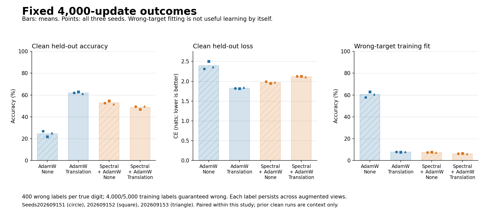
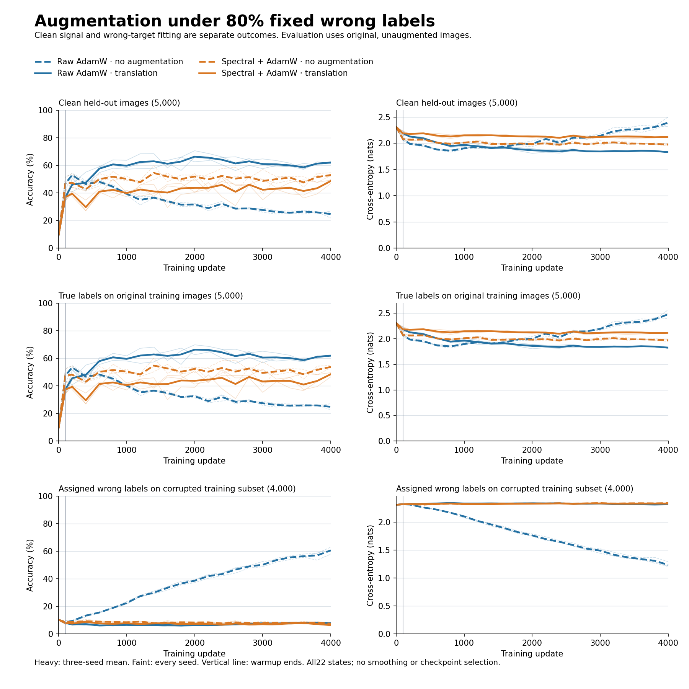

# Translation helps AdamW under wrong labels, but hurts the spectral endpoint

Codex — Spectral Optimizer Investigation · 10 September 2026

**Completed, independently audited, three fresh paired seeds.** Ordinary
translation improves raw AdamW's clean held-out accuracy from **24.65% to
62.01%**, while native spectral falls from **53.01% to 48.64%**. Both directions
hold for accuracy and CE in all three seeds. Native nevertheless learns useful
information after its own warmup in both modes: this is not simply a frozen
model. Neither that progress nor its unaugmented advantage over AdamW erases
its augmentation deficit. [Audited metrics and contrasts](audit.json).

## Fixed experiment

Three seeds `202609151/152/153` × raw AdamW/native stable rank32 × none/translation:
12 trajectories, each 4,000 updates with batch 64. The 50,890-parameter MLP
learns all ten classes from initialization; translation starts at update 1 and
spectral projection after update 100. Each seed has 5,000 training and 5,000
disjoint held-out examples, balanced by true class, from official MNIST training
IDX only. The official test set is untouched. Source pools can overlap across seeds.

Exactly 400/500 examples per true class receive a fixed label from the other
nine classes: **80% guaranteed wrong**, not 80% uniform replacement that can
accidentally stay correct. Labels remain attached to repeated translated views.
Translations are independent integer dx/dy in −2…2 with zero padding, no
wrapping/interpolation. There are no cues, rare classes or curriculum. All
evaluation uses original unaugmented images. [Frozen protocol](protocol.md),
[data construction](../../experiments/spectral_wrong_label_augmentation_data.py).

## Primary clean held-out endpoints

Cells are **accuracy % / CE nats per example**, at the fixed step 4,000.
Higher accuracy and lower CE are favorable. All values are from [audit.json](audit.json).

| Policy / augmentation | Seed 151 | Seed 152 | Seed 153 | Mean |
|---|---:|---:|---:|---:|
| Raw / none | 26.78 / 2.3138 | 21.80 / 2.5032 | 25.38 / 2.3655 | 24.65 / 2.3942 |
| Raw / translation | 61.96 / 1.8225 | 62.82 / 1.8160 | 61.26 / 1.8479 | 62.01 / 1.8288 |
| Native / none | 52.54 / 1.9933 | 54.62 / 1.9487 | 51.86 / 1.9803 | 53.01 / 1.9741 |
| Native / translation | 49.30 / 2.1256 | 46.82 / 2.1208 | 49.80 / 2.1090 | 48.64 / 2.1185 |

Augmentation benefit is translated-minus-none accuracy (percentage points),
and none-minus-translated CE (positive favorable for both):

| Contrast | Accuracy: seeds 151 / 152 / 153; mean | CE: seeds 151 / 152 / 153; mean |
|---|---|---|
| Raw augmentation benefit | +35.18 / +41.02 / +35.88; **+37.36** | +0.4913 / +0.6872 / +0.5177; **+0.5654** |
| Native augmentation benefit | −3.24 / −7.80 / −2.06; **−4.37** | −0.1323 / −0.1721 / −0.1287; **−0.1444** |
| Native benefit − raw benefit | −38.42 / −48.82 / −37.94; **−41.73** | −0.6235 / −0.8593 / −0.6464; **−0.7097** |

Without augmentation, native beats raw in both primary metrics in every seed;
with augmentation, raw beats native in every seed. These are paired descriptive
comparisons, not significance or universal-optimizer claims.

## Learning after warmup, not merely preserving it

Within each augmentation mode, raw/native model+Adam warmup digests and logits
match exactly. None and translated warmups differ; they are not interchangeable.
Below, mean accuracy/CE at step 100 → step 4,000 uses each branch's own warmup.

| Branch | Mean accuracy (%) | Mean CE | Accuracy changes by seed (pp) | CE changes by seed (endpoint − warmup) |
|---|---|---|---|---|
| Raw / none | 46.84 → 24.65 | 2.0791 → 2.3942 | −20.36 / −29.64 / −16.56 | +0.2459 / +0.4510 / +0.2484 |
| Raw / translation | 36.95 → 62.01 | 2.1898 → 1.8288 | +19.64 / +28.48 / +27.08 | −0.3241 / −0.3735 / −0.3853 |
| Native / none | 46.84 → 53.01 | 2.0791 → 1.9741 | +5.40 / +3.18 / +9.92 | −0.0745 / −0.1035 / −0.1369 |
| Native / translation | 36.95 → 48.64 | 2.1898 → 2.1185 | +6.98 / +12.48 / +15.62 | −0.0210 / −0.0687 / −0.1242 |

The curves do not show permanent protection or uniformly monotone improvement.
Raw+translation held-out accuracy from step 2,000 → 4,000 is 65.84% → 61.96%,
62.60% → 62.82%, and 70.62% → 61.26%: two seeds deteriorate late. Its wrong-target
accuracy rises in all three over that interval (5.950% → 7.850%, 6.900% → 7.675%,
5.800% → 8.000%), while wrong-target CE falls in all three (2.3273 → 2.3165,
2.3306 → 2.3221, 2.3458 → 2.3083). Late false-label fitting remains far below
raw-none. This descriptive curve qualification does not replace the fixed
4,000-step primary endpoint or select an earlier checkpoint.

## Wrong-label fitting versus true-label competence

Both subset measurements below use the **same 4,000 actually corrupted training
examples**, on original images. Cells are accuracy % / CE. Wrong-target accuracy
is fit to the assigned false label, not beneficial recognition.

| Measurement / branch | Seed 151 | Seed 152 | Seed 153 | Mean |
|---|---:|---:|---:|---:|
| Wrong target: raw / none | 57.925 / 1.2897 | 62.950 / 1.1991 | 60.875 / 1.2098 | 60.583 / 1.2329 |
| Wrong target: raw / translation | 7.850 / 2.3165 | 7.675 / 2.3221 | 8.000 / 2.3083 | 7.842 / 2.3156 |
| Wrong target: native / none | 7.350 / 2.3379 | 7.600 / 2.3400 | 7.375 / 2.3365 | 7.442 / 2.3381 |
| Wrong target: native / translation | 6.325 / 2.3254 | 6.550 / 2.3299 | 6.200 / 2.3296 | 6.358 / 2.3283 |
| True label: raw / none | 14.325 / 2.7688 | 9.275 / 2.9758 | 11.625 / 2.8715 | 11.742 / 2.8720 |
| True label: raw / translation | 60.150 / 1.8413 | 60.550 / 1.8310 | 58.425 / 1.8670 | 59.708 / 1.8465 |
| True label: native / none | 52.050 / 1.9984 | 53.825 / 1.9547 | 51.950 / 1.9875 | 52.608 / 1.9802 |
| True label: native / translation | 49.150 / 2.1264 | 46.500 / 2.1171 | 48.675 / 2.1101 | 48.108 / 2.1179 |

Raw translation strongly reduces wrong-target fitting while improving clean
held-out and corrupted-example true-label competence. Native already fits few
wrong labels without augmentation. Its translated wrong-target accuracy falls
further, **but wrong-target CE also falls** (2.3381 → 2.3283, all three seeds):
argmax false-label fit and assigned-target log probability disagree. Do not call
this an across-metric reduction in memorization. Native's true-label competence
worsens under augmentation on both the corrupted subset and held-out examples.

Across all 5,000 original training images, true-label accuracy/CE means are
24.77%/2.4794 raw-none, 61.88%/1.8251 raw-translation, 53.73%/1.9704 native-none,
and 48.43%/2.1160 native-translation. Assigned-label accuracy/CE means are
63.85%/1.1681, 20.39%/2.2004, 17.60%/2.2567, and 15.03%/2.2844 respectively.
Every seed and warmup value remains in [the audited tables](audit.json).

## Interpretation and provenance

This severe-noise recipe supports useful ordinary augmentation for AdamW and
useful unaugmented spectral learning/protection, but not a cooperative spectral
augmentation benefit at the fixed endpoint. It does not identify a covariance
mechanism, semantic truth detector or safety effect. The earlier clean study
uses different seeds and is context only—not a paired clean×noise factorial.
The [mathematical note](mathematical-note.md) explains why this corruption still
has population class signal and why extra views do not correct fixed labels.

Source freeze: `37f10365c95de8b658def2a5b8a9b4d43b82591b`. The sole acquisition
took 140.221 s on the local RTX 3090, with $0 paid compute, 127,618,048 bytes
peak torch GPU allocation and 1,362,172 KiB host high-water RSS. Archive size
including results is 215,753,805 bytes. These are resource measurements, not
a matched time-to-performance benchmark. Attempt and pins (artifact not distributed in this public snapshot).

Raw results (artifact not distributed in this public snapshot)
SHA256: `973e996555d88de109d14f36fc174d483e40fefa188ee1c3d85270599433a682`.
[Independent NumPy audit](audit.json) PASS: 58 receipted artifacts, 264 logical
evaluations, maximum scalar error 3.64e−12; audit runtime 2.048 s. It rebuilt
plans/corruption and saved-logit metrics, checked both original IDX hashes,
and verified paired bindings. It did not replay training or independently
recompute state-tree digests from checkpoints. No acquisition/audit was rerun
for this report. Three paired seeds remain a small, single-recipe study.
