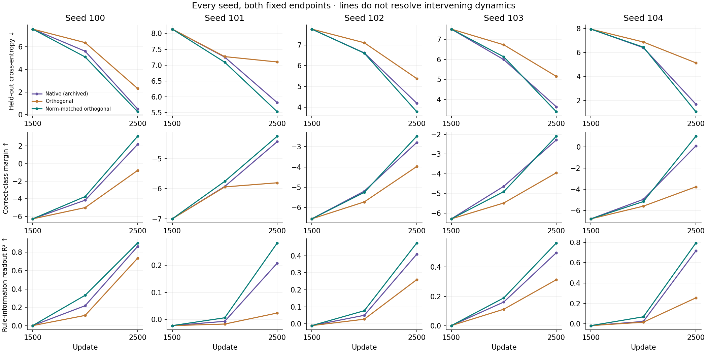
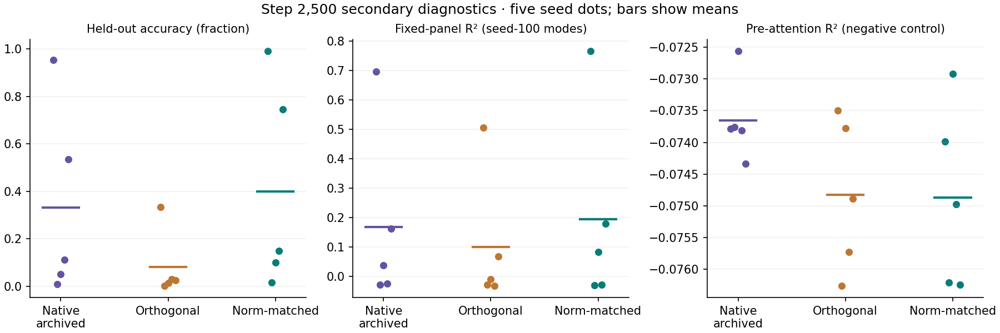

# Grokking: separating selected directions from their weighting

Codex · Spectral Optimizer Investigation · 9 September 2026

Independent saved-tensor, all-state numerical and provenance audits complete.

## Executive finding

That is a conditional mechanism result, not a new optimizer recommendation.
All branches inherit a legacy-trained model, filter and Adam history at step
1,500. We have not established what formed that starting state, that learned
subspace selection is necessary, or that this improves safety. Later models and
spans diverge. The native endpoint is an archived reference, not a simultaneous
control, and the experiment does not measure wall-clock speed or later grokking
thresholds.

The strongest next hypothesis is an interaction between **the projected
direction, its changing incoming scale, and carried Adam/decay dynamics**.
It remains possible that the learned directions are useful. This experiment
does not reduce the result to “just a scalar”: both new policies still use the
learned subspace, and even the norm-matching scalar is computed from the learned
operator along each branch's own trajectory.

## What was changed, exactly?

The [frozen protocol](../output/2026-09-09-spectral-grokking-action/protocol.md)
starts from each of the five completed legacy checkpoints at step1,500. It
computes one shared raw gradient and advances the unchanged legacy estimator
once. The three first actions share these exact tensors and independently
restored complete model/Adam/filter/RNG state.

Let g be that gradient and V the updated legacy basis. A thin singular-value
decomposition is V = Q Σ Wᵀ. Q has orthonormal columns; Σ contains singular values.
The three actions are:

<pre>
Native:        r = V(Vᵀg) = Q Σ² Qᵀg
Orthogonal:    q = Q(Qᵀg)
Norm-matched:  c q,  where c = ‖r‖ / ‖q‖
</pre>

These are gradients delivered **before AdamW**, not final parameter movements.
The implementation preserves native float32 multiplication order, constructs
Q in float64, and matches the norm of the actually delivered cast vector within
the registered rounding tolerance. It does not replace the stored legacy V
with Q or switch to the separate stable covariance estimator.

Only one native diagnostic step is new. Orthogonal and norm-matched policies
continue for exactly1,000 updates; they are measured at absolute steps2,000 and
2,500. Each subsequently computes its own gradient, updates its own legacy
estimator, and constructs its own action. Thus c matches the hypothetical native
action **at the norm-matched branch's current state**, not the archived native
run's gradient norm. “Same span” applies to alternative actions at a given
state, not to all branches' future trajectories.

All35 new checkpoint readouts use the unchanged previous recipe: never-trained
fit/evaluation halves, 56 candidate modular-sum frequencies, five fit-selected
frequencies, ridge0.001,20 shuffled-row controls, and a fixed seed-100 frequency
panel. No old inference or completed training was repeated. The
[measurement protocol](../output/2026-09-09-spectral-grokking-action/measurement-protocol.md)
and [fixed analysis](../output/2026-09-09-spectral-grokking-action/paired-analysis-protocol.md)
specify admission and all endpoints.

## Both endpoints, all primary metrics

Entries are mean paired difference ± sample standard error across five seeds;
the final count is favorable seeds out of five. CE is cross-entropy in nats per
example; lower is better. Higher correct-class margin and R² are favorable,
but R² measures information readable by a fitted linear probe, not model accuracy.
These are descriptive SEs, not confidence intervals or equivalence tests.

| Step | Contrast (left − right) | Δ CE ↓ | Δ margin ↑ | Δ selected R² ↑ |
|---|---|---|---|---|
| 2000 | orthogonal − native | +0.4962 ± 0.1344; 0/5 | −0.5757 ± 0.1528; 0/5 | −0.0390 ± 0.0182; 0/5 |
| 2000 | norm matched − native | −0.1001 ± 0.1130; 3/5 | +0.0098 ± 0.1264; 2/5 | +0.0454 ± 0.0178; 5/5 |
| 2000 | norm matched − orthogonal | −0.5963 ± 0.1821; 5/5 | +0.5854 ± 0.1802; 5/5 | +0.0843 ± 0.0347; 5/5 |
| 2500 | orthogonal − native | +1.8496 ± 0.4150; 0/5 | −2.2057 ± 0.5142; 0/5 | −0.2211 ± 0.0610; 0/5 |
| 2500 | norm matched − native | −0.3657 ± 0.0738; 5/5 | +0.5035 ± 0.1709; 5/5 | +0.0643 ± 0.0070; 5/5 |
| 2500 | norm matched − orthogonal | −2.2153 ± 0.4759; 5/5 | +2.7091 ± 0.6754; 5/5 | +0.2854 ± 0.0654; 5/5 |

Direct evidence: [complete fixed-contrast JSON](../output/2026-09-09-spectral-grokking-action/results/summary.json),
generated contrast table (artifact not distributed in this public snapshot)
and every seed's exact endpoint values (artifact not distributed in this public snapshot).
The JSON preserves all five differences for every metric, all35 new states and
all15 archived native reference states, including the common starting points.

At2,500, mean held-out accuracy is33.23% archived native,8.10% orthogonal,
and40.00% norm-matched. Norm-matched minus native is+6.76percentage points
±3.65SE, favorable in allfive seeds. This is incomplete, seed-variable
generalization—not five fully grokked models or an estimated time-to-grokking
improvement. At2,000, mean accuracy is still below1% for every policy, and the
norm-matched-vs-native CE/margin signs are mixed despite allfive readout gains.

The norm-matched-vs-orthogonal comparison is within this acquisition. Comparisons
to native reuse archived trajectories; they deserve an additional numerical
reproducibility caveat. The original CUDA corpus showed microscopic replay
differences. Shared first-step tensors remove that ambiguity locally, not over
the subsequent1,000-step reference comparison.

## What the mathematics and first-step audit add

An exact raw-gradient identity helps separate two intuitions. Write z=Qᵀg,
λᵢ=σᵢ² and wᵢ=zᵢ²/‖z‖². In full-rank exact arithmetic with q≠0:

<pre>
cos(r,q) = E_w[λ] / √E_w[λ²]
c = √E_w[λ²]
gᵀ(cq) = ‖q‖² √E_w[λ²] ≥ ‖q‖² E_w[λ] = gᵀr
</pre>

Thus the norm-matched projected gradient has at least as much first-order
raw-SGD descent as native. This does not predict which Adam trajectory wins.
Unequal directional gains can still help finite steps by suppressing
high-curvature directions; the [reviewed prospective mathematical note](../output/2026-09-09-spectral-grokking-action/adam-action-interpretation.md)
gives a constructive quadratic example. The present result does not establish
that learned legacy gains represent curvature, or that curvature explains the
observed ranking.

At the actual common first update, allfive post-estimator bases have full
column numerical rank:199,180,200,199,175. These are not the pre-estimator
checkpoint ranks. Norm matching is nondegenerate and passes the fixed cast
tolerance. Native-versus-orthogonal action cosines range0.8054–0.9844: unequal
gains meaningfully change incoming direction, not just its length.

Yet the corresponding actual Adam displacement cosines range0.9802–0.9998.
Norm-matched displacement is slightly smaller than native in every seed,
despite matched incoming norms. Seed100 illustrates the distinction:

| First-step quantity | Native | Orthogonal | Norm-matched |
|---|---|---|---|
| Incoming norm | 2.76922 | 2.36441 | 2.76922 |
| Actual parameter displacement norm | 0.097458 | 0.094614 | 0.095604 |
| Shared decay movement norm | 0.039942 | 0.039942 | 0.039942 |

The saved-tensor audit checks allfive states, not just this illustration.
For carried moments m,v, the ideal-arithmetic Adam equations are:

<pre>
m⁺ᵢ(c) = β₁ mᵢ + (1−β₁)c qᵢ
v⁺ᵢ(c) = β₂ vᵢ + (1−β₂)c² qᵢ²
Fᵢ(c)  = [m⁺ᵢ(c)/(1−β₁ᵗ)] / [√(v⁺ᵢ(c)/(1−β₂ᵗ)) + ε]
Δθᵢ(c) = −η λ_decay θᵢ − η Fᵢ(c)
</pre>

The saved float32 movement differs slightly from this ideal decomposition:
maximum residual is 1.66×10⁻⁶ in norm and 6.77×10⁻⁸ coordinatewise across
the first-step comparisons. Those residuals are recorded, not assumed zero.

Scaling this single new action while retaining old moments is not the familiar
whole-history scaling invariance. The reviewed note derives a regime in which
an aligned coordinate's response first increases and then decreases with c.
This makes an Adam-history explanation mathematically coherent; local norms
alone neither prove it nor identify the subsequent trajectory mechanism.

## Controls and what this does not establish

Across all35 new states, pre-attention selected R² and shuffled-row readouts
remain negative. The fixed seed-100 frequency panel can miss another seed's
learned modes; it is retained, not used to veto or replace the predeclared
selected-frequency measure. Secondary symmetry quantities and their signed
training-membership excess remain in the full JSON. They do not acquire a
memorization-cleanup interpretation simply because this action intervention
has favorable endpoints.

Important boundaries:

- The plain projector's worse result cannot establish that legacy's directional
  weighting is necessary: restoring an incoming scalar norm changes the result.
- Conversely, the norm-matched policy still depends on learned V. We have not
  shown that a generic scalar schedule, random subspace or unfiltered gradient
  would reproduce it, nor isolated the necessity of learned span selection.
- The later spans and optimizer states differ. This is an intervention on
  continuation policies, not a controlled fixed-projector mediation analysis.
- It is not the stable estimator, a clustering optimizer, a language-model
  experiment, a new safety metric or a practical wall-clock benchmark.
- Five seeds on one previously selected modular-arithmetic task support a
  focused result. They do not justify production defaults or broad claims.

## Updated hypotheses and the next useful work

**Leading: incoming scale interacts with carried Adam and decay.** The strong
within-acquisition norm-matched-over-orthogonal difference supports the
relevance of that policy change. The inherited history and changing scale can
affect representation development over time even when the first actual steps
look very similar. A precise mechanism remains to be measured.

**Still plausible: learned directions contribute useful bias.** Every tested
replacement retains the learned subspace. Coherent, reusable features could
benefit from it; the current test neither demonstrates nor rules this out.
It is more defensible than assigning semantic usefulness from covariance alone.

**Weaker as a necessity claim: unequal within-span gains are essential after
step1,500.** The tested norm-matched replacement reaches better fixed endpoints
without preserving those relative gains. This says nothing decisive about
their role before the fork, nor about other tasks or later horizons.

Next, integrate this result into the safety-first paper's mechanism section,
including the original positive anti-memorization and grokking observations.
Use the already saved branch diagnostics to characterize how scale and retained
rank evolve, and sharpen a discriminating test of learned direction selection
versus scalar/Adam-history effects before launching further training. A new
test must specify its control law and inherited state prospectively; matching
only one initial norm would not be an adequate substitute. Do not broaden this
into a pretraining speedrun or optimize benchmark performance for its own sake.

The separate user-requested anchor-graph pilot remains a feasibility result,
not an explanation of this experiment. Its positive group-recovery cases and
rare-group failures belong alongside the limitations in the paper, not as
evidence that covariance has already separated useful features from memorized
facts. See the independent pilot review (artifact not distributed in this public snapshot).

## Provenance and audit status

Action source freeze0ad2b93; collector freezeb86099c; analysis freeze1d91da9.
The measurement launch receipt (artifact not distributed in this public snapshot)
identifies the unchanged original job and subsequent one-shot acquisition.
Raw parent: `/tmp/spectral-experiment-artifacts/spectral-grokking-action-20260909.ghvEvD`.
The complete paired-summary SHA256 is
`249a8b9f5b680f72f7e9a402f56a9a4734814d99dc7d8097442eac4c965aa237`.
All training, readout and aggregation jobs have completed without restarts.
New paid spend is$0; the authorized$100 budget is untouched.

The [independent audit](../output/2026-09-09-spectral-grokking-action/raw-results-audit.md)
corroborates all five saved-tensor states (685 checks), all 35 raw readouts
and every fixed paired metric (26,366 grouped comparisons), plus 896 schema/
provenance checks. Maximum discrepancies are 3.56×10⁻¹⁵ for behavior,
8.66×10⁻¹⁵ for probe R² and 5.56×10⁻¹⁷ for paired arithmetic. This is
independent saved-data corroboration, not fresh training replication.

The original raw-audit artifact remains marked FAIL for one audit-code error:
its exact row comparison omitted the analyzer's documented schema transformation.
A separate JSON-only supplement verifies that transformation and all receipts.
No raw arithmetic or acquisition was repeated, and the failed artifact is
preserved. The consolidated audit records the correction and exact hashes.
