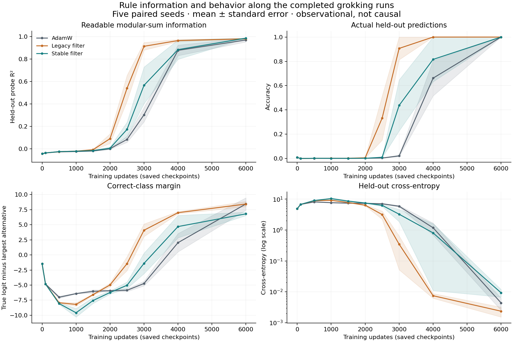
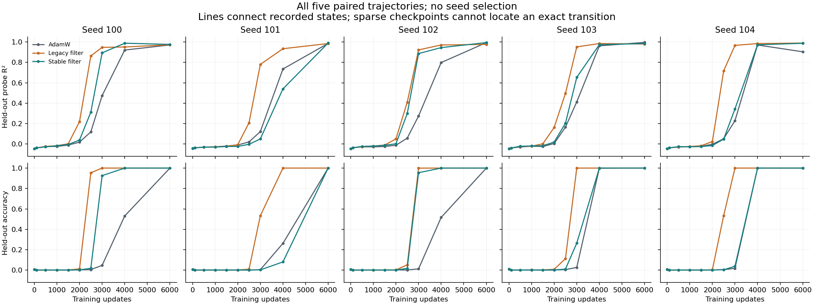
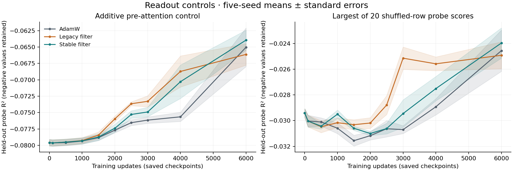
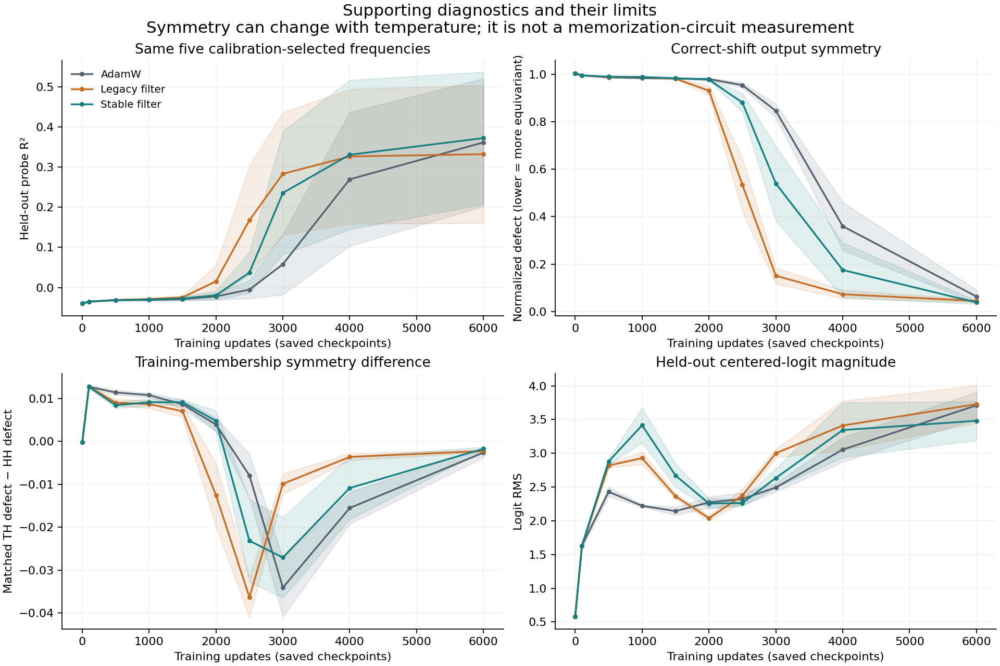

# What changes before grokking? Saved-state representation measurements

9 September 2026 · Codex — Spectral Optimizer Investigation.

## Finding

The legacy filter changes an internal learning marker **before useful
classification emerges**, not only the final grokking threshold. Modular-sum
information becomes more linearly readable earlier under the per-state
fit-selected readout of its saved representations.
At 2,000 updates, its mean probe R² is 0.090 versus approximately zero for
AdamW, while mean held-out accuracy remains below 1% for both. At 2,500 updates,
the paired probe advantage is +0.456 ± 0.106 standard error, positive in all
five seeds. The stable filter's effect is weaker and seed-dependent.

This is positive evidence for changed representation dynamics, not proof that
the filter isolates a generalizing circuit. Higher readability could reflect
stronger sum information, reduced interference, or a more accessible encoding.
The proposed symmetry-excess diagnostic does **not** cleanly identify cleanup.
The next causal question is whether legacy's non-projector within-span gains
matter, rather than assuming its effect comes from dropping directions alone.

## What this adds to the useful phenomenon

The preceding five-seed confirmation established a real but version-specific
behavioral effect: the legacy filter reaches its first recorded 90% held-out
accuracy at 2,810 updates on average, versus 3,930 for AdamW. Its sustained recorded
threshold is also earlier in all five seeds. The current-stable filter has a
mixed first-crossing advantage and almost no mean sustained-threshold gain;
both filters take longer measured training time. These findings are preserved,
not re-run or erased by the mechanism analysis.
[Confirmation report](grokking_stable_confirmation_2026-09-08.md).

The present question follows the user's original interest in shared rules
versus detailed memorization: **does a filter change when rule-related
information becomes readable, or mainly when the model successfully uses it?**
We measure the already completed trajectories rather than launch another
optimizer-ranking sweep. This is a mechanistic generalization study, not an
alignment-efficacy result or a broad capabilities-speedup claim.

## Measurement and evidence

The complete corpus contains 5 seeds × 3 arms × 10 saved checkpoints = 150 states.
Arms are AdamW, legacy spectral filtering and current-stable filtering; seeds
are 100–104; update counts are 0, 100, 500, 1,000, 1,500, 2,000, 2,500, 3,000, 4,000, 6,000.
Each model was evaluated once on the full 113 × 113 modular-addition grid,
without an optimizer step or backward pass. Logits, final128-dimensional
hidden vectors and a 256-dimensional pre-attention control were archived.

Only never-trained pairs enter the representation probe. For each seed,
stratify those pairs by true modular sum and split them into disjoint fit and
evaluation halves. Preserve those exact halves across all arms and checkpoints.
Fit a linear ridge readout for each of 56 cosine/sine pairs of the modular sum.
Feature/target centering and one-scalar feature scaling use fit rows only.
The mean-loss ridge coefficient is fixed at 0.001, with an unpenalized intercept.

For each state, select five frequencies using **fit** R² and report their mean
evaluation R². Retain every frequency score, not only the selected summary.
Twenty fixed row permutations of the modular sums repeat the whole fitting,
selection and evaluation procedure. These destroy input–target association;
merely permuting class names would not. Negative R² values are retained.

The pre-attention control concatenates both token residuals before interaction.
It has more feature dimensions, not artificially matched capacity. It tests
whether a linear combination of the separate token representations supplies
the same sum information. A second fixed-frequency panel, selected only from
the three seed100 final-state **fit** scores, tracks the same five modes across
all states. It is a sensitivity check, not a universal circuit dictionary.

All three seed 100 final states passed the prospectively fixed calibration
criterion: final selected R² ≥ 0.50 and gaps ≥ 0.20 over initial state, shuffled-row
maximum and final pre-attention control. Independent raw-array equations
reproduced calibration scores to maximum absolute error 7.11 × 10⁻¹⁵.
Final calibration scores were 0.970629 / 0.972834 / 0.975973 for AdamW/legacy/stable.
This checks the ruler; it is not evidence that stable has the best mechanism.

Saved logits also supply correct-class margins, output-shift/exchange
equivariance and a train-membership comparison. Within each input axis, shift
and source-sum group, compare equally many hash-selected train→held-out and
held-out→held-out edges. The normalized squared defect is a ratio of summed
residual energy to summed centered-logit energy; pool raw sums before division.
Positive TH−HH excess means the selected training-origin edges have greater
normalized defect. It does **not** directly measure a memorization circuit.

The [acquisition protocol](../output/2026-09-09-spectral-grokking-mechanism/protocol.md),
[analysis specification](../output/2026-09-09-spectral-grokking-mechanism/analysis-protocol.md),
[construct review](../output/2026-09-09-spectral-grokking-mechanism/construct-review.md),
calibration audit (artifact not distributed in this public snapshot)
and launch record (artifact not distributed in this public snapshot)
define exact algorithms, controls, handles and provenance. All checkpoints and
activation arrays remain at their hash-bound large-volume paths.

## Results and plots

All 150 states and their provenance checks completed. The committed
[full scalar summary](../output/2026-09-09-spectral-grokking-mechanism/results/summary.json)
contains every seed, checkpoint, frequency and input receipt; the
paired contrasts (artifact not distributed in this public snapshot)
retain all fixed checkpoints, not only the examples below. The following
comparisons are descriptive within one benchmark, not newly preregistered
significance tests.

The [independent result audit](../output/2026-09-09-spectral-grokking-mechanism/results-audit.md)
verified every receipt, scalar copy, frequency selection and aggregate. On a
subset fixed before intermediate outcomes were read—all five seeds, all three
arms, steps 1,500 and 2,500—it independently recomputed observed probes and two
nulls from raw arrays, plus behavior, margins and correct-shift defects.
Maximum checked probe discrepancy was 4.22 × 10⁻¹⁵. The wrong-shift, exchange
and matched-membership trees have source/fixture and aggregation checks, but
were not independently duplicated from raw arrays in this final audit.
The separate [report review](../output/2026-09-09-spectral-grokking-mechanism/report-review.md)
also reproduces the displayed values and checks the interpretation boundaries.

### Readable sum information appears earlier in the legacy trajectory

Each table cell gives **mean probe R² / mean held-out accuracy** over five seeds.

| Updates | AdamW | Legacy filter | Stable filter |
|---:|---:|---:|---:|
| 2,000 | −0.0001 / 0.19% | 0.090 / 0.57% | 0.004 / 0.18% |
| 2,500 | 0.083 / 0.38% | 0.539 / 33.23% | 0.172 / 1.02% |
| 3,000 | 0.302 / 2.17% | 0.913 / 90.65% | 0.565 / 43.72% |
| 6,000 | 0.970 / 100% | 0.980 / 100% | 0.986 / 100% |

Legacy minus AdamW selected-probe R² is **+0.0898 ± 0.0381 SE at 2,000**,
**+0.4560 ± 0.1063 at 2,500**, and **+0.6110 ± 0.0469 at 3,000**; each difference
is positive in all five paired seeds. At 2,000 updates, every legacy model still
has at most 1.22% held-out accuracy. This is an internal progress signal before
useful classification, although not before every change in held-out loss.

The early signal is not uniformly large: legacy seed 101 still has R² −0.0069
at 2,000. At 2,500, its R² is 0.208 with only 0.95% held-out accuracy, whereas
legacy seed 100 is already at R² 0.863 and 95.38% accuracy. Showing the full
seed trajectories matters; the mean does not describe a universal phase boundary.

Stable minus AdamW is **+0.0892 ± 0.0537 SE at 2,500**, positive in 3/5 seeds,
and **+0.2628 ± 0.1184 at 3,000**, positive in 4/5. Thus stable has interesting
representation/behavior dynamics in some seeds but does not reproduce the
legacy pattern uniformly. Its earlier first crossings should still be read
alongside the prior sustained-threshold and late-regression evidence.

### The controls work; the fixed panel exposes seed-specific modes

Across all 150 states, the additive pre-attention selected R² stays between
−0.0805 and −0.0581. The final-hidden twenty-shuffle maximum stays between
−0.0328 and −0.0203. The late positive readouts therefore do not appear in
these controls. Neither range is a multiple-testing-corrected confidence bound.

The calibration-fixed panel is **{9, 33, 32, 49, 11}**. At the final checkpoint,
its cross-seed mean R² is only 0.361 / 0.332 / 0.372 for AdamW/legacy/stable,
despite selected-panel means near one and perfect final accuracy. This is a
meaningful limit on the common-panel ruler, not failure to learn modular addition.
For example, legacy seed 103 selects {15, 34, 40, 1, 30}: its selected R² is
0.980, but the calibration panel scores −0.0336. Those five selected modes do
not overlap the seed-100 panel. We should not infer a universal fixed-frequency
circuit or use that panel alone to compare learning across seeds.

### Symmetry improves earlier, but the excess does not identify cleanup

At 3,000 updates, mean correct-shift defect is 0.846 / 0.151 / 0.540 for
AdamW/legacy/stable; the corresponding wrong-shift means remain
1.008 / 0.935 / 0.945. At 6,000, correct-shift means fall to
0.0634 / 0.0447 / 0.0386. The network outputs become more consistent with the
modular-addition transformations, and legacy gets there earlier in step space.
This corroborates the changed functional trajectory, subject to the mathematical
dependence between the readouts discussed below.

However, mean TH−HH excess becomes **negative**, not a clean positive
memorization penalty that disappears: at 2,500 it is
−0.0080 / −0.0363 / −0.0232. It later approaches zero from below. Training-origin
edges can have lower normalized defect during the transition. The signed
quantity must be retained, not clipped or silently relabeled as the amount of
memorization. Different logit energies, margins and score structure can affect
it. This diagnostic does not separate formation from cleanup here.

Finally, stable has the highest final mean selected R² and the smallest final
symmetry defect, yet worse final cross-entropy than AdamW in four of five seeds.
Its final mean correct-class margin is 6.81 versus AdamW's 8.45. A favorable
representation marker is not interchangeable with favorable task performance.

## What these measurements can and cannot establish

The probe measures **linear decodability of modular-sum modes on never-trained
pairs**. It does not show that the model uses the probe, discover its algorithm,
or establish a five-frequency circuit. Nanda and colleagues' mechanistic work
distinguishes circuit formation and cleanup in a different modular-addition
architecture; our readouts are inspired by that question, not an assumed
transfer of their circuit identification.
[Nanda et al.](https://arxiv.org/html/2301.05217v2).

The distinction matters algebraically. If centered logits already have a
perfectly equivariant template `z_c(a,b)=q(c−s)`, where `s=a+b mod p`, then

`Σ_c z_c(a,b) exp(i2πkc/p) = exp(i2πks/p) Q_k`,

where `Q_k=Σ_r q(r) exp(i2πkr/p)`. Whenever `Q_k≠0`, the left side is an affine
readout of the final hidden vector; dividing by that constant recovers the
cosine/sine sum targets. Thus good late symmetry and good late decodability
can reflect the same structure, not independent mechanism evidence.
[Reviewed conditional derivation](../output/2026-09-09-spectral-grokking-mechanism/readout-interpretation.md).

An equivariant but consistently shifted answer can be wrong. Conversely,
input-dependent logit temperatures can preserve perfect classification while
breaking exact equivariance; a training-specific temperature change can raise
TH−HH excess without bespoke memorization. Accuracy, loss, margins and logit
energy therefore remain beside the symmetry scores.

The informative result would be a reproducible difference **before** good
held-out behavior. Even then, these are already-diverged model/Adam/filter
trajectories: temporal ordering does not identify causal mediation. There are
five independent training seeds, not 150 independent observations. The null
maximum is descriptive, not multiplicity-corrected significance. Sparse saved
states cannot locate exact formation times or reconstruct the known stable
seed100 accuracy dips between later checkpoints.

## Consequence for the paper and next test

The strongest current hypothesis is that the legacy action advances the
transition to a representation in which the modular rule is accessible and
successfully used. That is a useful phenomenon to explain. The evidence does
not yet tell us whether it strengthens rule features, reduces interference,
changes Adam/decay competition, or relies on its unequal within-span gains.
The weaker stable effect makes treating legacy as a pure projection especially
unsafe. A “cleanup only” account is not identified by the signed excess, and
“earlier circuit formation” is stronger than the probe establishes.

The paper now has a positive behavioral result and a concrete internal
progress marker, with explicit implementation-version and task boundaries.
It still needs a common-state intervention before a central causal mechanism
claim, and engagement with close prior gradient-filtering work before novelty
claims. No evidence here establishes suppression of harmful knowledge,
emergent alignment benefits or a general training speedup.