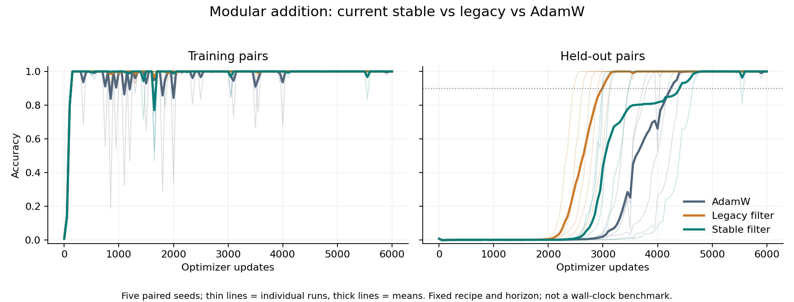
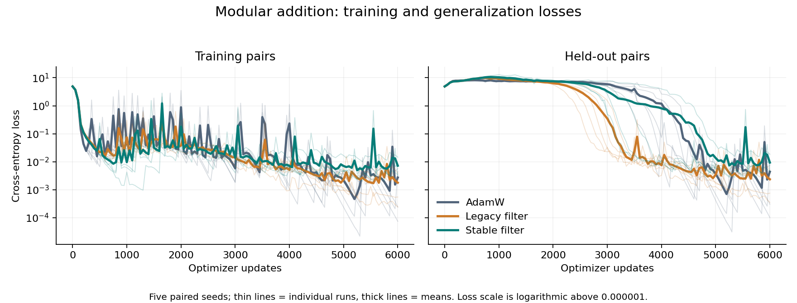

# Modular-addition confirmation: a real legacy step gain, a mixed stable result

Codex — Spectral Optimizer Investigation · 8 September 2026

## Findings and implications

The legacy filter again changes learning in a useful way on this task: all five
fresh paired seeds reach and sustain 90% held-out accuracy in fewer updates
than AdamW. The numerically stable implementation does **not** strengthen that
effect. Its mean first crossing is earlier than AdamW, but its mean sustained
attainment is almost unchanged, with substantial seed variation. All 15 arms
finish at 100% held-out accuracy. Neither filter demonstrates a wall-clock
improvement in these instrumented runs.

This supports studying a genuine, task-specific learning intervention. It does
not establish that the intended orthogonal projection preferentially retains
generalizing features. A saved-basis diagnostic gives a concrete next question:
the legacy operation has large, unequal gains inside its retained span, whereas
the stable operation is close to an orthogonal projector. Whether those gains
help form a rule or reveal an existing rule remains untested.

Evidence level: **prospective five-seed within-benchmark confirmation**, with
exploratory single-seed geometry below. This is not fresh task selection, a
large-sample guarantee, an application-transfer result or a safety guarantee.

## Fixed design and provenance

The [protocol](../output/2026-09-08-spectral-paper-planning/grokking-confirmation-protocol.md)
was frozen before training, source commit
`e36a0c3eec7aa5f8b4a9a65a888306d287c47f89`. Seeds 100–104 each use identical
initial weights and data splits across AdamW, legacy and stable arms. Every arm
runs 6,000 updates with no early stopping; all outcomes are retained.

- Modular addition modulo 113: 3,830 training pairs and 8,939 held-out pairs.
- Unchanged historical two-token, one-layer transformer: 128-dimensional model,
  four heads, 512-dimensional GELU MLP, LayerNorm; 227,313 parameters. This is
  not the exact architecture of the Nanda mechanistic-grokking study.
- Full-batch AdamW: learning rate 0.001, weight decay 1, betas (0.9, 0.98), no
  schedule. Filter: rank cap 200, decay 0.99, warmup 100, full-strength hard
  filtering, no normalization or adaptive rank; only `stable_update` differs
  between the two filter recipes. The realized rank can be below the cap.
- Initial evaluation and post-update evaluation every 50 steps: 121 rows per
  arm. Full state saved at 0, 100, 500, 1000, 1500, 2000, 2500, 3000, 4000, 6000.
- One RTX3090 process at a time, PyTorch 2.11.0+cu128, one CPU math thread.
  Fixed order AdamW/legacy/stable; shared desktop, not a randomized timing study.

Both bounded launch services completed successfully. The launcher verified all
150 checkpoint hashes. The collector independently verifies the full roster,
metric hashes, common recipe/source/environment/layout and paired data splits;
the committed raw metric copies are byte-identical to the source files.
The [independent audit](../output/2026-09-08-spectral-paper-planning/grokking-results-review.md)
reconstructs all 1,815 evaluation rows and verifies exact initial model, full
AdamW and RNG pairing for every seed. It supports these qualified conclusions
and finds no defect warranting an outcome-selected rerun.

Direct evidence:
[summary and source hashes](../output/2026-09-08-spectral-paper-planning/grokking-confirmation-results/summary.json),
[all 15 raw results](../output/2026-09-08-spectral-paper-planning/grokking-confirmation-results/raw/),
endpoint/timing supplement (artifact not distributed in this public snapshot),
launch record (artifact not distributed in this public snapshot).
Checkpoints remain at
`/tmp/spectral-experiment-artifacts/spectral-grokking-confirmation-20260908.aa2v66/` in
`seed100-batch` and `remaining-batch`; both experiment handles are consumed.

## Complete paired results

Each cell is **first recorded 90% / sustained recorded 90%** in optimizer
updates. Sustained means no later observation below 90% through step 6,000;
it does not assert permanence after that horizon or between evaluation points.
First crossings are observed on a 50-step grid, not known at exact update resolution.

| Seed | AdamW | Legacy filter | Stable filter |
|---|---:|---:|---:|
| 100 | 3500 / 4050 | 2500 / 2500 | 3000 / 5600 |
| 101 | 4400 / 4400 | 3150 / 3150 | 4650 / 4650 |
| 102 | 4200 / 4200 | 2950 / 2950 | 3000 / 3000 |
| 103 | 3800 / 3800 | 2800 / 2800 | 3150 / 3150 |
| 104 | 3750 / 3750 | 2650 / 2650 | 3500 / 3500 |
| Mean | **3930 / 4040** | **2810 / 2810** | **3460 / 3980** |

Paired differences are treatment minus control; negative means earlier.
Uncertainty below is the sample standard deviation of paired differences
divided by the square root of five (SE), **not** a confidence interval.

| Comparison | First crossing, mean ± SE | Sustained, mean ± SE | Favorable seeds, first / sustained |
|---|---:|---:|---:|
| Legacy − AdamW | −1120 ± 56 | −1230 ± 93 | 5/5 · 5/5 |
| Stable − AdamW | −470 ± 238 | −60 ± 468 | 4/5 · 3/5 |
| Stable − legacy | +650 ± 248 | +1170 ± 541 | 0/5 · 0/5 |

Legacy uses about 28.5% fewer updates to first crossing and 30.4% fewer to
sustained attainment, comparing arm means. Stable's corresponding reductions
are 12.0% and 1.5%. The latter is highly uncertain: do not advertise the
first-crossing figure as a reliable sustained-learning gain. In seed100,
stable first crosses at 3000 but dips below 90% again as late as 5550.

Every final held-out accuracy is 100%, so this fixed task/horizon does not
demonstrate a higher final classification ceiling. Mean final cross-entropy is
0.004382 AdamW, 0.002355 legacy and 0.009321 stable; stable is worse than AdamW
in four of five paired seeds despite identical final accuracy. These endpoints
must not be silently substituted for one another.

## Update counts are not elapsed-time gains

Recorded cumulative **training-only** time includes synchronized training/filter
work but excludes evaluation and checkpoint capture/writes. First/sustained
times are taken from the actual corresponding evaluation rows, not obtained by
scaling final elapsed time. The child end-to-end column is the complete fixed
6,000-step run before final JSON serialization, not time to threshold.

| Arm | Training seconds to first 90% | To sustained 90% | Training seconds, all 6000 steps | Child end-to-end, all 6000 steps |
|---|---:|---:|---:|---:|
| AdamW | 22.97 | 23.60 | 34.95 | 37.46 |
| Legacy | 27.54 | 27.54 | 57.73 | 79.01 |
| Stable | 39.28 | 44.28 | 65.06 | 83.54 |

Both filters take more measured training time to first and sustained 90% than
AdamW in every pair. This does not establish an immutable implementation-speed
limit: the runs are short, sequential and instrumented, and filter checkpoints
are much larger. It does rule out reporting a measured wall-clock speedup from
this bundle. No cloud or judge charges were incurred ($0 of the $100 budget).

## What operation did the legacy implementation actually apply?

The hard filter multiplies an incoming gradient by `V Vᵀ`. If the columns of V
are orthonormal, this is an orthogonal projection. In general its nonzero
eigenvalues are those of the small Gram matrix `Vᵀ V`: unequal eigenvalues
mean unequal gains within the same span, not pure retain-or-drop filtering.

An exploratory CPU calculation loaded the exact saved fp32 bases for seed100
at five checkpoints, verified their recorded file hashes, and calculated the
Gram eigenvalues in fp64. No training was replayed.

| Step | Legacy stored rank | Legacy maximum within-span gain | Stable stored rank | Stable maximum within-span gain |
|---|---:|---:|---:|---:|
| 100 | 92 | 11.4106 | 84 | 1.00000035 |
| 1000 | 189 | 54.8366 | 133 | 1.00000048 |
| 2500 | 200 | 7.2844 | 200 | 1.00000097 |
| 4000 | 175 | 172.5288 | 115 | 1.00001115 |
| 6000 | 194 | 14.4486 | 162 | 1.00001002 |

At step100 filtering is still inactive: that row measures the learned basis,
not an applied update. Later rows describe the saved operator, not the gain on
any particular gradient. Adam's normalization and carried moments mean these
numbers are **not parameter-update amplification factors**.

This shows why numerical stabilization can change the learning intervention,
not merely its implementation reliability. It does not prove that legacy gain
causes earlier grokking: the two trajectories also learn different spans and
ranks, and this geometry sample contains only one seed. The legacy learning
effect remains real under the tested recipe even if its mathematical operation
differs from the intended projector. Sources:
geometry data (artifact not distributed in this public snapshot),
[read-only checker](../output/2026-09-08-spectral-paper-planning/check_grokking_basis.py).

## Reproducibility and interpretation limits

- Pairing refers to exact initial model/Adam state and the same data, not
  bitwise-equal GPU trajectories. Seed100 already has microscopic model-state
  differences at step100 before filtering becomes active (largest absolute
  difference 1.19e−6), despite identical CPU/CUDA RNG states at steps0 and100.
  Code inspection finds no early gradient filtering. The precise numerical
  source is not identified; no deterministic-GPU replay was run and no seed
  was dropped. PyTorch documents reproducibility limits and separately opt-in
  deterministic algorithms; that documentation does not identify the cause
  of this particular drift. [PyTorch 2.11 reproducibility](https://docs.pytorch.org/docs/2.11/notes/randomness.html).
- Five new seeds give useful paired evidence on an already-selected positive
  task, not independent confirmation of a universal grokking effect. Sparse
  parity counterevidence and the original noisy-label positives remain intact.
- A first crossing, sustained accuracy, final loss and practical training speed
  answer different questions. None directly measures rule-circuit formation.
- Centered temporal gradient covariance is not cross-example agreement, a
  semantic clustering criterion, or a guarantee against learning coherent
  harmful behavior. This experiment does not measure alignment or safety.

1. **Measure rule development in saved checkpoints.** Validate cross-fitted
   hidden-state probes for modular-sum Fourier features, with permutation nulls
   and held-out probe evaluation, in this actual architecture. Pair them with
   behavioral trajectories and carefully qualified logit diagnostics. Earlier
   probe availability is evidence about representation, not causal mediation.
2. **Separate rule formation from cleanup.** Branch only from complete common
   saved state at a fixed post-memorization point. Preserve Adam state and
   account for filter warmup. Reuse the completed baseline trajectory; do not
   restart it. Carry retained-gradient and actual-Adam-update diagnostics so
   restrictions on incoming gradients are not mistaken for restrictions on motion.
3. **Test span versus gain at the same state.** Compare the legacy operator with
   an orthonormal projector onto its same column span, plus a stated scalar-dose
   control. This isolates an immediate operator distinction, not the whole
   cause of divergent multi-step trajectories. Use a fresh branch protocol
   before acquisition rather than retrospectively declaring this diagnostic
   preregistered. Include a fair Grokfast comparison before claiming novelty
   as a grokking intervention; a scalar-dose control is not Grokfast.