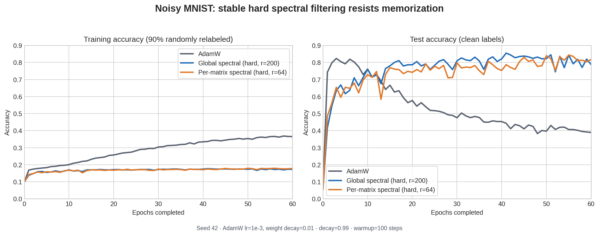

# Stable hard filters on noisy MNIST

## Question

How does the per-weight-matrix spectral filter compare over time with AdamW
and the global full-weight spectral filter on MNIST with noisy training labels?

The previously committed noisy per-matrix experiment used LoRA and soft
weighting. It could not answer this full-model, stable-hard comparison, so all
three curves here are new matched runs.

## Protocol

- MNIST MLP with 235,146 parameters.
- 90% of training examples selected for uniform random relabeling. A random
  replacement can equal the original label; the test labels remain clean.
- 60 epochs, seed 42, learning rate `1e-3`.
- AdamW base optimizer with weight decay `0.01` for all three methods.
- Both spectral methods use the stable covariance update, hard projection,
  decay `0.99`, and a 100-step warmup.
- Global rank 200; per-matrix rank 64 with joint weight/bias blocks.

The matrix rank was selected from a 20-epoch seed-42 scout:

| Rank | Peak test | Final test |
|---:|---:|---:|
| 8 | 0.5791 | 0.4678 |
| 16 | 0.6245 | 0.6136 |
| 32 | 0.7157 | 0.6740 |
| 64 | **0.7695** | **0.7420** |

Because selection and the plotted run use the same seed, the result is a
descriptive single-seed comparison rather than an unbiased multi-seed estimate.

## Results

| Method | Peak test | Mean test | Last-10 test | Final test | Final noisy-train | Time | Basis |
|---|---:|---:|---:|---:|---:|---:|---:|
| AdamW | 0.8235 | 0.5395 | 0.4069 | 0.3893 | 0.3651 | 133 s | — |
| Global stable hard, r=200 | **0.8548** | **0.7728** | 0.8026 | 0.7877 | 0.1726 | 485 s | 179.40 MiB |
| Per-matrix stable hard, r=64 | 0.8435 | 0.7500 | **0.8146** | **0.8174** | 0.1781 | 429 s | 57.41 MiB |

AdamW peaks early, then increasingly fits the corrupted labels while clean-test
accuracy collapses. Both stable hard filters keep accuracy against corrupted
training labels near 0.17–0.18 and preserve roughly 0.8 clean-test accuracy.
The global filter has the best mean and peak test accuracy; the per-matrix
filter has the best final and last-10-epoch accuracy in this seed, uses 3.125x
less maximum basis storage, and finishes 12% faster than the global filter.

## Soft versus hard

Soft weighting was not abandoned globally. It was the only per-matrix setting
that matched plain LoRA on the earlier clean LoRA benchmark, while hard LoRA
underfit. This experiment deliberately uses hard projection as requested and
shows that hard per-matrix filtering can work well for the full MLP under label
noise. The appropriate weighting remains workload-dependent.

Raw JSON, including every epoch, is under
`results/noisy_mnist_hard_curves/`; the plot is regenerated with
`experiments/plot_noisy_mnist_hard_curves.py`.
