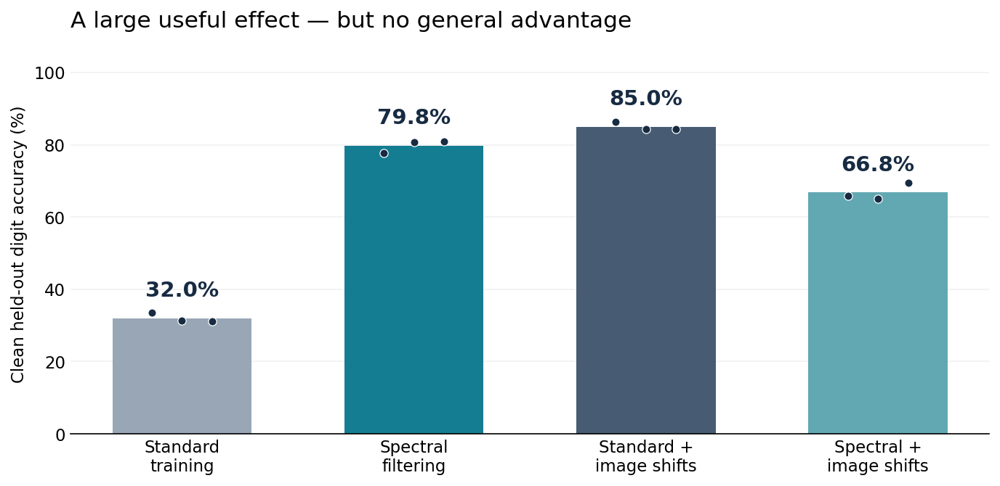

# Spectral filtering controls learning—but does not know which learning we want

Final core report · **Codex — Spectral Optimizer Investigation** · 11 September 2026

Public edition: private correspondence and execution details are omitted; the
scientific findings are unchanged. Publication was subsequently authorized.
See [snapshot scope](../PUBLICATION.md) for provenance and reproduction limits.

## Executive verdict

**There is a real, interesting learning effect here. There is not yet a compelling general-purpose optimizer or a demonstrated safety intervention.** The strongest result is substantial learning despite heavily corrupted labels, not merely preserving a frozen model. But ordinary image augmentation does better in the strongest controlled comparison, and adding the filter makes that recipe worse.

My best explanation is that the filter changes **which learning is easy**, according to gradient history, sampling and optimizer state. Sometimes that restricts memorization; sometimes it restricts useful adaptation or permits a shared wrong association. That is a useful research finding, but weaker than the original hypothesis that leading covariance directions separate generalizable features from memorized facts.

**Decision:** finish this as a focused empirical characterization with a mathematical account, not a breakthrough-optimizer or alignment-defense claim. Drop the optional familiarity/frequency study from this finish line; it would refine a secondary explanation without establishing the missing safety benefit. J-Lens and other extensions are parked. This report consolidates completed evidence; no new experiment was run for it.

## 1. The clearest result: it really can learn through noise

The strongest recent test trained a 235,146-parameter MNIST digit classifier with approximately **81% actually wrong training labels**, fixed throughout training. Four recipes used paired initializations, labels and minibatches in each of three seeds. The filter tracked a rank-200 space over **all model parameter gradients**, not a single activation layer. The base optimizer was AdamW.

| Training recipe | Final clean held-out accuracy | Accuracy at validation-selected checkpoint |
|---|---:|---:|
| AdamW | 32.0% | 72.5% |
| Spectral + AdamW | 79.8% | 83.0% |
| AdamW + small image translations | 85.0% | 86.0% |
| Spectral + AdamW + translations | 66.8% | 68.7% |

These are means over **three paired seeds**, not estimates of general performance across datasets. Each checkpoint was selected using separate clean validation cross-entropy; reporting examples were disjoint from training and validation within a seed. All data roles came from the official training split, not the official MNIST test set.

The unaugmented filtered classifier rises from **36.7% at filter activation to 79.8%**, with improved held-out cross-entropy in every seed. It is learning, not just refusing to change. It also fits only **2.5% of the actually wrong assigned labels**, versus **39.2%** for unaugmented AdamW at the endpoint. Learning true structure and limiting incorrect-label fit coexist.

Two limits belong beside that positive. First, filtering beats unaugmented early stopping on selected accuracy but **loses on selected cross-entropy** in every seed: it does not uniformly beat early stopping. Second, augmented AdamW beats the combined recipe on both accuracy and loss, in every seed, at fixed, validation-selected and late readouts. The combination actually fits wrong assignments more than either single intervention; its worse accuracy is not evidence of even stronger corruption suppression.

This is the principal figure pair for the paper: **useful learning first; the practical boundary immediately beside it.** The result does not need another experiment to become reportable. It is also not a wall-clock speedup: measured synchronized training averages about 676 seconds for unaugmented filtering versus 237 seconds for raw AdamW at the same exposure. Those are implementation costs, not a matched-target speed benchmark. [Full experiment, all seeds, timing and audit](../output/2026-09-10-spectral-strong-augmentation/results.md).

## 2. What the optimizer actually computes

Let **gₜ = ∇θ Lₜ** be the flattened minibatch-mean gradient over P model parameters. The regular, idealized observer update is:

<pre>
μₜ = β μₜ₋₁ + (1 − β) gₜ              running gradient mean
zₜ = gₜ − μₜ                           centered innovation
Cₜ ≈ truncateₖ[β Cₜ₋₁ + (1 − β) zₜzₜᵀ]
Πₜ = UₜUₜᵀ, with UₜᵀUₜ = I           leading retained parameter space
hₜ = Πₜgₜ                             gradient supplied to the base optimizer
</pre>

Conceptually C is **P×P**, with observations taken across training steps. The implementation stores a P×k factor, not a dense P×P matrix. This is the original temporal optimizer, distinct from the parked proposal to collect per-example gradients of a frozen model. No B×B implementation is selected here.

The approximation sign matters: truncation, numerical repair, initialization and finite precision distinguish the implementation from exact covariance. The first gradient seeds the mean, and the first nonzero innovation has special initialization weight. The current gradient enters the observer **before** filtering. The maintained stable policy repairs its basis; older grokking results use a legacy basis whose nonorthogonality changes within-space gains. Those versions cannot be treated as one identical projector. [Implementation](../spectral_filter.py); [code-grounded mathematical account](spectral_optimizer_unified_hypotheses_2026-09-10.md).

### Covariance is variation, not an agreement or truth score

At fixed parameters, suppose gradients have a shared component s plus zero-mean noise ε:

<pre>
g = s + ε
Cov(g) = Cov(ε)
E[ggᵀ] = ssᵀ + Cov(ε)
</pre>

A perfectly constant shared component disappears from centered covariance. A fluctuating wrong shortcut can dominate it. This does **not** make the original intuition useless: different groups of examples can contribute coordinated, low-dimensional changes that are genuinely useful. It means the link requires conditions; it is not built into the word “spectral.” Eigenvectors are directions, not automatically clusters of parameters or semantic concepts.

### Projection before Adam does not confine the actual weight update

AdamW applies carried momentum, coordinatewise scaling and decay after receiving h:

<pre>
mₜ = β₁mₜ₋₁ + (1 − β₁)hₜ
vₜ = β₂vₜ₋₁ + (1 − β₂)(hₜ ⊙ hₜ)
Δθₜ = −η m̂ₜ / (√v̂ₜ + ε) − ηλ θₜ₋₁
</pre>

Consequently, Δθ need not lie in the retained space. Supplying zero is also not freezing: inherited Adam state can still move the parameters. This weakens the simple stability story that the model literally travels in only k directions. It does not rule out stability benefits; those need their own measurements.

## 3. The mathematical steelman survives

There is a clean situation in which restricting directions does more than slowing or stopping all learning. Take an isotropic quadratic training loss with noisy optimum **w = θ⋆ + ζ**, where useful target θ⋆ and corruption ζ are nonzero and orthogonal. Let A = ‖θ⋆‖², B = ‖ζ‖² and curvature λ > 0. Ordinary gradient descent from zero follows scalar multiples of w. Even allowing any scalar endpoint:

<pre>
Clean risk at αw = (λ/2)[A(1 − α)² + Bα²]
Best scalar risk = (λ/2) AB/(A + B) > 0
</pre>

An ideal projector Π that retains θ⋆ and removes ζ instead gives:

<pre>
θₜ₊₁ = θₜ − ηΠ ∇Ltrain(θₜ), with θ₀ = 0
Clean risk = (λA/2)(1 − ηλ)²ᵗ → 0, for 0 < ηλ < 1
</pre>

Thus selective continuation can keep learning what matters while rejecting a corrupt component. **The missing bridge is discovering the right space.** This construction supplies the favorable projector; it does not prove the temporal observer finds it. It is an existing conditional derivation, not a claimed new theorem or a refutation of all scalar optimizers. Derivation and imperfect-direction qualifications (artifact not distributed in this public snapshot).

## 4. Which parts of that explanation have empirical support?

### A direction-dependent effect exists, not just a smoothing effect

Five modular-addition continuations compare a norm-restored projected gradient with a raw-direction action using the same **functional norm rule** on its own trajectory. Projection wins every final held-out loss, margin and representation-readability comparison. The raw alternative fits training perfectly but has only 0.22–2.13% held-out accuracy. This is constructive evidence that restricting direction can help useful generalization.

However, the projected arms themselves range from 1.58–98.99% held-out accuracy; these are not five fully grokked models. The branches inherit legacy-trained states, their scalar histories diverge, and actual Adam steps are not norm-matched. This defeats that particular raw-direction control, not every smoothing method or alternative subspace. [Complete five-parent comparison](grokking_raw_direction_2026-09-09.md).

The separate five-seed grokking confirmation also corrects the speed narrative: legacy filtering reaches sustained 90% accuracy earlier in updates on average, while the repaired stable implementation is almost unchanged versus AdamW. Both take longer measured training time in every pair. [Legacy/stable confirmation](grokking_stable_confirmation_2026-09-08.md).

### Presentation and history matter, even with identical exposure

At a fixed model, collect per-example gradients as columns of D and let a batch have example-weight vector a. Then:

<pre>
g = Da
Cov(g) = D Cov(a) Dᵀ
</pre>

The sampler can therefore change the selected geometry without changing the mean objective. A separate three-seed experiment preserves the exact indexed examples and assigned labels within each block but changes their grouping. Under noisy labels, grouped batches improve native common-digit accuracy from **47.92% to 56.64%**; rare-digit accuracy stays zero. The policy-by-schedule interaction is favorable in every seed. This supports a presentation-dependent learning effect, not proof that covariance alone mediates the final outcome. [Conserved-exposure experiment](../output/2026-09-10-spectral-batch-composition/results.md).

A local follow-up holds model parameters, Adam state and delivered input fixed while changing only observer history. It improves relative rare loss in all three reused clean parents, but only one of three noisy parents—even though rare-direction accessibility rises sharply. That isolates a useful **local observer-history pathway**, not the cause of the long-run endpoints. [Observer intervention](../output/2026-09-10-spectral-observer-pathway/results.md).

For a desired-loss gradient q, a small SGD step depends on **qᵀΠg**, not merely on how much of q fits in the space, **‖Πq‖²**. The input mixture and its signed alignment matter. More access is not automatically more useful delivery; Adam adds another transformation. The adverse relative effects in two noisy parents already appear at delivery, so they cannot first originate in Adam. [Saved-signal accounting](../output/2026-09-10-spectral-observer-signal/interpretation.md).

## 5. What the broader record prevents us from claiming

| Tempting claim | What the evidence actually permits |
|---|---|
| “It selects generalizable rather than memorized information.” | The rank-32 study preserves common accuracy under corruption but has zero rare-class recognition; a coherent wrong cue remains strongly learned. Rare loss still improves, so zero recognition is not zero learning. Frequency and novelty are confounded. |
| “It is just a moving average,” or “a moving average is generally better.” | Simple temporal controls are serious competitors. Gain normalization reverses an earlier endpoint ordering; a wider scalar family remains competitive with unequal selection opportunities. The grokking direction result prevents a blanket smoothing-only explanation. |
| “It works only because of Adam's second moments.” | An earlier controlled study finds fixed-label protection with SGD momentum as well as AdamW, but not plain SGD. Adaptive second moments are not necessary in that tested regime. |
| “It is an alignment or robustness defense.” | The recovered EM studies do not establish a matched-competence defense. Later adversarial evaluations contain harmful results despite similar clean competence. These cannot be erased by the noisy-label positive. |
| “The variant is always the same.” | Global temporal filtering, per-matrix LoRA filtering, old sample-space methods and adapter singular-value penalties are different interventions. Their results are not pooled replications. |

Sources: [selectivity report](../output/2026-09-09-spectral-selectivity-boundary/results.md); [cross-optimizer I14](../output/2026-09-06-spectral-optimizer-investigation/continuation/iteration-014/results.md); [gain-normalized I17](../output/2026-09-06-spectral-optimizer-investigation/continuation/iteration-017/results.md); [unified hypothesis ranking](spectral_optimizer_unified_hypotheses_2026-09-10.md); cross-repository investigation (artifact not distributed in this public snapshot). The last source preserves the EM, robustness, Numerai and missing-artifact qualifications rather than treating every historical result as independently rerun.

**Confidence:** high that the audited numbers describe these particular runs; moderate in history-dependent restriction as a unifying explanation; low in identifying the unique accumulated mechanism; no demonstrated broad safety efficacy. Several studies reuse parents or adaptively revisited tasks. Multiple treatment arms do not create independent replications. Arithmetic audits are not independent training replication or external validation.

## 6. The paper and safety case

The strongest defensible paper is **“What does temporal gradient-subspace filtering select?”** Its contribution is a connected empirical characterization: useful learning under corruption, limits on useful adaptation, conserved-exposure sampler effects and a controlled local history pathway. It should lead with the learning phenomenon, not a long catalogue of failed variants. Grokking supplies complementary directional evidence; the archive supplies the contradictions.

The original theory motivation is legitimate but needs careful wording. [Zhang et al.](https://arxiv.org/abs/1611.03530) demonstrate random-label fitting and challenge conventional explanations of generalization. That is not a proof that useful deep-learning theory is impossible. Conversely, [Feldman's long-tail model](https://arxiv.org/abs/1906.05271) gives conditions where memorization is needed for good generalization: restricting it can harm legitimate rare cases. Our digit experiment is not a direct test of that theorem.

Nor is gradient agreement or history filtering new. [Coherent Gradients](https://arxiv.org/abs/2002.10657) already connects cross-example gradient reinforcement with generalization. [Grokfast](https://arxiv.org/abs/2405.20233) uses temporal gradient filtering to accelerate grokking. The existing [bounded subspace-prior review](spectral_subspace_prior_check_2026-09-10.md) also identifies DOME's materially different versions, GaLore and an especially close TAGD indexed-method lead. TAGD's full evaluation and bibliography remain unverified. **This is not an established novelty claim**, and these methods were not all run as matched baselines.

The safety-relevant insight is that restricting updates needs an account of **which behavior it protects and which useful learning it sacrifices**. A real defense would have to reduce absolute unwanted behavior while retaining benign competence, coverage and useful adaptation. Existing findings do not meet that standard. Consequently, no LM pretraining speedrun, high-learning-rate optimization or RL expansion is part of this finish. This prioritizes understanding over capability gains; small-scale work is not automatically free of dual use. The public scientific snapshot was subsequently authorized; no paper submission is claimed.

## 7. Close the investigation, preserve the unresolved questions

No further rank sweep, clustering branch, J-Lens readout, model acquisition or local mechanism study is required for this report. Completed jobs and saved data must not restart. The final deliverable is this coherent account plus the existing methods-complete working manuscript and evidence archive—not a claim to have solved generalization or submitted a paper.

### Durable evidence and reading order

1. [Strong augmentation experiment](../output/2026-09-10-spectral-strong-augmentation/results.md).
2. [Unified mathematical hypotheses](spectral_optimizer_unified_hypotheses_2026-09-10.md).
3. [Knowledge-base synthesis](../knowledge/index.md) and its linked evidence map.
4. [Publication and reproduction scope](../PUBLICATION.md).

**Bottom line:** the optimizer is not a dumb idea. It produces a useful, conditional bias in learning. What we have earned is an explanation of some of that bias and its limits—not evidence that spectral prominence identifies safe or generalizable knowledge.
