# What Does Temporal Gradient-Subspace Filtering Select?

Working research-paper draft · updated 10 September 2026 · not submission-ready

This draft integrates the approved safety-first research direction with the
completed grokking confirmation, representation measurements, action
interventions, rare-learning/shared-cue boundary study, fixed-exposure
batch-composition intervention, matched-parent observer-history diagnostic and
saved-vector signal accounting, and the subsequent masking, ordinary clean/
wrong-label augmentation, fixed-state, clean multiview and strong rank-200
augmentation studies.
It is not a submitted paper, a claim of established novelty,
or a replacement for the frozen experiment-specific reports.

The [contribution-first paper core](spectral_paper_core_2026-09-10.md) provides
the compact argument, positive mathematical case and main evidence hierarchy.
This longer document retains the detailed evidence and methodological limits.
The typeset working manuscript (artifact not distributed in this public snapshot)
assembles the main argument, visible equations, five existing figures and
methods/evidence appendix. The [subspace-prior check](spectral_subspace_prior_check_2026-09-10.md)
adds version-specific method attribution, with a partial-access TAGD lead.
The working PDF includes section4.10's augmentation result in Appendix C,
with exact methods, cue-metric components and the frequency/reliability distinction.
Its introduction/discussion now include the [safety/contribution framing](spectral_safety_contribution_2026-09-10.md):
useful conditional control of learning, not yet a validated safety intervention.
Sections4.11–4.12 and the PDF's AppendixD add the completed ordinary-augmentation
sequence and strong bridge with visible mathematics and compact endpoint tables. Their full
all-seed account is in the [augmentation section](spectral_augmentation_sequence_2026-09-10.md).
Appendix E now consolidates the reviewed [augmentation loss identities](spectral_augmentation_loss_geometry_2026-09-10.md)
and [feature-geometry specialization](spectral_feature_geometry_2026-09-10.md).
Their constructive and adverse examples are conditional mathematics with
explicit prior precedents, not additional experimental evidence.

## Abstract

Can a gradient-subspace restriction preserve useful learning while suppressing
training-specific errors? We study an online temporal-covariance filter through
controlled learning tasks and inherited-state interventions. In a three-seed
MNIST study, stable filtering preserves common-digit accuracy under diffuse
label corruption: 62.01% versus 33.97% for raw AdamW at the fixed endpoint.
This useful preservation coexists with poor acquisition of a new rare correct
class and a readily learned shared misleading cue, despite partial cue
protection. A separate three-seed intervention rearranges identical example
occurrences and labels within fixed blocks; grouping improves noisy common
preservation in every seed without restoring rare recognition. Holding model,
Adam state and action input fixed then identifies a local observer-history
pathway: grouping improves relative rare loss in all three Clean parents but
not consistently under corruption. Increased access to a useful direction is
insufficient for improved delivered alignment or actual learning. Complementary
five-seed modular-addition interventions show a useful directional-restriction
effect against a specified raw-direction policy, with legacy/stable and
training-time qualifications. Conditional selective-continuation mathematics
provides a positive mechanism, while centering, sampling and carried optimizer
state limit its application. The results characterize a history- and
sampler-dependent learning bias, not semantic selection, a generally superior
optimizer or a demonstrated alignment intervention. Long-run mediation and
necessity of learning the particular subspace remain unresolved.

## 1. Motivation: predictable generalization, not a universal optimizer

Fitting a training set does not identify what a neural network has learned.
The same broad class of training procedures can fit meaningful data or random
labels. Zhang et al.'s experiments make this discrepancy concrete; Nagarajan
and Kolter show limitations of particular uniform-convergence explanations,
including tightly algorithm-restricted two-sided bounds in their constructions.
These results motivate more informative accounts of learned solutions. They
do not establish that generalization theory is impossible or that changing an
optimizer resolves the theoretical problem.
([Zhang et al.](https://arxiv.org/abs/1611.03530);
[Nagarajan and Kolter](https://arxiv.org/abs/1902.04742).)

Surrogate-based analyses provide informative guarantees in related settings;
the constructive alternative is to test conditional accounts of learning
dynamics, not assert that all theory has failed.
([Negrea et al.](https://proceedings.mlr.press/v119/negrea20a.html);
[Simon et al.](https://arxiv.org/abs/2604.21691v1).)

The motivating hypothesis is constructive: updates supported by reusable
structure may occupy a common subspace, while fitting some training-specific
exceptions requires other directions. Restricting those latter directions
could permit useful learning while reducing particular forms of overfitting.
Our goal is to identify the conditions under which this account is predictive,
rather than assume that high covariance means usefulness.

Goal misgeneralization gives a separate safety motivation: capability can
remain while the learned goal generalizes incorrectly. Our classifiers are
not agents and do not test that construct.
([Shah et al.](https://arxiv.org/abs/2210.01790v2).)
For safety, the distinction matters in both directions. Suppressing arbitrary
corruption may be beneficial; suppressing a rare truthful observation may not
be. A coherent harmful feature could be retained by precisely the bias that
helps a common benign rule. Therefore the project studies a possible control
of learning dynamics, not an alignment mechanism already validated by better
average test accuracy. Long-tail memorization theory supplies a concrete reason
to retain rare-example costs in the scientific question.
([Feldman](https://arxiv.org/abs/1906.05271).)

The originating Lawrence Chan posts and their later qualification are reviewed
in the approved paper assessment (artifact not distributed in this public snapshot).
Their rhetorical criticism of deep-learning theory is not a theorem. The paper's
contribution should instead be a limited, testable relationship between update
geometry and learned behavior.

### Contributions and evidence hierarchy

The main argument is organized around three findings: the useful protection
and selectivity boundary (Section 4.5), its controlled change under equal
training exposure (4.6), and a local observer-history pathway that separates
access from delivery and actual motion (4.8–4.9). These are complementary
tests, not successive requirements for declaring the preceding effects real.
The grokking interventions (4.2–4.4) supply constructive supporting evidence
for directional restriction, with a distinct legacy implementation and no
general speed claim. Provisional score analysis (4.7), detailed scalar histories
and application pilots remain supporting material with their own status.

## 2. The estimator, the action and the optimizer are different objects

Let gₜ be the batch-mean loss gradient in the flattened P-dimensional parameter
space. The running mean is updated before forming the innovation:

<pre>
μₜ = β μₜ₋₁ + (1−β) gₜ
zₜ = gₜ − μₜ
Cₜ ≈ β Cₜ₋₁ + (1−β) zₜ zₜᵀ
</pre>

The covariance expression describes the intended low-rank streaming estimate,
not an exact full-history identity after repeated rank truncation or numerical
error. Initialization is special: the mean is seeded with the first gradient,
and the first nonzero innovation initializes S=‖z‖, so its covariance contribution
lacks the later (1−β) weighting. This is an innovation-second-moment construction,
not literally a standard exponentially weighted covariance. The implementation
stores a P-by-k basis and smaller state, not a dense
P-by-P matrix. Its current gradient participates in the updated basis: the
filter is causal but not determined solely by the strict past. The actual
legacy and stable recurrences are distinguished in the
[canonical implementation](../spectral_filter.py) and
[stable-update report](stable_filter_evaluation.md).

Temporal centering is not per-example agreement. If gᵢ=s+εᵢ at fixed weights,
with zero-mean εᵢ and a perfectly shared component s, then
Cov(gᵢ)=Cov(εᵢ), whereas E[gᵢgᵢᵀ]=ssᵀ+Cov(εᵢ). A shared useful mean can thus
be absent from centered covariance. Across optimizer time, gradients also
change because the model itself changes. A temporal eigenvector is neither
automatically a cluster of parameters nor a semantic feature.

For a retained basis V, the historical hard action is r=VVᵀg. If V has
orthonormal columns, this is projection. With the legacy nonorthogonal basis,
a compact SVD V=QΣWᵀ, keeping its positive singular values and orthonormal Q,
gives the following actions when QQᵀg≠0:

<pre>
r_native = Q Σ² Qᵀ g
r_orthogonal = Q Qᵀ g
r_norm = c Q Qᵀ g,       c = ‖r_native‖ / ‖Q Qᵀ g‖
</pre>

Thus basis membership and within-span weighting are separate properties.
These actions are supplied to ambient-coordinate AdamW. Its carried first and
second moments, coordinatewise division, and decay need not preserve the input
subspace or action norm. Constant positive scaling of an entire gradient history
from zero moments nearly cancels in Adam when epsilon is negligible; scaling
only the current gradient with old moments retained need not. The
[reviewed derivation](../output/2026-09-09-spectral-grokking-action/adam-action-interpretation.md)
gives the exact coordinate response and a nonmonotonic regime.

### Shared-event covariance depends on the sampler

There is a constructive form of the original shared-feature intuition. At a
fixed model, if per-example gradients are G=a+Ib with I Bernoulli(q), the mean
of B independent draws has covariance q(1−q)bbᵀ/B. A shared direction can
dominate many weaker example-specific directions. But frequency and squared
amplitude interact: a rare strong direction can dominate, and a constant
shared contribution has no centered variance. No correctness label enters.

More generally, let W be average within-group gradient covariance and H the
covariance of group means. Iid batches have covariance (W+H)/B. Independent
within-group sampling with exact proportional counts has W/B at the same
expected gradient, when those counts are integral. Thus batch composition can
change the selection statistic without changing the expected objective.
Actual training also changes the base optimizer's noise, and moving native
eigenspaces do not equal eigenspaces of expected covariance. This is conditional
mathematics, not measured neural mediation or a new covariance identity.
See the [reviewed derivation](../output/2026-09-09-spectral-next-mechanism/batch-composition-theory.md).

### A conditional bridge from shared structure to useful learning

For modular addition, T_h(a,b)=(a+h,b−h) mod p preserves the target. Averaging
class-centered logits over this group defines a function-space projector R
onto sum-consistent predictions. Convexity of cross-entropy gives
L_full(Rf)≤L_full(f). If the starting function already satisfies f=Rf, then
L_full(f+Rδ)≤L_full(f+δ) for any finite logit change δ. This is a concrete
sufficient condition under which removing task-inconsistent function motion
helps relative to the unfiltered motion; it does not imply improvement over
doing nothing. The full-grid guarantee does not automatically hold on an
arbitrary held-out subset.

There is also a constructive counterexample to indiscriminate restriction.
For a noninvariant centered function f=Rf+h, the update δ=−h corrects its
inconsistency, whereas suppressing that update's residual gives Rδ=0 and
blocks the correction. Thus a within-sum update may remove an existing
inconsistency rather than create one. Its energy alone is not memorization.

The parameter projector P does not automatically implement R. For ideal SGD,
the first-order raw-to-truncated bridge would require J_θPg≈RJ_θg; equal-norm
projection adds the retained-amplitude factor. Carried Adam further changes
the action-to-function map. The empirical question is therefore whether the
actual update changes task-consistent structure in a beneficial signed way,
not whether low-dimensional updates are inherently semantic or safe. See the
reviewed derivation and counterexample (artifact not distributed in this public snapshot).
Group-orbit averaging itself is established related work, not a novelty claim
([Chen, Dobriban and Lee,2020](https://www.jmlr.org/papers/v21/20-163.html)).

## 3. Relation to earlier work

Coherent Gradients and its robust-aggregation follow-ups are close motivational
precedents. Their within-step per-example agreement is not the temporal
centered statistic above. Work showing that training can create coherence even
with random labels further rules out coherence as a semantic certificate.
([Coherent Gradients](https://arxiv.org/abs/2002.10657);
[Making Coherence Out of Nothing At All](https://arxiv.org/abs/2008.01217).)

A [further bounded primary-method check](spectral_subspace_prior_check_2026-09-10.md)
identifies closer subspace precedents. [DOME v1](https://arxiv.org/html/2507.03545v1#S3)
uses a historical global sketch plus random probes, restores the mean after
sketching innovations, and supplies reconstructed gradients to an ambient Adam
variant. [DOME v2](https://arxiv.org/html/2507.03545v2#S3) changes both title and
method: it streams covariance of per-example gradients centered inside each
minibatch, then removes its leading space. Native instead centers successive
batch means and retains its leading space. These are different statistics,
not merely opposite actions on one covariance. V2's text/algorithm scaling and
optimizer descriptions also need resolution before code-equivalence claims.

[TAGD's indexed primary methods](https://openreview.net/pdf?id=Dc6AEOYQjM)
describe a centered rolling global gradient history and dominant-space
retention with adaptive complement damping before the base optimizer. This is
a particularly close same-action precedent, but direct PDF access was challenged:
full evaluation and current bibliographic provenance remain unverified. Its
visible algorithm is sufficient to reject a confident first-history-projection
claim, not to certify equivalence or a complete priority assessment.

[Song et al., v3](https://arxiv.org/html/2405.16002v3#S3) already show that high
gradient alignment with a dominant Hessian space need not sustain learning;
their adaptive-optimizer comparison projects the update vector, unlike native's
pre-Adam input filtering. Neither the selected matrix nor placement can be
silently equated. The empirical candidate here is the specified equal-exposure
and observer-only intervention, not a newly discovered energy-versus-utility
distinction. Its priority remains open.

Grokfast adds an average of past gradients to the current gradient before the
base optimizer; it does not replace the gradient by its average. Its EMA form
is μₜ=αμₜ₋₁+(1−α)gₜ and rₜ=gₜ+λμₜ. This uses temporal frequency filtering,
not eigendecomposition of parameter-space covariance. Its paper already studies
late switching and interaction with weight decay. Consequently neither
“gradient history affects grokking” nor a late-switch gain is a new claim here.
A matched Grokfast comparison is still missing.
([Grokfast, v2](https://arxiv.org/html/2405.20233v2);
[official implementation](https://github.com/ironjr/grokfast/blob/main/grokfast.py).)

GaLore projects instantaneous layer-gradient matrices into low-rank factors
for optimizer-state efficiency. Its matrix rank is not flattened global
parameter-space dimension. Nanda et al.'s mechanistic grokking work supplies
the formation-versus-cleanup distinction, but its identified circuit cannot be
assumed for our different architecture. The local measurements therefore use
held-out linear probes and supporting symmetry readouts, not an imported
Fourier circuit attribution.
([GaLore](https://arxiv.org/abs/2403.03507);
[Progress measures for grokking](https://arxiv.org/abs/2301.05217).)

NeuralGrok learns positive coordinate reweighting followed by norm rescaling,
and explicitly tests direction-preserving normalization c g/‖g‖ alone. Scale
versus direction is therefore not a new question. Its released implementation
normalizes each parameter tensor, clips globally, then calls Adam; its
meta-learning surrogate is an SGD-like update without inherited Adam moments.
([NeuralGrok, v2, Section 3.2](https://arxiv.org/html/2504.17243v2#S3.SS2);
[version-pinned training code](https://github.com/Blackzxy/NeuralOptGrok/blob/a7490be2bccf9ba1690283378915e622b932cb8e/src/train.py).)

Egalitarian Gradient Descent polar-normalizes instantaneous layer gradients:
G=USWᵀ becomes UWᵀ on the nonzero singular subspace. This equalizes matrix
singular values, not temporal variation or Adam's subsequent coordinate
movements. Its linear-model inverse-covariance argument does not prove the
nonlinear neural-optimizer extension.
([EGD, v3](https://arxiv.org/html/2510.04930v3#S4).)

Related Muon work reports faster minority-component learning in selected
imbalanced settings, especially early; its population SpecGD theorem assumes
linear squared loss and jointly diagonalizable moments. Another controlled
study finds that the relative benefit of Muon versus SGD reverses with the
strength of a spurious feature. These support conditional optimizer–data
interactions, not generic shortcut rejection. Layer-matrix spectral
equalization is also a different operation from retaining leading temporal
parameter-covariance directions.
([Imbalanced-data study, v3](https://arxiv.org/html/2510.22980v3);
[simplicity-bias study](https://arxiv.org/html/2603.00742).)

The focused primary-source and code check (artifact not distributed in this public snapshot)
documents these distinctions and implementation caveats. Our defensible current
contribution is the specific inherited-state temporal-operator intervention and
its measured limits, not a first gradient-normalization idea or speed record.
Priority over the broader subspace literature remains unestablished.

## 4. Evidence: useful behavior first, explanatory controls second

The [consolidated methods supplement](spectral_paper_methods_2026-09-10.md)
specifies the three-contribution core's architecture, data/label construction,
observer and Adam policies, exact-exposure scheduling, frozen-parent readout,
replication units and saved-vector accounting. It is a retrospective
organization of the completed protocols, not new acquisition or reanalysis.

| Evidence | Observed positive effect | Boundary |
|---|---|---|
| Historical three-seed noisy MNIST | Mean endpoint clean accuracy 79.74% with rank-200 filtering versus 37.22% Adam | Test-selected peaks are 84.88% versus 83.19%; not proof of superiority to valid early stopping |
| Five-seed modular-addition confirmation | Mean first/sustained 90% steps: legacy 2810/2810 versus AdamW 3930/4040 | Stable 3460/3980; both filters slower in measured training time |
| Saved-state representation measurement | Legacy-minus-AdamW selected R² at 2500: +0.4560 ± 0.1063 SE, positive in all five seeds | Linear readability, not circuit identification or safety |
| Common-state action intervention | Norm-matched-minus-native at 2500: CE −0.3657 ± 0.0738 SE; R² +0.0643 ± 0.0070 | Archived reference; inherited legacy state; early behavioral signs mixed |
| Raw-direction discriminator | Projected beats raw on CE/margin/R² in all five seeds at2500 under the same functional norm rule | Not identical scalar histories; not a random/frozen-span control or safety result |
| Three-seed selectivity boundary | Diffuse-noise common accuracy 62.01% spectral versus 33.97% AdamW; less wrong-target fitting | Rare accuracy 0% versus 51.73%; shared misleading cue largely learned, despite partial protection |
| Three-seed strong augmentation bridge | Unaugmented native200 learns +43.053 points beyond warmup and reaches79.753% versus raw32.000%; selected accuracy also favors native | Selected unaugmented CE is worse; with translation native66.820% loses to raw84.973% in every seed and both metrics, also at selected/late readouts |

Direct sources: historical numerical audit (artifact not distributed in this public snapshot),
[confirmation raw-linked summary](../output/2026-09-08-spectral-paper-planning/grokking-confirmation-results/summary.json),
[representation summary](../output/2026-09-09-spectral-grokking-mechanism/results/summary.json),
[action summary](../output/2026-09-09-spectral-grokking-action/results/summary.json),
[raw-direction summary](../output/2026-09-09-spectral-raw-direction/results/summary.json),
[selectivity checked summary](../output/2026-09-09-spectral-selectivity-boundary/results/checked-summary.json),
[strong-bridge audit and all reporting windows](../output/2026-09-10-spectral-strong-augmentation/audit.json).
These studies have different recipes and evidence status; they are not pooled
replicates of one estimand. SE denotes the sample standard error across the
stated paired seeds, not a confidence interval or an equivalence test.

### 4.1 Why the noisy-label result remains useful

The endpoint effect shows that substantial clean classification can coexist
with reduced fitting of corrupted labels. Later stable-code studies preserve
some endpoint protection but also reveal underfitting, selector-dependent
comparisons, and reduced useful adaptation. Mean-preserving variants can
restore adaptation while admitting corrupted-label fitting again. These
observations refine a genuine phenomenon into a learning tradeoff rather than
erase it. The detailed [noise evidence page](../knowledge/findings/noise-memorization.md)
links each claim to its experiment, including scalar-control results.

### 4.2 What the grokking intervention isolates

Five full model/Adam/filter/RNG states at step 1500 were the fixed starting
points. Three first actions shared one raw gradient and post-update estimator.
Native stopped after one diagnostic update. Orthogonal and norm-matched
policies each continued exactly 1,000 updates; native endpoints were reused from
the completed corpus. Known CUDA trajectory sensitivity limits comparison to
an archived rather than contemporaneous native branch; full-state restoration
does not certify bitwise future replay. All 35 new states were measured once
using model-training-held-out pairs with separate probe-fit and probe-evaluation
halves, the fixed frequency/null recipe, and behavioral readouts.

Plain projection is worse than native on CE, margin and selected R² for every
seed at both endpoints 2000/2500. Norm-matched projection is better than plain
projection on all three for every seed at both endpoints. Against native,
norm-matched readout improves in all five at both endpoints, but CE/margin signs
are mixed at 2000 and uniformly favorable at 2500. Mean accuracy at 2500 is
40.00% norm-matched, 33.23% native and 8.10% orthogonal—not completed grokking
for every model. See the [full action report](grokking_action_mechanism_2026-09-09.md)
and [independent raw audit](../output/2026-09-09-spectral-grokking-action/raw-results-audit.md).

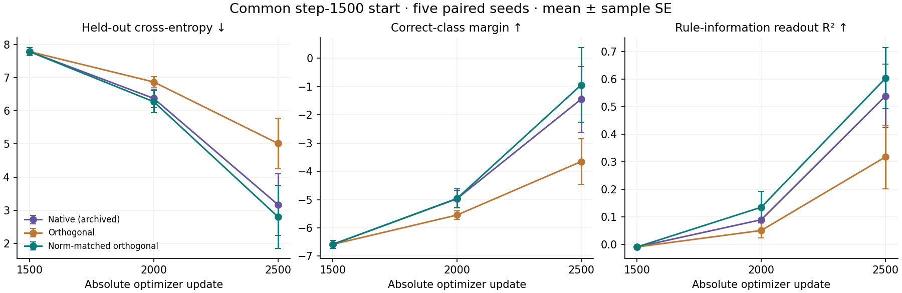

### 4.3 Direction restriction beyond the functional norm law

A new five-seed arm resumes the same original parents and delivers
`r_raw = a g/‖g‖`, where `a=‖V(Vᵀg)‖` is recomputed from its own unchanged
legacy observer. It removes the delivered-span restriction while retaining
the scale function. It does not hold subsequent numerical scales, gradients,
filter states or Adam histories common. All15 new states and their complete
history/first-action records were independently checked; no old experiment or
inference was repeated.

At2500, raw minus archived norm-matched projection is CE+3.8245±0.6632SE,
margin−4.5054±1.0246, and selected R²−0.4357±0.0695; every seed favors
projection on every primary. Raw also loses to native and unscaled projection
on all three primaries in every seed. At2000, raw-vs-projected behavioral signs
favor projection4/5, with5/5 readout gains. Raw reaches100% training accuracy
but only0.22–2.13% held-out accuracy at2500. It still develops some readable sum
information: lower readability is not absence or demonstrated erasure.

This is constructive evidence for useful directional restriction conditional
on the inherited state and specified policy alternative. It does not establish
generic necessity of learned geometry, superiority to every scalar schedule,
or semantic identification of discarded directions. See the
[full result and preserved analysis-reader correction](grokking_raw_direction_2026-09-09.md).

At a common state, P r_raw=ρ r_norm, where P=QQᵀ and ρ=‖Pg‖/‖g‖.
Equal-total-norm projection removes off-span motion **and** boosts retained-span
drive by1/ρ. Harmful off-span updates and insufficient useful within-span drive
are distinct explanations not separated by this contrast.

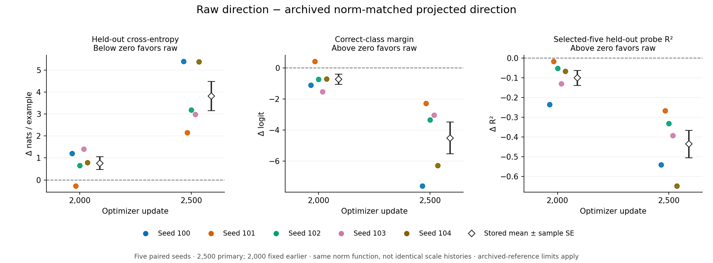

### 4.4 A local functional discriminator: suppression versus amplification

At the same five inherited step-1500 states, a completed one-step diagnostic
compares raw action u, truncation Pu without norm restoration, and the
norm-restored projected action Pu/ρ. Each independently restores the identical
model and Adam state. Archived before/raw readouts are reused; the new steps
are truncation, norm restoration and an explicit-zero-gradient Adam drift
reference. An independent saved-data audit passes 7,675 checks. This measures
finite responses at one shared state per seed, not trajectory mediation.

Raw→truncated held-out CE is −0.001178 ± 0.000730 SE and margin is
+0.001465 ± 0.000908; every seed is favorable. Training CE and margin instead
worsen in all five. Truncated→norm-restored reverses part of this held-out
benefit: CE +0.000201 ± 0.000174 and margin −0.000264 ± 0.000233, while training
improves in all five. Some amplification differences are tiny (seed100 CE
2.96e−7, margin −6.01e−8); sign counts are descriptive, not a cross-invocation
CUDA precision certificate. Raw→truncated changes no classification decisions.

Decompose class-centered finite logit changes into sum-consistent Rδf and
within-sum (I−R)δf. Their signed negative-CE-gradient inner products are evaluated
at the shared before logits, separately normalized on train and heldout inputs.
For raw→truncated, held-out linear utility is +0.001171: the sum-consistent
component is adverse (−0.000317) and the within-sum component favorable
(+0.001489), each with the same sign in every seed. This does not show increased
useful rule-consistent motion; beneficial within-sum correction is compatible
with the conditional theory in Section2.1. Neither component is a semantic
memorization label, and the utility is a derivative along a finite output
chord, not a parameter JVP or exact finite CE change.

Explicit zero input still moves the model through inherited Adam history and
decay. Every active action improves training relative to that reference, but
worsens held-out CE/margin in four of five seeds. Therefore local gradient
effects and carried-state dynamics both matter; zero is not a generally better
optimizer. The earlier 1,000-step advantage cannot simply be attributed to an
immediate held-out gain from retained-direction amplification at these states.
See the [full all-seed interpretation and directly linked evidence](../output/2026-09-09-spectral-function-response/interpretation.md).

### 4.5 Rare correct recognition and a shared misleading cue

A fixed three-seed MNIST study adds 36 trajectories: four data conditions,
three policies and three seeds. A common 100-step warmup excludes digit 8;
subsequent 5,000-example training includes 50 correctly labelled 8s. The
conditions are Clean, Diffuse majority-label corruption, Shared wrong patch
cue and a matched Sham. Raw AdamW, stable global rank32 and an own-state
native-norm rule along raw direction run to the fixed step-2000 endpoint.
The independent saved-data audit passes 631,855 checks. These held-out data are
split from the official training set; the official test set is not used.

Under Diffuse, spectral common-digit accuracy is 62.01% versus 33.97% raw,
favorable in every seed, with wrong-target training accuracy 6.22% versus
32.48%. Both decline from warmup common accuracy 87.76%: this is useful
preservation against corruption, not absolute improvement. Common CE is nearly
unchanged in mean with mixed paired signs; balanced CE including the rare
class is worse. Better classification does not establish better probability
predictions.

Spectral rare accuracy is lower and rare CE higher than both raw policies in
every seed and cell. Clean rare accuracy is 4.93% versus 52.00% raw; Diffuse
is 0% versus 51.73%. Rare training accuracy is also zero under Diffuse and
Sham. Yet rare CE improves from warmup in every spectral seed/cell: zero
argmax accuracy is not zero learning. Rarity, digit identity, warmup exclusion
and representation novelty are entangled in this one-class pilot.

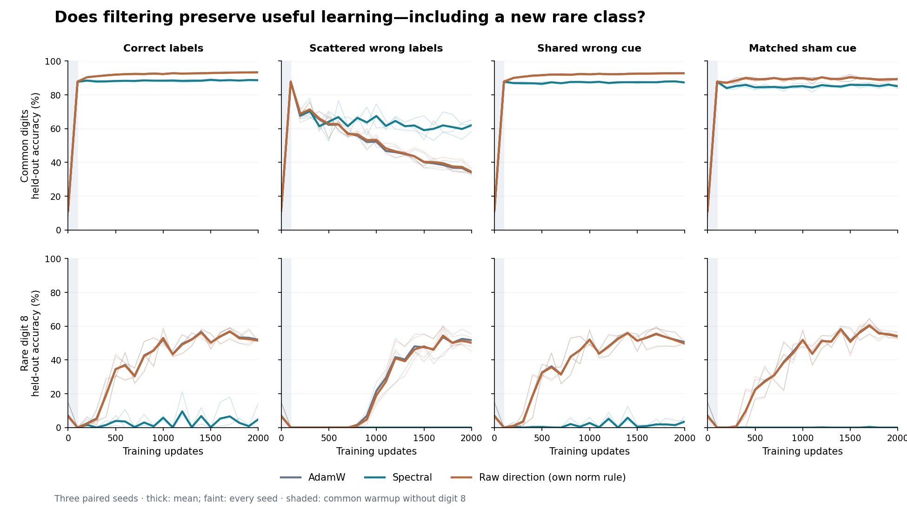

Shared and Sham have identical 500 wrong target-0 labels and exact per-digit
patch counts, but different patch/poison association. The primary cue effect
is patched-minus-unpatched target-0 prediction rate on 4,000 matched held-out
nonzero common-digit images within each seed. Spectral Shared excess is
94.825 percentage points versus raw 98.933; its wrong-target fit is 96.87%.
The registered difference-in-differences,

    D = (E_Shared − E_Sham)_spectral − (E_Shared − E_Sham)_raw,

is −3.358 ± 0.893 points SE across three seeds, favorable in all three. This
modest protection coexists with nearly complete cue-induced classification
failure. Patched common CE is substantially better (2.9232 versus 11.3060),
so the result is not a blanket lack of protection: the filter reduces
confident errors while retaining a highly learnable misleading association.
This synthetic cue is not a human-values misalignment assay.

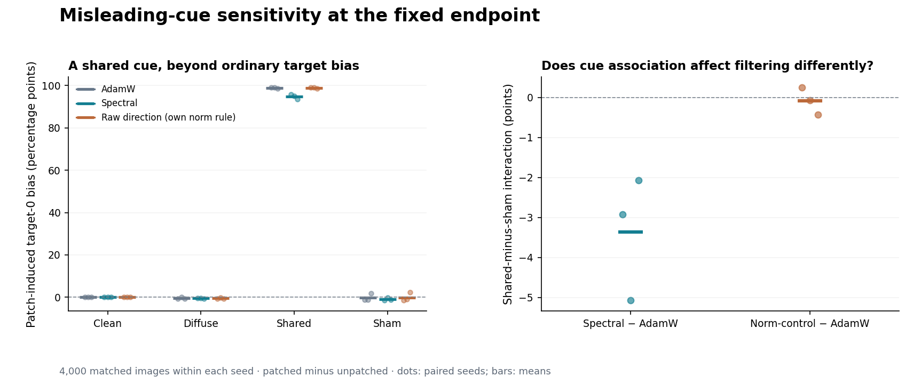

The specified own-norm raw policy largely resembles AdamW, so that norm rule
does not reproduce the learning tradeoff. Numerical scalar histories and
actual Adam steps are not matched. Native diagnostics further weaken a simple
permanent exclusion account: rare within-group gradient coherence is high
at step101, and rare mean-action energy retention reaches 98.05–99.12% at
late Clean/Shared anchors despite poor recognition. Across all 36 anchors,
62.39–86.14% of actual Adam movement squared norm lies outside the saved span.
Convenience-subset probes do not identify mediation. Incoming retention,
signed movement and accumulated learning are different quantities. See the
[full result](../output/2026-09-09-spectral-selectivity-boundary/results.md) and
[independent interpretation](../output/2026-09-09-spectral-selectivity-boundary/interpretation.md).

### 4.6 Fixed exposure, changed batch composition

A new prospectively fixed three-seed experiment compares two schedules with
identical indexed examples and labels in every50-update block. Interleaved
spreads rare counts nearly equally; Grouped concentrates them in as few
batches as possible. Within-group occurrence order and slot shuffles are
shared. Both differ from the earlier iid baseline. Clean/Diffuse and the
three original policies give36fresh trajectories and72native diagnostics,
from shared100step warmups to fixedstep2000. Independent saved-data audit
PASS covers514404checks,756evaluations and all72events.

The intervention gives a useful effect: spectral Diffuse common accuracy
improves47.92→56.64% under grouping, with gains9.20,10.07,6.91points. Its
native-minus-raw schedule interaction is+8.34±1.08points SE, favorable in all
three seeds. Wrong-target fitting falls7.93→6.40%; balanced accuracy and CE
improve in every seed. Common CE is mixed across seeds and remains worse
than raw in mean, despite a large common-accuracy advantage. This remains
relative preservation of the clean warmup, not absolute common improvement.

Rare Diffuse accuracy is still0% for spectral in every seed and schedule.
The favorable+34.4point rare-accuracy interaction is entirely due to raw
AdamW deteriorating51.80→17.40% under grouping; it is not a rare-learning
rescue. Clean spectral rare accuracy improves2.27→10.27%, with paired
gains.8,.6,22.6points: the mean is dominated by one seed. Rare CE is mixed,
and common accuracy/CE worsen in all three. Both raw policies remain better
on every Clean rare/common primary. All seeds and contrasts are retained in
the[checked result](../output/2026-09-10-spectral-batch-composition/results.md).

The[saved-event interpretation](../output/2026-09-10-spectral-batch-composition/interpretation.md)
adds a constructive local result: all18Grouped high-count events improve the
rare training-probe CE after the actual Adam step. Nevertheless all9Diffuse
Grouped high events worsen common-probe CE, while the common endpoint improves.
Late Diffuse Grouped rare mean-action retention is96.29–99.18%, despite zero
final rare recognition. Incoming accessibility and helpful burst updates
therefore need not accumulate into correct recognition. Count-selected sparse
anchors, including current-gradient observation, do not establish inter-burst
forgetting or a matched-state mediator.

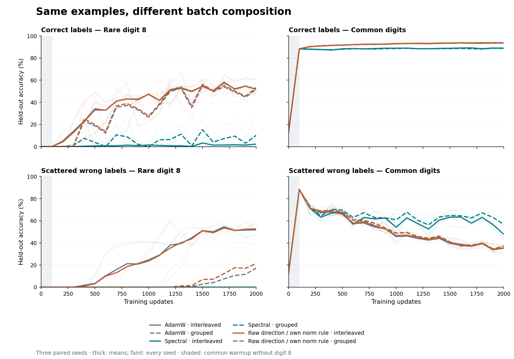

At fixed parameters, a deterministic two-group model gives

    g_t = mu_c + q_t (mu_r − mu_c)
    Cov_block(g_t) = Var_block(q_t) (mu_r − mu_c)(mu_r − mu_c)^T.

Identical block occurrence multisets preserve the mean gradient in exact
arithmetic, but not along diverging trajectories. The contrast is a difference
of group means, not necessarily the useful rare mean; Adam state and update
spacing change too. This establishes a sampler–policy interaction, not
covariance-only mediation or semantic classification of gradient directions.

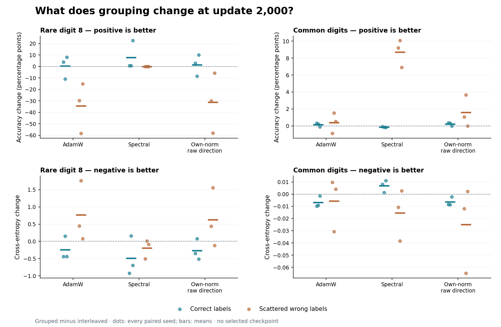

### 4.7 Provisional distinction between rare recognition and discrimination

A separate post-hoc analysis of the preceding selectivity study's saved
unpatched logits asks whether poor argmax recognition hides useful rare
ranking. It fixes the score and a true-class-count adjustment before logit
access:

    s(x) = z_8(x) − log(sum_{k != 8} exp(z_k(x)))
    z'_8(x) = z_8(x) + log(550/50)
    s'(x) = s(x) + log(11), so AUROC(s') = AUROC(s).

Native rare AUROC rises from mean.5546 at warmup to.9295 Clean,.9119 Shared
and.8823 Sham, improving in every seed despite low recognition. Diffuse
instead falls to.4080 and is below.5 in every seed. Both controls have
stronger AUROC everywhere. Thus low argmax accuracy need not mean absent
useful discrimination, but the noisy gap cannot be corrected solely by a
constant rare-score offset. The fixed+log11 transform raises rare accuracy
with common-class costs; it is not a trained or calibrated remedy, and the
same adjustment is applied to controls. It does not establish prior mismatch
as a causal explanation.

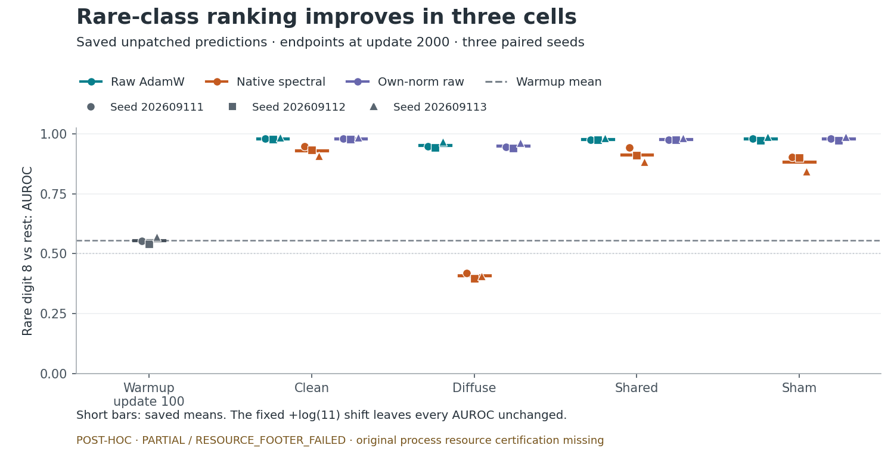

**Evidence limitation:** this analysis remains PARTIAL/RESOURCE_FOOTER_FAILED.
All144 numerical rows and input checks completed, but its original terminal
resource certificate is missing. Main's separate table-only check verifies
1880comparisons, including432original metrics against the preceding independent
audit; new AUROC was not independently remeasured. No scientific retry occurred.
See[source, all-seed values and provenance](../output/2026-09-10-spectral-rare-score-analysis/interpretation.md).
This provisional supplement is not required for the checked batching result.

### 4.8 Fixed-model observer history: access versus useful delivery

The preceding batching intervention changes gradients and learned states along
its trajectories. A separate diagnostic reuses its three step-100 parents,
holding model parameters and Adam state fixed while two observer copies receive
the first 50 grouped/interleaved batches. Each cell uses the same occurrence
multiset and a canonical common block-mean action input. After observing that
input once, the native action takes one copied-state Adam step; raw and
explicit-zero actions provide references. This gives six Clean/Diffuse cases,
12 histories and 21 physical readouts (24 logical cases, sharing zero across
label cells). Independent saved-data audit PASS covers 33,032 checks without
replaying gradients, inference or the observer stream.

In exact fixed-parameter arithmetic, the equal exposure implies

<pre>
g* = (1/50) sum_t g_t^Grouped = (1/50) sum_t g_t^Interleaved
h_s = V_s V_s^T g*                       [after common-input observation]
Delta_s = AdamStep(theta_100, A_100, h_s) − theta_100
U_s = L_heldout(theta_100) − L_heldout(theta_100 + Delta_s)
D = U_Grouped − U_Interleaved.
</pre>

The implementation verifies a fixed FP32 mean-agreement bound and supplies
exactly the same symmetrically constructed input bytes to both native arms
and raw. Observer time advances 100→150→151 while Adam advances only 100→101.
It is an artificial local intervention, not normal next-minibatch continuation.

For rare clean-label loss, D is +0.001414, +0.004464 and +0.003399 nats/example,
mean +0.003092 ± 0.000894 sample SE. Grouped absolute rare improvements are
−0.012301, +0.007962 and +0.025786: one reduced-damage case and two greater
positive-progress cases. The full observer history therefore changes a useful
finite step at fixed model, optimizer and input states. Common contrasts are
tiny and mixed, not established equivalence. Under Diffuse, rare D instead is
+0.000752, −0.000962 and −0.001638, mean −0.000616 ± 0.000711 SE, despite
positive Grouped absolute rare improvement in all parents. Raw makes more
common CE progress than either native history in every case. Rare training
and held-out accuracies remain zero. Nonzero noisy actions all improve
actually-wrong-label fitting loss, so this is not local corruption suppression.

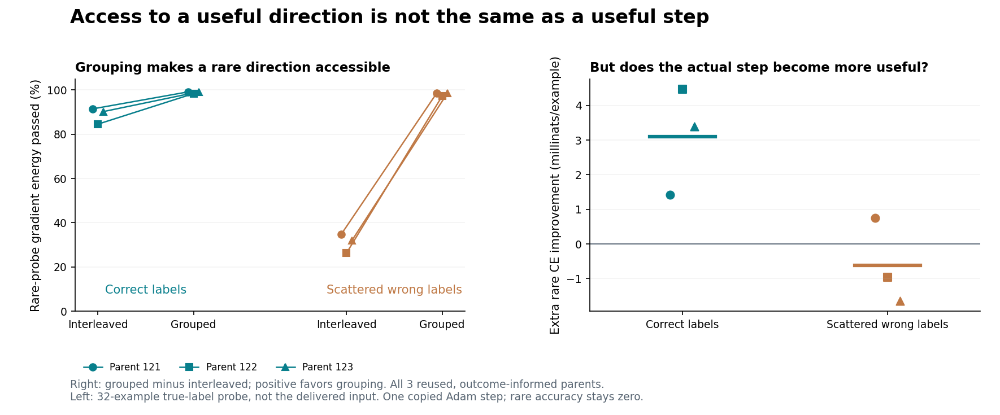

Rare true-label probe energy retention rises from 84.5–91.4% to 98.3–99.1%
under Clean and 26.3–34.8% to 97.2–98.6% under Diffuse. Yet both noisy-history
actions already retain about 99.6% of their actual common input. A filter's
ability to pass a known helpful direction is not the useful content of the
delivered mixture. Common-input self-inclusion barely changes the history
contrast. Actual native adaptive movement has 84.84–95.39% of squared norm
outside the observer span, reflecting coordinatewise Adam and inherited state,
not a measured causal contribution of either. Zero-gradient Adam still moves:
it improves common loss and worsens rare loss in all parents.

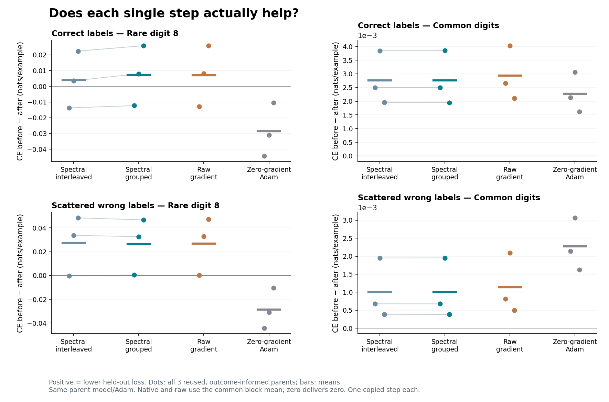

The three parents are reused and outcome-informed; the action is a smoothed
block mean. History includes running means, centered innovations, truncation
and ordering, while direction and gain both change. The result identifies a
local useful-history channel and a boundary to accessibility-only reasoning,
not population-covariance mediation, semantic selection or an explanation of
the step-2000 protection. Full seed values, absolute controls and precise
provenance appear in the [report](../output/2026-09-10-spectral-observer-pathway/results.md)
and [interpretation](../output/2026-09-10-spectral-observer-pathway/interpretation.md).

### 4.9 Available direction, present signal and delivered alignment

A bounded post-hoc calculation adds the missing cross products to Section 4.8
without any new model or optimizer execution. It reads 21 previously saved
archives from the same three parents, retaining both label conditions, both
true-label diagnostic probes and all native/raw/zero controls. The source and
fabricated fixtures were independently reviewed; each new FP64 reduction was
checked against compensated summation using fixed cancellation-aware bounds.
This is not an additional independent scientific audit. Actual Adam utilities
and held-out losses below are joined from the accepted preceding audit.

For a diagnostic probe q, common input g and native delivered action h_s:

<pre>
B_q = q^T g                         [input alignment]
F_q,s = q^T h_s                     [delivered alignment]
D_filter = q^T(h_Grouped − h_Interleaved)
J_q,s = −q^T Delta_s                [actual Adam linear utility]
D_Adam = J_q,Grouped − J_q,Interleaved.
</pre>

In exact arithmetic with A=VV^T, q^TAg=(Aq)^Tg. Large norm retention of q
therefore does not fix its interaction with g. The analysis uses actual stored
FP32 actions, not a reconstructed ideal orthogonal projector.

Rare B is positive at every parent under both labels. Its mean increases from
2.2989 Clean to 4.8866 Diffuse, while cosine falls from 0.4210 to 0.1698 and
input norm rises from 0.3653 to 1.9161. Thus reduced angular alignment and
increased absolute probe-aligned signal coexist. Neither absence nor reversal
of rare input alignment describes these states; the projection is not an
attribution to rare examples alone.

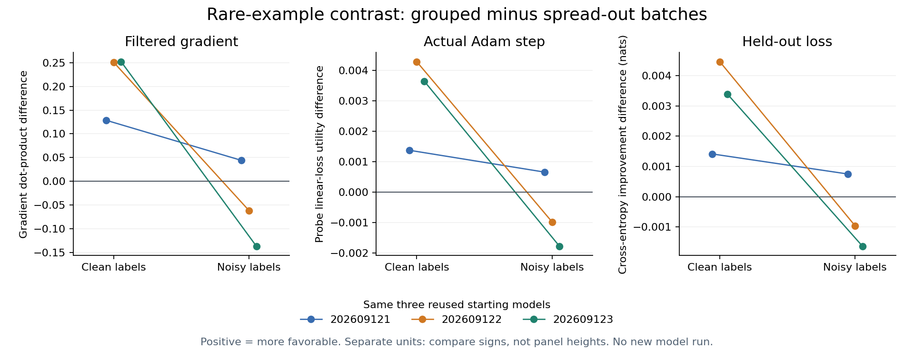

Clean D_filter is +0.128563, +0.250851 and +0.252053; Diffuse gives +0.044021,
−0.061640 and −0.136978. All six signs match D_Adam and the corresponding
held-out rare-loss contrast. Clean's useful local history effect is therefore
coherent across these stages. In the two adverse Diffuse comparisons, the
ordering differs already at filtered delivery, not first at the Adam mapping,
despite much higher standalone rare-probe retention after grouping.

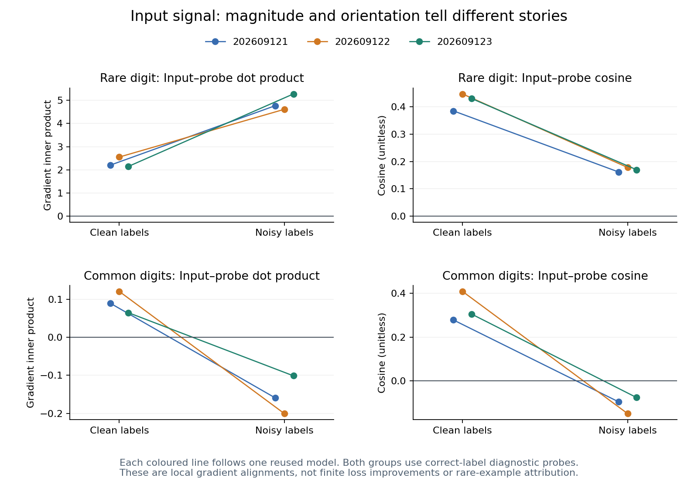

This statement is specific to the primary rare grouped-minus-interleaved
contrast. Grouped-minus-raw rankings do reverse between gradient and Adam
geometry. In the first Clean parent, all nonzero rare F are positive but actual
J and held-out utility are negative. Diffuse common F are negative while actual
J and held-out utility remain positive; inherited zero steps also improve
common loss. Raw retains its all-case common-loss advantage. Common grouping
signs do not agree at every stage, and rare recognition remains zero.

The result locates a conditional delivery mismatch, not a causal fraction of
long-run forgetting or a covariance-based test of semantic value. Probe and
held-out populations differ, the input is block-averaged, and all parents are
early, reused and outcome-informed. Full scalars and controls are in the
[report](../output/2026-09-10-spectral-observer-signal/results.md) and
[archived JSON](../output/2026-09-10-spectral-observer-signal/results/result.json).

### 4.10 Augmentation: frequency reduction is not reliability reduction

The [user-prioritized augmentation study](../output/2026-09-10-spectral-augmentation/results.md)
fixes72continuations across three fresh seeds, Clean/Shared/Sham, raw/native32
and None/Random/Targeted/Opposite masking. It preserves common unmasked warmup,
assigned labels and indexed exposure. Masks are label-independent and paired
by batch occurrence, applied after cue insertion. Evaluation is never masked.
Independent NumPy reconstruction passes all1,512logical evaluation records;
checkpoint bytes are hashed, but state execution is not independently replayed.

Random improves raw rare accuracy and rare/common CE in every seed in each
condition. Raw rare accuracy means56.07→61.40%,57.27→63.80%,58.07→61.67%.
Native rare CE worsens in each seed/cell, with rare accuracy means
11.60→10.40%,9.20→3.40%,0.73→0.20%. Small native common-class improvements
remain in Sham; the result is not a blanket augmentation null.

Targeted Shared native common accuracy falls87.96→87.03%, rare accuracy
9.20→0.47%, with adverse common/rare CE in every seed. Patch excess E falls
95.717→92.058points, but its components are critical: patched wrong target-0
rate improves97.475→96.083% in mean (two favorable seeds), while unpatched
wrong target-0 bias rises1.758→4.025% in every seed. Native Random's favorable
Shared−Sham interaction similarly does not establish lower Shared susceptibility:
Shared E rises while Sham E rises more. Absolute predictions and competence
must accompany the difference metrics.

Preserve the constructive positive: native Shared patched common accuracy
exceeds raw and patched common CE is lower in every seed under every mode.
With Targeted the means are14.56% versus11.29%, CE2.879 versus8.137. Most
patched images still fail, and new rare acquisition remains costly. Native
rare CE improves from warmup in all modes despite poor final recognition.

The prospective theory note (artifact not distributed in this public snapshot)
explains why a plausible covariance route need not be sufficient. A constant
additive cue component with occurrence q has covariance q(1−q)ccᵀ; halving
q from0.1 to0.05 reduces its coefficient0.09→0.0475. Yet surviving inserted
Shared cues remain perfectly associated with their assigned wrong target,
and masked examples retain wrong labels. This manipulates frequency rather
than eliminating that conditional reliability. Actual gradient cross-terms,
image damage and evolving observer state were not measured mechanistically.

The complete curves (artifact not distributed in this public snapshot)
and [checked contrasts](../output/2026-09-10-spectral-augmentation/audit/summary.json)
retain all seeds and endpoints. Three seeds, one MLP/rank/rate, inherited
warmup and known-location erasure limit generalization. These outcomes constrain
this recipe, not invariant learning or augmentation generally. No new mask
sweep or compulsory mechanism diagnostic is required before reporting it.

### 4.11 Ordinary augmentation: useful learning without a practical spectral gain

The user's intended all-class augmentation question was then tested directly,
separately from cue erasure. Three fresh clean seeds and three fresh wrong-label
seeds each cross raw AdamW/native stable rank32 with none/one-view translation,
using a 50,890-parameter MLP, balanced 5,000/5,000 train/heldout split and fixed
4,000-step endpoint. Translation begins during the common 100-step warmup.
The noisy study assigns exactly 80% actually wrong fixed labels; transformations
do not resample those labels. These are separate studies, not a paired noise
factorial. Both primary metrics retain every seed.

A later local diagnostic reuses only the six clean native warmup states.
Rescaling actual post-Adam data displacements in both directions identifies
a favorable native direction for translated input/readout after unaugmented
warmup, all three seeds, alongside adverse translated-input/original-readout
effects that size matching does not remove. Old-span mean/between-image energy
is preferentially retained over within-view energy; those components are not
semantic labels. These post-outcome local findings do not reverse the training
results or establish their mediation.

The fresh clean multiview follow-up observes the mean of four gradients but
delivers the projected first-view gradient. It improves translated heldout
accuracy over native1 by 1.88/1.44/1.52 points, with lower CE and actual own-
warmup progress in all three seeds. Primary original accuracy changes
+0.16/+0.70/−0.26 points; CE improves in one seed and worsens in two, with a
near-zero mean difference that is not equivalence. Raw four-view delivery
reaches 95.633% original accuracy versus observer4's 81.593%, and beats both
filtered policies on both readouts/metrics in every seed. Extra views require
16,000 rather than 4,000 gradient evaluations per trajectory.

The [source-linked sequence](spectral_augmentation_sequence_2026-09-10.md)
retains every primary contrast, local sign and warmup qualification. It also
preserves the older stable global-rank200 positive, 78.77% versus 38.93% raw
AdamW in seed42, and the three-seed legacy late-horizon protection. The larger
model, normalization, data and exposure differ; those historical trials do not
test ordinary translation. The small recipe fails to add practical augmentation
value. The selected larger-configuration bridge is now complete below, without
recasting it as exact historical reproduction or erasing the older positives.

### 4.12 Strong rank-200 bridge: substantial learning without added augmentation value

Twelve prospectively fixed trajectories use fresh seeds 202609171–173 and
raw/native stable rank 200 × none/translation. The 235,146-parameter MLP and
normalized inputs follow the stronger recipe; AdamW and canonical hard filtering
are unchanged, including warmup 100 and no gain restoration or moment reset.
Each seed randomly splits official training images into 50,000 train/5,000 clean
validation/5,000 clean reporting. Fixed 90% uniform replacement produces
80.962/81.016/81.012% actually wrong labels; translation precedes standardization
and all readouts use original images. The 72 full passes preserve 3.6M historical
example exposures but use 56,304 updates and different data roles/repetition.
This is a bridge, not exact reproduction or a paired clean-by-noise factorial.

All 12 validation-CE choices were saved and verified before reporting arithmetic,
with the frozen float64 reduction and earliest exact tie. Both selected metrics
use that one own-selected checkpoint. Three-seed mean reporting outcomes:

| Recipe | Fixed-final accuracy / CE | Validation-selected accuracy / CE |
|---|---:|---:|
| Raw, none | 32.000% / 2.708446 | 72.487% / 1.757167 |
| Native200, none | 79.753% / 1.854416 | 82.973% / 1.808122 |
| Raw, translation | 84.973% / 1.804289 | 85.993% / 1.764379 |
| Native200, translation | 66.820% / 1.981758 | 68.673% / 1.931696 |

Unaugmented native improves 36.700→79.753% beyond its shared raw/native warmup,
gaining 35.08/38.68/55.40 points (mean 43.053) and lowering CE in every seed.
Its final advantage over raw is 47.753 points with lower CE in all seeds.
At validation-selected checkpoints, its accuracy advantage remains all-seed
(mean 10.487 points), but CE is worse in every seed (mean excess 0.050955).
This is useful continued learning, not general superiority to early stopping.
Translated native also improves 26.120→66.820% and lowers CE in every seed.

The primary native+translation versus raw+translation loses all three seeds:
accuracy differences −20.44/−19.18/−14.84 points, CE benefits
−0.181014/−0.151446/−0.199948 nats. Selected and fixed late epochs 61–72
lose every seed on both metrics too (mean accuracy deficits 17.320/19.708,
CE excesses 0.167317/0.185124). Translation helps raw and hurts native at
fixed final in every seed/both metrics; the accuracy interaction is −65.907
points. Raw+translation also beats unaugmented native at final and selected
readouts. Raw augmentation's selected CE alone is slightly worse in two seeds
and in mean: do not claim universal selected-metric improvement.

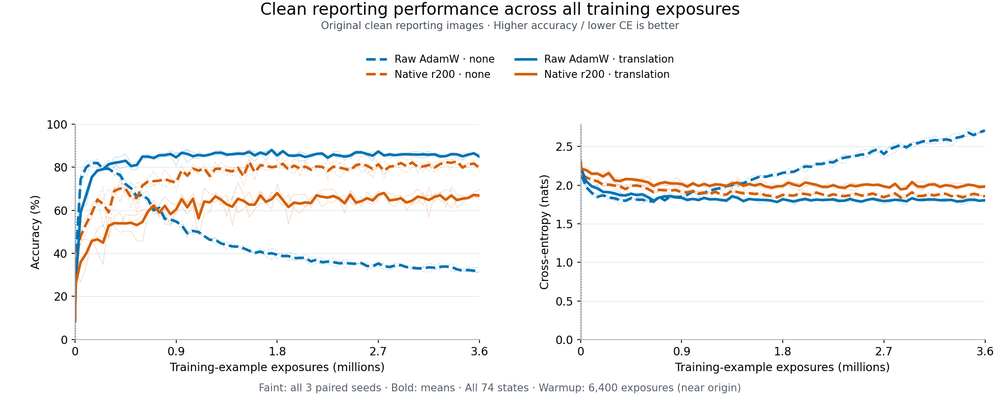

On actually wrong training examples, wrong-target accuracy/CE are
39.158%/1.649918 raw-none, 2.517%/2.376372 native-none, 2.230%/2.377909 raw-
translation and 3.762%/2.355321 native-translation. Both single interventions
restrict assigned fitting relative to raw-none while supporting clean learning.
The combination fits wrong assignments **more than either single intervention
in every seed** by both subset metrics. Its lower aggregate assigned accuracy
does not show extra noise suppression; useful correctly labeled fitting also
falls. Fit proxies do not identify memorization circuitry.

The saved-array audit is PASS: 937 artifacts, 888 logit states and 12 validation
choices, maximum scalar discrepancy 1.4552e−11 under fixed 1e−10 tolerances.
It hashes opaque checkpoints without model replay and verifies selection before
reporting, but saved reporting data are not cryptographically blinded. Independent
scalar/interpretation review corroborates all registered windows without new
neural computation. Mean branch walls are 254.424/695.874/272.787/728.823 s in
table order, each for 56,304 gradient calls/3.6M examples: descriptive costs,
not speed benchmarks. Three paired seeds on one adaptively revisited task do
not establish transfer, semantic selection or safety efficacy. Small rank 32
is no longer a sufficient explanation for the adverse augmentation result;
which useful components or Adam histories mediate it remains unidentified.
No new experiment is selected.
[Full report](../output/2026-09-10-spectral-strong-augmentation/results.md),
[audit](../output/2026-09-10-spectral-strong-augmentation/audit.json),
[independent interpretation](../output/2026-09-10-spectral-strong-augmentation/interpretation-review.md),
[exact methods](spectral_paper_methods_2026-09-10.md#f4-strong-rank-200-augmentation-bridge-with-validation-only-selection).

The later [component-utility diagnostic](../output/2026-09-10-spectral-component-utility/results.md)
uses twelve existing native states, three seeds and two common-parent action
draws to measure S/F/C versus clean changes. Raw itself worsens consistency at
translated final parents in every seed average; native's tiny clean effects
are mixed, with less C deterioration in the two clean-adverse seeds. Warmup
relative C instead improves while clean CE worsens in both prior-training
settings/all three seeds. Actual wrong-fit measures differ from F, and the
local lost-useful-consistency account is unsupported. This does not explain
the accumulated gap or overturn useful native learning. [All-cell evidence](../output/2026-09-10-spectral-component-utility/interpretation-analysis.md)
and [exact local methods](spectral_paper_methods_2026-09-10.md#f5-common-parent-signed-component-utility)
preserve full/tenth, finite/linear, per-draw and tiny-value limits.

## 5. Mechanistic conclusions and their mathematical limits

At the shared first action, all five post-estimator bases have full column
numerical rank. Native/orthogonal gradient cosines range 0.8054–0.9844, but
actual Adam movement cosines range 0.9802–0.9998. Norm-matched movement is
smaller than native in every seed despite matched incoming norms. The saved
moment and displacement audit retains small float32 decomposition residuals.
Thus a gradient-norm control is not an actual-step or decay-balance control.

The first action study weakens a necessity claim for legacy unequal within-span gains
after the fork. It does not show that the learned span is unnecessary: both
new policies use it, and c itself depends on V. Nor does it establish that
one scalar schedule reproduces the result independently of learned geometry.
Later gradients, bases and optimizer moments diverge, so continuation is a
policy effect rather than fixed-projector mediation.

### 5.1 Saved histories: the scale law is not a fixed multiplier

An exploratory analysis of all 9,990 saved continuation steps finds numerical
rank equal to stored column count throughout. The counts range 117–200 for
orthogonal and 153–200 for norm-matched trajectories, among 227,313 parameters.
Thus these differences are not extra rank truncation by the action's QR/SVD;
the legacy estimators themselves evolve differently after the policies diverge.

Within norm-matched trajectories, c has per-seed whole-window medians
1.023–1.172 and means 1.401–1.997; individual values span 0.963–216.714.
All 4,995 norm matches pass the original post-cast tolerance without denominator
clamping. A single initial or median scale is therefore not the policy that
produced the positive endpoints. No causal benefit or harm of its large
excursions has been isolated. Its retained projected/raw norm fraction has
equal-seed mean 0.8494 and minimum 0.3432, not uniformly near one.

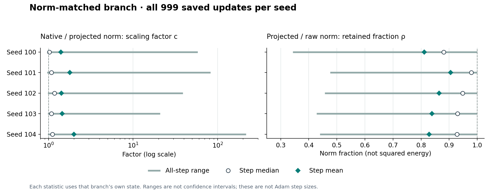

The [saved-history report and complete summaries](../output/2026-09-09-spectral-grokking-action/trajectory-analysis/results.md)
retain all seeds and fixed windows; an
[independent scalar audit](../output/2026-09-09-spectral-grokking-action/trajectory-analysis/independent-audit/review.md)
recomputes their arithmetic. These are post-outcome descriptions, not new
learning outcomes or independent tensor measurements. Original completion
receipts omitted individual history hashes; present hash/metadata consistency
cannot retroactively prove immutable acquisition. Later logs do not contain
actual Adam movements or oriented bases, so neither later optimizer dose nor
subspace turnover is identified.

### 5.2 Local geometry calibrates a test, not its answer

The equal-norm first-order comparison is exact in its stated idealization.
For q=QQᵀg≠0, z=Qᵀg, λᵢ=σᵢ² and wᵢ=zᵢ²/‖z‖²:

<pre>
gᵀ(cq) = ‖q‖² √E_w[λ²] ≥ ‖q‖² E_w[λ] = gᵀr_native.
</pre>

The projected direction maximizes local raw-SGD descent among equal-length
vectors in its span. Unequal gains can nevertheless improve finite steps by
attenuating high curvature; this theorem does not order Adam trajectories.
The actual positive result is experimental, not forced by this inequality.

A further diagnostic connects retained norm to the completed direction control.
Let Π=QQᵀ, a=‖VVᵀg‖>0, q=Πg≠0, ρ=‖q‖/‖g‖, and compare
u=a g/‖g‖ with v=a q/‖q‖. For exact orthogonal Π:

<pre>
cos(u,v) = ρ
‖u−v‖/a = √[2(1−ρ)].
</pre>

This identity is only a local geometry statement. A high retained norm can
bound the immediate equal-length raw-versus-projected action difference, but
does not bound long-run representation differences without additional
assumptions on dynamics. Small action differences can interact with carried
Adam or accumulate over time. Its role is to calibrate a discriminating test,
not predict equivalent trajectories; the completed control is in fact adverse
at the fixed final endpoint. The retained squared
energy fraction is ρ², not ρ.

## 6. Safety relevance and unresolved work

The positive safety-relevant contribution is controlled characterization of
the preservation–adaptation tradeoff: useful common recognition can survive
corruption, and equal-exposure presentation can strengthen that protection.
The boundary is equally important: variance, agreement, generalization and
benignness are not interchangeable. No harmful-behavior
evaluation at matched competence has established a safety benefit here.
Emergent-misalignment results remain exploratory and measurement-confounded;
the adapter spectrum in that literature is a different object from temporal
gradient covariance. The [application assessment](../output/2026-09-08-spectral-paper-planning/application-and-safety-scope.md)
retains those limitations.

A later safety-efficacy claim would require lower absolute undesired-behavior
rates with maintained benign competence, including rare legitimate requirements,
and useful new learning beyond a frozen parent. Response quality, refusal and
coverage must remain visible rather than excluding failures until the remaining
responses look safer. This is not a gate before reporting the current learning
results. The [synopsis](spectral_safety_contribution_2026-09-10.md) states the
schematic evaluation contract and its limits. Gradients can carry semantic
information without guaranteeing desirable selection.

[Evil Spectra](https://arxiv.org/html/2606.31591v1#S3) motivates optimizer-sensitive
safety evaluation, but its regularized object is the singular spectrum of BA,
not our temporal-gradient covariance. Its intervention's benefits therefore
cannot be borrowed as evidence for this filter. Public release still needs
a safety/capabilities assessment; small-scale understanding work is not
automatically free of dual-use implications.

The user-requested low-memory clustering pilot demonstrates a feasible
factorized graph construction in synthetic cases, with rare-group failures
(reviewed pilot (artifact not distributed in this public snapshot)).
The subsequent [three-seed neural comparison](../output/2026-09-09-spectral-clustering-mnist/results.md)
adds 24 MNIST trajectories with a common 100-step warmup and fixed 2,000-step
endpoint. Under .9 uniform replacement, cluster means retain 48.93% clean
held-out accuracy versus AdamW's 29.37% and stable hard spectral's 50.80%.
Clustering beats AdamW accuracy in every seed, but its small CE advantage is
mixed; existing spectral beats clustering on both metrics in every seed under
both clean and noisy training. Clustering mainly preserves inherited noisy
accuracy (49.90% at warmup), restricts clean learning, and adds overhead.
Half-strength clustering restores clean learning but loses most accuracy
protection. These are bounded useful learning effects, not from-scratch
clustering success, a tuned benchmark, or evidence of semantic selection.
More faithful clustering does not supply the missing usefulness label.
The proportional-gradient argument (artifact not distributed in this public snapshot)
motivates an amplitude-weighted group action, but it is not an experimentally
identified explanation of these outcomes.

The evidence inventory below distinguishes completed work from unresolved
stronger claims. Methods-complete reporting and bounded nearest-prior work
remain necessary writing tasks, not compulsory new neural diagnostics.
The completed augmentation sequence now includes the strong-regime bridge:
useful unaugmented learning and an adverse augmentation primary, with selected
and late-window boundaries retained. Familiarity and persistence
remain optional; their absence does not negate measured conditional effects.

Completed evidence and remaining claim boundaries:

1. **Completed, free analysis:** the full saved scale/rank histories now sharpen
   the mechanism account, with independent scalar arithmetic and explicit
   provenance limits. They do not identify which excursions matter.
2. **Direction and local functional discriminators complete:** the
   specified raw replacement loses to projection on every final primary in
   every seed. The new common-state measurement finds a local held-out benefit
   from suppression, partly reversed by amplification, with favorable
   within-sum utility rather than increased useful sum-consistent motion.
   This is not fresh validation or established trajectory mediation. Effects
   at later states and cumulative feedback remain open. A random/frozen-span
   test addresses the separate necessity of learning/adapting the particular
   space. The separately user-authorized clustering MNIST pilot is complete;
   it supports conditional protection, not superiority to the existing filter.
3. **Nearest-prior comparison:** a same-model, frozen-budget Grokfast comparison
   is needed for a grokking-method novelty claim. Gradient-transform priors must
   be reconciled before choosing that claim. Historical hyperparameter search
   cannot be recast as prospective confirmation.
4. **Selectivity boundary and constructive batching intervention complete:** Section4.5
   establishes useful corruption protection with restricted rare recognition
   and a learnable shared wrong cue, not general semantic selectivity. The
   [completed batching test](../output/2026-09-10-spectral-batch-composition/results.md)
   changes composition at fixed exposure and strengthens noisy common protection,
   without restoring rare recognition. Its Clean rare gains are uneven and
   costly; a favorable noisy rare interaction is control deterioration.
   Sections4.6–4.9 distinguish sampling, recognition, provisional ranking and
   a useful fixed-model observer-history pathway. More rare-direction access
   does not consistently improve the noisy one-step contrast. Saved-vector
   accounting now locates its two adverse rare ordering differences at filtered
   delivery, while preserving Clean's favorable chain. It does not support an
   absent or reversed rare input at these parents. Longer-run persistence and
   warmup familiarity remain distinct questions before
   claiming a long-run mediator. Warmup exposure remains
   an untested factor, not an existing remedy;
   a frozen-span grokking continuation remains deferred.

Further training requires a specific bounded protocol, not a broad optimizer
sweep. Existing desktop resources are the first option; the authorized $100
paid budget remains unspent. Frontier pretraining, public speedrun optimization,
and high-learning-rate scaling are not objectives of this paper. Publication
requires human authorship/novelty and safety review; no submission is authorized
or performed here.

## 7. Conclusion

Temporal gradient filtering can change useful learning, including resistance
to late corrupted-label overfitting and the development of modular-sum
readability. Its action cannot be interpreted solely as selecting a small
number of good directions: centering, numerical within-span gains and the base
optimizer matter. Norm-matched continuation and its raw-direction control
make this distinction empirically concrete: the projected policy supports
better fixed-horizon generalization than retaining its scale law along raw
gradients, despite strong training fit in the latter. The separate selectivity
study makes the safety boundary concrete: protection from scattered wrong
labels can coexist with poor new correct recognition and ready acquisition
of a shared error. High late rare mean-gradient retention prevents explaining
the whole cost as discarded rare directions. Fixed-exposure grouping now
demonstrates that the sampler changes this tradeoff, strengthening common
protection without a general rare-learning rescue. A matched-parent diagnostic
then establishes useful local observer-history effects on clean data, alongside
an accessibility–utility gap on noisy data. Saved-vector accounting locates
the primary rare contrast in the interaction of the filter with the present
input, before Adam, while other controls retain optimizer-map reversals.
The remaining question is how local useful delivery, later persistence and
inherited state connect to sustained learning, without treating covariance
magnitude as a label for truth.